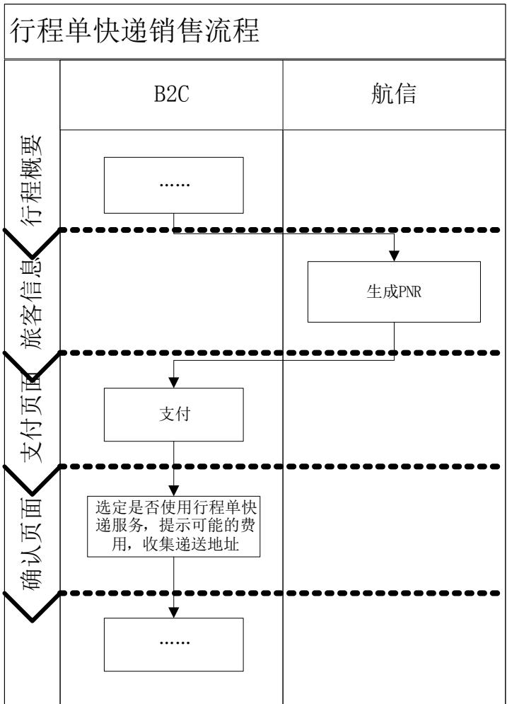
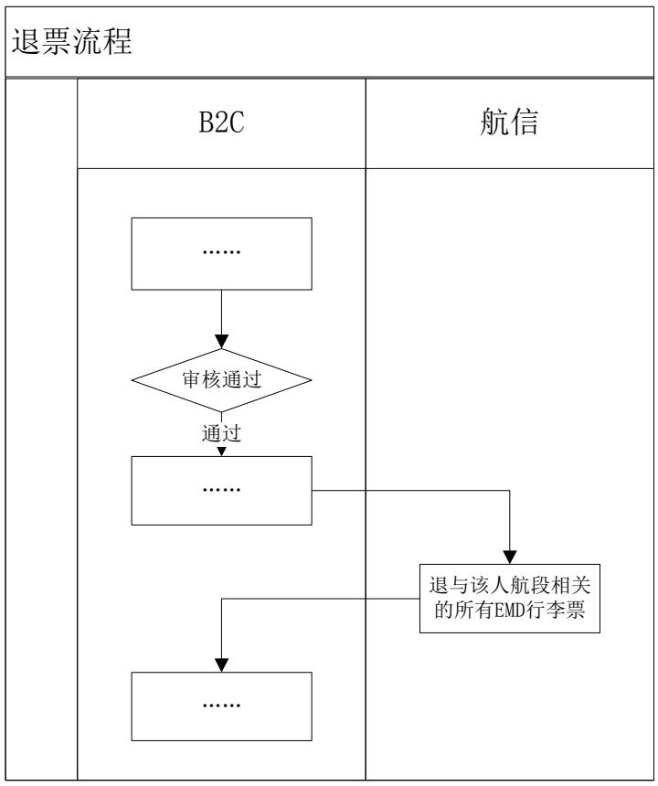
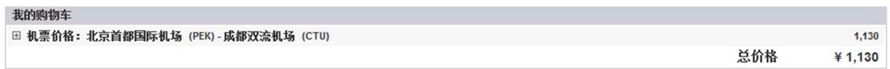
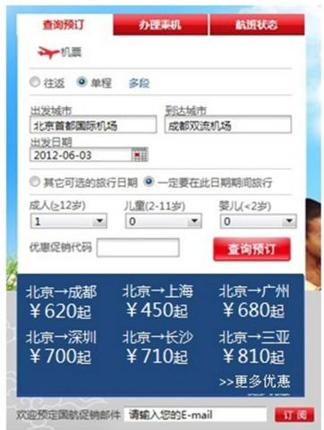
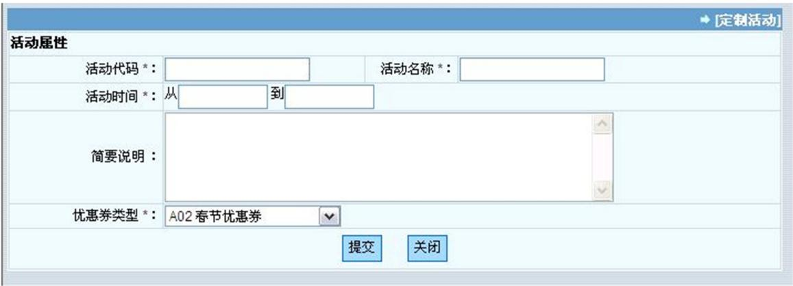
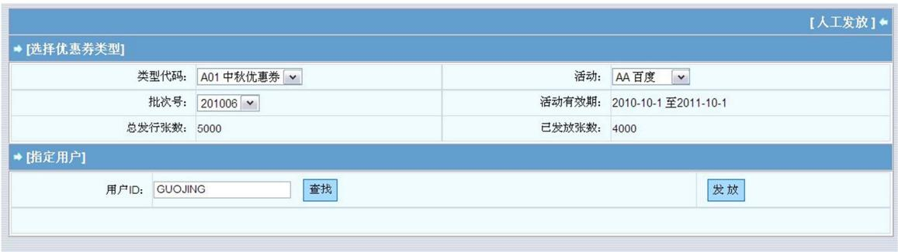

# AIR CHINA

# 中国国際航空公司

# 国航电子商务项目二期需求规格说明书

项目名称：国航电子商务项目二期

版本编号：V2.0

日 期：2012 年 11 月 16 日

文档信息

<table><tr><td>文档标题</td><td>国航电子商务项目二期需求规格说明书</td></tr><tr><td>归档日期</td><td></td></tr><tr><td>所有者</td><td>ACE 项目组</td></tr></table>

修订历史

<table><tr><td>版本编号</td><td>版本日期</td><td>修订内容</td><td>备注</td></tr><tr><td>V1.0</td><td>2012-9-1</td><td>初版</td><td></td></tr><tr><td>V1.1</td><td>2012-9-28</td><td>针对 Batch A 需求进行多轮讨论形成需求规格说明书,经需求评审确认。同时,针对少量待定事项予以列明。</td><td></td></tr><tr><td>V2.0</td><td>2012-11-16</td><td>终稿。完成 Batch B 业务需求讨论和需求评审,同时针对 Bach A 遗留问题完成需求澄清。</td><td></td></tr><tr><td></td><td></td><td></td><td></td></tr><tr><td></td><td></td><td></td><td></td></tr><tr><td></td><td></td><td></td><td></td></tr><tr><td></td><td></td><td></td><td></td></tr><tr><td></td><td></td><td></td><td></td></tr></table>

文档审核与交付

<table><tr><td>人员</td><td>签字</td></tr><tr><td>编写人</td><td>ACE 二期项目业务组、新功能组、新产品组、后台组</td></tr><tr><td>审核人</td><td></td></tr><tr><td>签署人</td><td></td></tr></table>

# 目 录

# 第 1 章 前言 PREFACE ..

1.1 文档目标与范围.  
1.2 文档目标读者..  
1.3 术语定义..

# 第 2 章 概述 OVERVIEW ...

2.1 功能概述.  
2.2 系统需求编制说明.

2.2.1角色描述介绍.  
2.2.2用例介绍. 4   
2.2.3用例命名规则. 5

# 第 3 章 新品牌运价业务需求分析 ..

3.1 业务需求概述.   
3.2 NEW FARE FAMILY 需求分析 .  
3.3 UPSELL 需求分析 . C  
3.4 促销产品投放需求分析. 11  
3.5 增值服务产品投放需求分析. 12  
3.6 免费增值服务需求分析. .13  
3.7 CROSS SELL 与附加服务需求分析 13  
3.8 相关业务流程. ..14

# 3.8.1B2C前台销售流程 .14

3.8.1.1 用户订票总流程 . . 14  
3.8.1.2 Fare Family UPSELL 流程 . . 15  
3.8.1.3 里程 UPSELL 流程 . . 16  
3.8.1.4 退票流程 . . 17  
3.8.1.5 升舱改期流程 . . 17  
3.8.1.6 促销/增值服务/交叉销售产品购买与服务流程 . 17

# 3.9 功能分析.. .25

3.9.1功能概述 .25  
3.9.2购票及处理.. ..26

3.9.2.1 购票 .. . 27  
3.9.2.2 升舱改期 .. . 38  
3.9.2.3 退票 .. . 39

# 3.9.3订单管理 ..41

3.9.3.1 查询查看 .. . 41   
3.9.3.2 退额外行李 . . 42

# 3.9.4销售报表（提供给销售费用管理系统） .42

3.9.4.1 促销产品销售报表 . . 42  
3.9.4.2 增值服务销售报表 . . 43

# 第 4 章 常旅客直减功能需求分析 .. .45

4.1 业务需求概述. ..45   
4.2 购票人直减需求分析.. .45

4.2.1目标客户群 .45  
4.2.2产品说明. .45   
4.2.3后台管理需求. .47

4.3 乘机人直减需求分析.. .48

4.3.1 目标客户群.. ..48   
4.3.2 产品说明.. ...48   
4.3.3 后台管理需求.. .51

4.4 里程奖励规则展现. .52

4.4.1 目标客户群.. .52   
4.4.2 产品说明.. ..52

4.4.2.1 额外赠送里程规则展示 . . 52  
4.4.2.2 后台统计报表 . . 53

# 第 5 章 RETAILER 功能需求分析 ... 54

5.1 需求概述. ..54   
5.2 首页低价动态展示. ..54

5.2.1 基于O/D 的低价促销专栏展示 .. .54  
5.2.2 Omniture 跟踪统计. ..56

5.3 促销列表排序.. .57  
5.4 支付宝推广. .59  
5.5 价格日历展示. .61

# 第 6 章 里程 UPSELL . .64

6.1 业务需求概述.. ..64

6.1.1里程UPSELL销售需求变更 ..64   
6.1.2里程UPSELL报表导出（给MSAS） ..64

# 第 7 章 EMD ... ..66

7.1 前台业务需求概述. ..66

7.1.1出票.. ..6   
7.1.2改期升舱. ..6   
7.1.3单独退EMD票. ..66

7.2 后台业务需求概述. .66

7.2.1退票. ..66   
7.2.2退EMD票. ..66   
7.2.3强制退EMD票 ..67

# 第 8 章 促销与增值服务产品库功能需求分析 . .68

8.1 总体业务流程. ..68

# 8.2 促销产品库管理需求分析. ..69

# 8.2.1促销资源管理. ..69

8.2.1.1 促销资源创建 . . 69  
8.2.1.2 促销资源分配 . . 69  
8.2.1.3 促销资源分配的审批 . . 70  
8.2.1.4 促销资源的查询与查看 . . 70   
8.2.1.5 促销资源删除 . .. 70

# 8.2.2促销产品管理. ..71

8.2.2.1 促销产品创建 . . 71  
8.2.2.2 促销产品的查询与查看 . . 71   
8.2.2.3 促销产品审批 . . 71   
8.2.2.4 促销产品修改 . . 72   
8.2.2.5 促销产品删除 . . 73   
8.2.2.6 促销产品冻结与激活 . . 73   
8.2.2.7 促销产品超级修改 . . 73

# 8.3 促销订单管理.

# 8.3.1前台功能. ..73

8.3.1.1 匹配成行数据 . . 73  
8.3.1.2 促销子订单发放状态维护 . . 74   
8.3.1.3 生成发放处理报表 . . 74  
8.3.1.4 发放结果报表同步 . 74   
8.3.1.5 历史报表文件下载 .. . 74

# 8.3.2后台功能. ..75

8.3.2.1 成行数据导入处理 . . 75

# 8.4 权限定义. .75

# 8.5 相关业务流程. ..77

8.5.1促销产品库维护. ..77   
8.5.2促销产品状态转化图.. ..78   
8.5.3促销产品子订单发放状态转换图.. ..78

# 8.6 功能分析. .78

8.6.1 功能概述.. ..78  
8.6.2产品库.. .79

8.6.2.1 促销产品库 .. . 79  
8.6.2.2 促销订单管理 . . 89

# 第 9 章 电子代金券功能需求分析 .. .95

9.1 代金券管理流程. ..95  
9.2 代金券生命周期.. ..96  
9.3 代金券状态转换图. .97  
9.4 代金券业务前提与假设. .97  
9.5 国内 B2C 系统前台部分需求分析 .98

# 9.5.1 代金券管理（B2C-FND-CPN-001） ..98

9.5.1.1 代金券查看 .. .. 98   
9.5.1.2 代金券使用 .. . 99

# 9.6 国内 B2C 系统后台管理需求分析 .102

9.6.1电子代金券管理（B2C-BND-CPN） .102  
9.6.2功能需求. ..102  
9.6.3UI页面描述. ..103  
9.6.4用例描述. ..103

9.6.4.1 新增代金券类型(UC-B2C-BND-CPN-001) . . 106   
9.6.4.2 查询代金券类型(UC-B2C-BND-CPN-002) . . 109   
9.6.4.3 更新代金券类型(B2C-BND-CPN-003) .. . 110  
9.6.4.4 删除代金券类型 (B2C-BND-CPN-004) .. . 112  
9.6.4.5 新增活动(UC-B2C-BND-CPN-005) .. . 114   
9.6.4.6 查询活动(UC-B2C-BND-CPN-006) .. .. 116   
9.6.4.7 修改活动(UC-B2C-BND-CPN-007) .. . 117   
9.6.4.8 删除活动(UC-B2C-BND-CPN-008) . . 118  
9.6.4.9 增加发放批次 (B2C-BND-CPN-09) .. . 120  
9.6.4.10 修改发放批次 (B2C-BND-CPN-10) .. . 122  
9.6.4.11 删除发放批次 (B2C-BND-CPN-11) .. . 123  
9.6.4.12 发放代金券给用户 (B2C-BND-CPN-012) . . 125  
9.6.4.13 增加自动发放事件(B2C-BND-CPN-013) .. . 127  
9.6.4.14 删除自动发放事件(B2C-BND-CPN-014) .. . 129  
9.6.4.15 修改自动发放状态 (B2C-BND-CPN-015) . . 131   
9.6.4.16 自动发放代金券(B2C-BND-CPN-016) .. . 132  
9.6.4.17 查询代金券发放情况 (B2C-BND-CPN-017) . . 133   
9.6.4.18 查询代金券使用情况 (B2C-BND-CPN-018) .. . 136  
9.6.4.19 下载代金券使用情况明细(B2C-BND-CPN-019) . .. 138  
9.6.4.20 修改代金券使用状态 (B2C-BND-CPN-020) . . 139  
9.6.4.21 查询代金券定制及发放情况(B2C-BND-CPN-021) .. . 141  
9.6.4.22 下载代金券定制及发放情况(B2C-BND-CPN-022) .. . 142

# 9.7 系统非功能需求. ..143

# 9.7.1 服务水平需求(SLRs). ..144

9.7.1.1 安全性 .. . 144  
9.7.1.2 容量与性能 .. .. 145   
9.7.1.3 高可用性 . .. 146

# 第 10 章 补充说明 ... ..147

10.1 OUT OF SCOPE.. ..147   
10.2 需求变更风险项.. .147

# 图表目录

表 1-1 术语定义表 .

表 2-1 用例中的角色描述 . 4

表 2-2 用例表格介绍 . 4

表 2-3用例命名规则 . 6

表 4-1 代金券属性 . .. 102

表 4-2新增代金券类型界面 .. 107

表 4-3代金券类型查询界面 .. 110

表 4-4代金券类型查询输出界面 . 110

表 4-5新增活动界面元素 . .. 115

表 4-6活动查询界面元素 . . 117

表 4-7活动查询界面输出元素 . 117

表 4-8代金券发放批次管理界面 . 121

表 4-9代金券发放批次管理界面 . . 123

表 4-10自动发放事件界面 .. 128

表 4-114 代金券发放管理输出界面 .. 138

图 2-1 用例图示 . 3

图 3-1 国内航线 Fare Family 划分 .. 9

图 4-1购票人直减-航班选择页面提示信息 . .. 46

图 4-2购票人直减-行程概括页面提示信息 .. 46

图 4-3 会员信息 . . 47

图 4-4 订单详细页面 . .. 48

图 4-5当旅客行程满足直减条件时，添加优惠提示 .. . 49

图 4-6 支付页面添加修改 .... .. 50

图 4-7常旅客额外奖励规则 . 53

图 4-1代金券管理流程 . 95

图 4-2我的代金券查询 . .. 98

图 4-3支付页面选择代金券 .. 100

图 4-4支付页面确定代金券 .. 101

图 4-5 代金券管理菜单界面 .. 103

图 4-6代金券类型查询界面 .. 104

图 4-7 新增代金券类型界面 .. 105

图 4-8活动管理主界面 . .. 114

图 4-9新增活动界面 . . 114

图 4-10 批次管理主界面 . .. 120

图 4-11 新增批次界面 .... .. 120

图 4-12 人工发放界面 . . 125

图 4-13系统发放设置界面 . 127

图 4-14 发放日志 .. .. 133

图 4-152 代金券发放情况输出界面 .. 135

# 第1章 前言 Preface

# 1.1 文档目标与范围

本文主要描述国航电子商务项目二期 New Fare Family 相关的前台功能以及与此相关的后台管理的系统需求。

# 1.2 文档目标读者

本文的目标读者是业务人员、国内 B2C 网站及后台管理系统设计人员。

# 1.3 术语定义

在本文档中用到如下的术语定义，解释如下：

表 1-1 术语定义表

<table><tr><td>术语</td><td>定义</td></tr><tr><td>Phase 1A</td><td>国航电子商务一期第一阶段</td></tr><tr><td>B2C</td><td>Business-to-Consumer,网络直销电子商务</td></tr><tr><td>DLX</td><td>Datalex 公司简称</td></tr><tr><td>航信</td><td>中国民航信息网络股份有限公司</td></tr><tr><td>TTL</td><td>中国民航信息网络股份有限公司</td></tr><tr><td>TravelSky</td><td>中国民航信息网络股份有限公司</td></tr><tr><td>GDS</td><td>Global Distribution System,全球分销系统</td></tr><tr><td>ICS</td><td>Inventory Control System,航空公司订座系统</td></tr><tr><td>CRS</td><td>Computerized Reservation System,航空预订系统,一般供代理人使用</td></tr><tr><td>DCS</td><td>Departure Control System,离港系统</td></tr><tr><td>TDP</td><td>Datalex 公司的产品,全称为 Travel Distribution Platform。TDP 是 Datalex 用于构建航空电子商务系统的核心平台</td></tr><tr><td>PNR</td><td>旅客订座记录,即 PASSAGER NAME RECORD 的缩写,它反映了旅客的航程,航班座位占用的数量及旅客信息</td></tr><tr><td>FFP</td><td>Frequent Flyer Program 飞行常客计划,本文中特指国航常旅客系统</td></tr><tr><td>IBE</td><td>IBE(Internet Booking Engine),即互联网订座引擎</td></tr><tr><td>IBE 接口</td><td>E-Build 基础 API 接口(IBE 接口)是航信提供的航空公司电子商务网站解决方案中的底层基础服务接口</td></tr><tr><td>儿基会</td><td>中国儿童少年基金会</td></tr><tr><td>MSAS</td><td>市场销售分析系统</td></tr><tr><td>ESB</td><td>国航信息共享平台系统</td></tr><tr><td>BRC</td><td>Business Rule Center,TDP 产品的一部分,用于定义和设置业务规则</td></tr><tr><td>APD</td><td>Advanced Passenger Data</td></tr><tr><td>MOTO PAY</td><td>Mail Order and Telephone Order payment,即信用卡无密码支付</td></tr><tr><td>订单号</td><td>B2C 系统中用来唯一标识一笔订单的编号。</td></tr><tr><td>电子客票编号</td><td>电子客票编号即订单号。因为后台人员习惯于叫电子客票编号所以在本文档后台系统中采用该名称。</td></tr><tr><td>票号</td><td>票号是航信系统中用来标识旅客客票信息的编号,由主机生成,被记录在 PNR 中。</td></tr><tr><td>支付订单号</td><td>支付订单号是由 IBE 系统为一次支付生成的一个编号,该编号会被支付平台记录,并作为后续处理环节中对该支付的唯一标识。</td></tr></table>

# 第2章 概述 Overview

# 2.1 功能概述

新运价品牌（New Fare Family）是在原运价体系和舱位划分的基础上，为了更好地满足大多数旅客对于运价的和服务的偏好，更便捷地提供差异化的运价服务组合而对运价体系的重新组合与制定。

新运价品牌以物理舱位为基准，以目标旅客对于服务的需求（包括退改签条件、里程累积规则、价格以及其它附加服务等）作为基本的划分原则。目标旅客的购票方式则由对舱位的直接选择转化为对运价品牌的选择，从而简化和提升旅客的购票体检。

另外，在新运价品牌体系中还可以提供对向上销售、促销产品以及增值服务产品的支撑。

# 2.2 系统需求编制说明

系统需求包含四大部分：功能需求、非功能需求、集成需求、报表统计需求，其中功能需求采用用例图的方式描述。

用例图是由角色（图中人型）和案例（图中椭圆）组成。角色是指系统外部的人或事，但与系统相互作用。角色代表用户、外部硬件、其他系统或时间等。

  
图 2-1 用例图示

# 2.2.1 角色描述介绍

角色与单个系统使用者的区别是：角色代表特别种类的使用者而并非实际的使用者。一些使用者能发挥同样的作用，这意味着它们是一个或同一个角色。在此类情况下，系统使用者构成一个角色。

在有些情况，只有一个人承担角色的作用。比如， 只有一个人是一个较小系统的系统管理员。某个人可以扮演多个角色。

表 2-1 用例中的角色描述

<table><tr><td>角色名称</td><td colspan="2">角色名字应能反应出它能起的作用,必须清楚反映出角色是使用者(人)、外部硬件、其他系统或是时间等。</td></tr><tr><td>概述</td><td colspan="2">用一句或两句话(最多一段话),定义角色在使用系统时所起的作用以及扮演的职责。</td></tr><tr><td rowspan="2">继承</td><td>超类</td><td>被继承的角色</td></tr><tr><td>子类</td><td>从超类继承的角色</td></tr></table>

# 2.2.2 用例介绍

如下表，为用例描述中各字段的含义。

表 2-2 用例表格介绍

<table><tr><td>用例编号</td><td colspan="7">对该用例进行的编号</td></tr><tr><td>用例名称</td><td colspan="7">用例的名称</td></tr><tr><td>用例简述</td><td colspan="7">对用例的简单描述</td></tr><tr><td>业务事件</td><td colspan="7">该用例所涉及的业务事件</td></tr><tr><td>行为角色</td><td colspan="7">描述该用例涉及到的用户角色</td></tr><tr><td>频率及重要性指标</td><td colspan="7">该用例发生的频率及重要性</td></tr><tr><td>业务触发事件</td><td colspan="7">描述触发该用例发生的业务事件</td></tr><tr><td colspan="8">结束条件</td></tr><tr><td colspan="8">描述结束该用例的条件,分为成功条件和失败条件● 成功条件描述能够使该用例执行成功的条件● 失败条件描述导致该用例执行失败的条件</td></tr><tr><td colspan="2">输入概述</td><td colspan="6">说明该用例的输入内容</td></tr><tr><td colspan="2">输出概述</td><td colspan="6">说明该用例的输出内容</td></tr><tr><td colspan="8">主事件流:(描述正常操作的事件流)</td></tr><tr><td>步骤</td><td colspan="2">动作描述</td><td>数据项</td><td colspan="2">数据确认</td><td colspan="2">备注</td></tr><tr><td>步骤序号,以1,2,3,...标识</td><td colspan="2">描述每个步骤所发生的动作</td><td>说明与该步骤相关的数据</td><td colspan="2">说明所输入的数据是否为空</td><td colspan="2">对该步骤进行补充说明</td></tr><tr><td colspan="8">异常事件流:(描述由于异常操作造成的事件流)</td></tr><tr><td>编号</td><td>步骤号</td><td>条件</td><td>描述</td><td colspan="2">数据项</td><td>转去步骤号</td><td>备注</td></tr><tr><td>步骤序号</td><td>所对应的主事件流步骤序号</td><td>说明导致该步骤异常的条件</td><td>描述该异常步骤的操作</td><td colspan="2">描述与该步骤相关的数据项</td><td>说明该步骤在失败后需要跳转到的主事件流序号</td><td>对该步骤进行补充说明</td></tr><tr><td colspan="8">业务规则:</td></tr><tr><td>编号</td><td colspan="4">规则</td><td colspan="2">备注</td><td>对应步骤号</td></tr><tr><td>业务规则编号</td><td colspan="4">描述该业务规则内容</td><td colspan="2">对该业务规则的补充说明</td><td>说明对应该业务规则的步骤号,包括主事件流和异常事件流的步骤号</td></tr></table>

# 2.2.3 用例命名规则

本文档中，将以“UC-AAA-BBB[-CCC]-NNN”形式来命名项目中的所有用例。

表 2-3 用例命名规则

<table><tr><td>域</td><td>描述</td><td>举例</td></tr><tr><td>UC</td><td>Use Case 的缩写,所有的用例都将以 UC 开头。</td><td>UC</td></tr><tr><td>AAA</td><td>子系统教简称</td><td>B2C B2C 网站PRT Portal</td></tr><tr><td>BBB</td><td>子系统模块简称</td><td>FND 前台BND 后台</td></tr><tr><td>CCC</td><td>子模块简称</td><td>SYS 系统管理</td></tr><tr><td>NNN</td><td>对用例的数字编号</td><td>001</td></tr></table>

# 第3章 新品牌运价业务需求分析

# 3.1 业务需求概述

# 3.2 New Fare Family 需求分析

New Fare Family 是针对典型客户群的主要需求，将航空公司产品的不同属性（或子属性）进行组合，而形成的相对简约的产品系列。它将一组具有类似规则的运价集合起来，简化运价的显示与处理。该项目中在同一个 Fare Family 中的多个运价在展示的时候，会选择显示可用航班中可用的最低价格。传统的查询过程中，通常会展示所有可用运价的最低价格，从数目众多的运价与限制条件中选择最合适的价格，对旅客来讲相当繁琐。而面向 Fare Family 的购票形式会展示每个 Family 中的最低价格，从而引导客户充分了解每组 Fare Family 的特点和条件，进而有效地提升用户体验，并可以促使用户在价格与服务之间找到最佳的平衡点。

国航电子商务 B2C 网站 Phase 2 阶段 New Fare Family 的划分与制定的出发点与原则如下。

# 运价产品分类的出发点

# 客户化原则

根据客户的需求，考虑客户的体验。通过使用 New Fare Family，使得客户可以充分了解 New Fare Family 之间的差别，包括价格、服务与约束等信息，从而促使客户在更低的价格和更好的服务之间取得平衡，最终达到提升服务和销售利润的双重目的。

# 品牌化原则

定制良好且灵活的 New Fare Family 可以为客户提供良好的用户体验，是区别于竞争对手的有效手段，可以通过品牌化的手段提高客户对国航 B2C网站的认可度，进而形成产品的品牌化优势。

# 国航 B2C网站运价产品分类与制定的原则

# 一致性原则

每个 New Fare Family 内包括多种不同的运价产品，要求组内运价产品具有类似的规则，不存在冲突的情况。若存在规则冲突或严重不一致的情况，则需要划分至不同的 New Fare Family 内，故在产品设计并制定规则时，需要充分考虑该原则。当运价产品不可避免的出现在与之规则不符的 New FareFamily 当中时，需用\*来标示该产品，并提供对应规则说明，让用户理解该产品具体的服务与限制信息。

# 简约化原则

New Fare Family 的设计要遵循简洁与易维护的原则。New Fare Family 的划分数量不宜过多，以国内产品为例，可以划分为 5 组，分别是头等舱、公务舱、商旅知音、折扣经济、超值特价。

# 最低价显示原则

New Fare Family 的使用，是为了方便旅客在具有一组类似规则的运价中，选择最低票价，国航 New Fare Family 的设计也依照此最低价显示原则。即在每组符合条件的New Fare Family列表中，仅显示可用的最低票价（组合）。

# New Fare Family 针对国内航线、国际长航线以及国际短航线的实际差异可以分别进行定义，而且可以为特殊的某些指定的例外航线使用自定义的专用New Fare Family。这些 New Fare Family 可以使用自定义功能进行自行配置。

目前对于国内航线确定的New Fare Family与舱位以及各项其它服务项目的对应关系如下：

<table><tr><td></td><td></td><td></td><td></td><td></td><td></td></tr><tr><td>舱位</td><td>P/F/A</td><td>C/D/Z/J</td><td>W/Y</td><td>B/M/H/K/L/Q</td><td>G/V/S/U/E/T</td></tr><tr><td>签转</td><td>部分允许</td><td>部分允许</td><td>允许</td><td>不允许</td><td>不允许</td></tr><tr><td>起飞前变更服务费</td><td>免费</td><td>免费</td><td>免费</td><td>收费10%</td><td>收费30%</td></tr><tr><td>起飞后变更服务费</td><td>收费5%</td><td>收费5%</td><td>收费5%</td><td>收费20%</td><td>收费50%</td></tr><tr><td>起飞前退票费</td><td>免费</td><td>免费</td><td>收费5%</td><td>收费20%</td><td>收费50%</td></tr><tr><td>起飞后退票费</td><td>收费10%</td><td>收费10%</td><td>收费10%</td><td>收费30%</td><td>不允许</td></tr><tr><td>里程累积</td><td>200%</td><td>150%</td><td>100%</td><td>100%</td><td>50%</td></tr><tr><td>里程升舱</td><td>-</td><td>√</td><td>√</td><td>√</td><td>-</td></tr><tr><td>额外里程赠送</td><td>1000</td><td>800</td><td>500</td><td>300</td><td>-</td></tr><tr><td>座位区域预选</td><td>头等舱任意区域</td><td>公务舱任意区域</td><td>经济舱任意区域</td><td>经济舱中后部区域</td><td>-</td></tr><tr><td>两舱休息室</td><td>√</td><td>√</td><td>8折付费</td><td>9折付费</td><td>-</td></tr><tr><td>免费快递行程单</td><td>√</td><td>√</td><td>√</td><td>-</td><td>-</td></tr><tr><td>两舱专属服务</td><td>√</td><td>√</td><td>-</td><td>-</td><td>-</td></tr></table>

图 3-1 国内航线 Fare Family 划分

而国际的部分暂时维持现状不变

\- New Fare Family 针对用户购买的票价有额外的定级里程赠送，目前的规则为：国际机票每八元赠送一公里定级里程，国内机票每五元赠送一公里定级里程，其中金额指的是票款中除去税费外的纯机票票价的部分。（具体标准可能仍有调整）

# 3.3 UPSELL 需求分析

UPSELL，中文含义为向上销售，意味着根据客户原始的购买意愿进行适度的推荐，从而合理地鼓励其使用价位更高的产品，增加国航的销售额。

UPSELL 具体分为两种类型，且这两类 UPSELL 可以同时选择：

\- Fare Family 之间的 UPSELL

 每一个 UPSELL 都仅向两个更高级的子 Fare Family 进行，直到最高一级的 Fare Family。向上 UPSELL 时，且 FF 内有不同舱位时，取最低的一个有足够座位数量的舱位  
不支持 UPSELL 后继续向更高级 Fare Family 进行 UPSELL  
UPSELL 根据OD（不含人）分别进行，举例如下：

有一张订单由两个 OD构成，分别是 CTU-DLC和 DLC-CTU，用户在进行 Fare Family UPSELL 时可以指定对其中的任何一个 OD 进行UPSELL，也可以同时将两个 OD UPSELL。

 UPSELL 必须对同一个订单中的所有旅客同时进行，举例如下：

在一张由 PEK-SHA 的单程 OD、以及两位旅客构成的订单中，如果客户选择了将 FF3 UPSELL 成 FF2，则这一选择对这两位旅客都生效，即这两位旅客最终都买的是 FF2 的对应舱位的机票，而不可以只有一位旅客选择升级成 FF2，而另一位旅客选择保留原来的 FF3 舱位。

# - 里程 UPSELL

根据旅客当前选择的航程，提供以放弃一定的金额（相当于额外付费）来换取一定里程的销售行为  
该 UPSELL 按 OD 进行，里程成行后赠送，如果产生退票，则 UPSELL的金额与票款一同退还  
 进行里程 UPSELL 只适用于单程或往返  
UPSELL 的规则使用配置的方式进行管理（TDP 产品配置），规则为：

 国内航线：800 公里以下 40 元换取 200 公里里程，800 公里以上60 元换取 300 公里里程  
国际航线：短航线 60元换取 300 公里里程，长航线 120 元换取 600公里里程（短航线、长航线即 Fare Family 制定时使用的航程类型，地区航线视作短航线）

对于一个 OD 但联程的情况也可以进行里程 UPSELL，但是否给予里程绑定的是最后一个航段，即只有在最后一个航段成行后才予以给予里程  
在同一订单中，可以为不同的旅客选择是否里程 UPSELL，但如果有多个 OD（即往返）时必须同时购买里程 UPSELL，举例如下：

有一张往返订单由两个 OD构成，分别是 CTU-DLC和 DLC-CTU，用户在进行里程 UPSELL 时不能指定只对其中的某一个 OD 进行 UPSELL，即一旦选择进行里程 UPSELL，则在这一订单中的所有 OD 都将一起选择，而如果存在多名成人旅客的情况下（如 A 和 B 两人），则可以只为个别旅客选择此 UPSELL（如只有 A 购买里程，而 B 放弃购买里程）。

里程 UPSELL 涉及的这部分金额将在 PNR 的 FN 项中得到体现，具体是 FCNY, SCNY 以及 ACNY 都将在原来的基础上加上里程 UPSELL 的这部分金额。  
对于购买了里程的旅客，在 PNR 中与该旅客对应的 EI 项中增加一项标注，格式为 M+增加的金额，如 M40, M60, M120。

# 3.4 促销产品投放需求 促销产品投放需求分析

促销产品，即用于提升机票销售量的赠送性质产品。为了鼓励旅客购买特定时段、特定航线以及特定舱位的机票，促销产品需要根据这些特定的条件在销售过程中体现，从而引导旅客进行选择购买。

促销产品资源可能有数量限制，一但数量用完（或库存低于止售限），则促销产品的活动随即停止。不同的促销产品资源的库存有各自的止售限（%或者数量），航班搜索时需要判断止售限与库存，只有多于止售限并且库存量多于该订单可能产生的赠送数量时（往往与订单中的人数有关）才显示促销标记，之后的相关页面（即支付页面）中仍需要再次判断促销生效的所有条件，如符合则均视作可以提供该促销产品，真实的产品库存只在出票后进行扣减；如无促销标记，则之后的各个页面均视作不提供促销产品。

促销商品根据促销产品的设定在航班查询结果中进行显示（库存与与乘客身份有关的除外），针对特定航班的促销将与航班信息一起显示，而应用于该条航线的同一促销商品则同一显示在航线信息上（意味着该促销产品设置的适用条件中与具体航班、旅行的时间段相关的属性为空）。

之后则直到支付页面将根据行程以及旅客的信息对是否有促销产品适用进行再次检查，可用的促销产品将进行显示（图标、描述），以及必要的促销产品的信息收集项。

促销产品的信息收集方式大约分为下面几类：

不收集，需要用户主动地选择是否需要该项服务，但不需要用户输入用于服务使用的任何信息

 地址姓名类，用户需要选择是否需要该项服务，并且输入姓名、地址和联系电话信息（默认填入订票用户的信息）  
卡号类，用户需要选择是否需要该项服务，并且输入一串代表某种卡类的号码信息  
联系电话类，用户需要选择是否需要该项服务，并且输入一项电话号码信息（默认填入订票联系人的手机号）  
定制类，收集的内容需要根据具体的促销产品进行定制

根据短信通知的内容配置，将配置的内容发送给订票联系人的手机号或者不需要进行短信发送。

创建 PNR 时如果促销产品设置有回写返回产品号操作，则需要向 PNR 中的 TC 项写入该产品号。

对于每一个赠送的促销产品，均需要生成子订单信息，子订单中有状态标识（预订状态）。例如，对于一张包含两名旅客的订单，如果每名旅客都可以赠送一个促销产品，则需要在此订单下创建两张促销产品子订单，每名旅客一张。当促销产品由于用户进行改期、退票等相关操作后不再符合促销条件，则对应子订单的状态需要调整为取消。

促销产品的兑现在航班成行后在线下手工进行。

升舱改期后，如果新的航班不符合促销政策，则原有促销订单自动取消，但促销品的库存不自动恢复。

退票后，原有促销订单自动取消，但促销品的库存不自动恢复。

# 3.5 增值服务产品投放需求分析 增值服务产品投放需求分析

增值服务产品，即用于改善用户体验、方便或回赠旅客而提供的免费或收费产品。

增值服务产品根据其特定的特性与规则的设定在行程概要、旅客信息、支付页面或者确认页面中进行显示、选择和信息收集。

升舱改期后，如果新的航班不符合增值服务提供的政策，不影响原有增值服务订单，但后续处理视具体产品而定。

用户退票时，在退票请求提交时，如果对应增值服务产品可退，则原有增值服务订单自动取消。当退票审核通过，已产生的这部分增值服务收费将和机票款一起进行退款，否则此增值服务订单状态不变。

也有一些增值服务可以根据具体的规则在不申请机票退票的情况下单独发起退订增值服务和进行相应的退款。根据目前对于增值服务的需求，保险（同现状）和国际额外行李额属于该种情况。

# 3.6 免费增值服务需求分析

免费增值服务与机票业务有关联，用于向购买了特定机票或者特定等级的用户提供额外免费提供的特殊专享服务。

这类服务的提供按票号进行，根据每一张单独的票号可以依具体业务规则提供零项到多项服务。

免费增值服务服务的规则和服务提供均不在 ACE 中维护，但在 ACE 进行预订和免费增值服务订单的管理。

ACE 系统在成功出票后，根据票号向航信调取票号下的可用服务，并在确认页面中予以显示，并为每一项免费增值服务提供相应的信息收集和预订。

在航班升舱改期后，可以使用的免费增值服务可能会发生变化，与订票时的操作类似，ACE 提供用户重新进行预订。

这样免费增值服务包括：免费宝马车、免费中转酒店、计时休息室、贵宾免费停车、两舱餐食。

# 3.7 Cross Sell 与附加服务需求分析

Cross Sell 与附加服务位于出票后的确认页面中提供，具有以下特征：

国航网站不收费  
国航网站可以不管理订单信息  
国航网站使用嵌入来自外系统的页面或者链接的形式提供Cross Sell与附加服务  
 目前 ACE 中提供的这类附加服务包括：目的地指南、目的地天气、酒店交叉销售等，但目的地天气与酒店交叉销售并不在二期范围内实现。

# 3.8 相关业务流程

# 3.8.1 B2C 前台销售流程

# 3.8.1.1用户订票总流程

# 3.8.1.2Fare Family UPSELL 流程

# 3.8.1.3里程 UPSELL 流程

# 3.8.1.4退票流程

# 3.8.1.5升舱改期流程

  
图 3-5 升舱改期流程图

# 3.8.1.6促销/增值服务/交叉销售产品购买与服务 交叉销售产品购买与服务产品购买与服务流程

# 3.8.1.6.1 促销产品标准销售流程

# 3.8.1.6.2 免费/收费行程单快递 收费行程单快递

根据用户的等级以及购票的等级，行程单的快递可能会为两种情况：

# 场景一：

免费的行程单快递服务。

在确认页面中允许用户勾选是否选用此项服务，同时提供快递收件人和地址联系信息的收集.：

# 场景二：

收费的行程单快递服务。

在确认页面中允许用户勾选是否选用此项服务，同时提供快递收件人和地址联系信息的收集和价格提示，后台递送行程单时现场进行收费和提供发票。

# 3.8.1.6.3 国际额外行李额

国际额外行李额仅对单程的指定国际航线提供。

# 3.8.1.6.4 免费增值服务 （免费增值服务 （含免费宝马车接送）

# 3.9 功能分析

# 3.9.1 功能概述

<table><tr><td>模块</td><td>功能</td><td>描述</td><td>使用者</td><td>备注</td></tr><tr><td>购票及处理</td><td>购票</td><td>以新的 Fare Family 显示待选票价,显示 Fare Family 的详述描述提供筛选和排序提供特惠标识显示提供 UPSELL 选择和放弃已选的 UPSELL 提供航线和航班的促销产品显示,收集促销品信息提供增值服务选择,收集用于增值服务的信息支付提供免费增值服务预订提供 cross sell 和附加服务</td><td>旅客</td><td></td></tr><tr><td></td><td>升舱改期</td><td>对 UPSELL、促销产品和增值服务产品、免费增值服务产品等的订购的改变</td><td></td><td></td></tr><tr><td></td><td>退票</td><td>在退票申请和退票审核页面体现里程 UPSELL、促销品以及增值服务的子订单退增值服务产品的订购</td><td></td><td></td></tr><tr><td>订单管理</td><td>查询查看</td><td>增加对机票订单下促销产品和增值服务产品的订购情况、子订单状态、以及预订人、旅客常客属性的显示</td><td></td><td></td></tr><tr><td></td><td>退额外行李</td><td>退订以已订购的指定额外行李增值服务</td><td></td><td></td></tr></table>

# 3.9.2 购票及处理

该模块提供网站用户查询机票信息和购票功能中与 New Fare Family 相关的所有功能，包括了按新 Fare Family 进行票价展现、Fare Family 规则对比、筛选排序、UPSELL、促销和增值服务订购相关的所有功能。

除此以外，在用户进行升舱改期和退票的情况下，对应的升舱改期和退票

功能也需要增加与以上 New Fare Family 相关内容的业务操作。

# 3.9.2.1购票

该功能提供网站用户查询和订购机票信息的功能要求。

购票过程总体上分为下面几个页面进行，新功能将分别被承载到各个页面中：

<table><tr><td>页面</td><td>承载新功能</td><td>备注</td></tr><tr><td>航班搜索</td><td>无</td><td></td></tr><tr><td>搜索结果</td><td>按所选航线,按对应的 Fare Family 显示每个 Fare Family下的最低价格,鼠标悬浮显示每个可用价格所在 Fare Family 的详情,在表头鼠标悬浮显示每个 Fare Family的信息详情(表格阶梯式的展示)按起飞时间和价格双向排序按经停、直达、国航承运、是否提供机上娱乐设备、是否提供餐食(取决于航信)筛选航班显示航线和航班的促销标志和促销信息详情对于头等/公务舱特惠价格显示特惠标识增加新标识的图例显示</td><td></td></tr><tr><td>行程概要</td><td>显示 FF 之间的 UPSELL,或放弃已选的 UPSELL显示里程 UPSELL选择和收集必要的增值服务信息(保险、儿基会)</td><td></td></tr><tr><td>旅客信息</td><td>输入确认旅客信息和常客级别提供对哪些乘客需要保险、额外行李额、里程 UPSELL的选择确认生成 PNR</td><td></td></tr><tr><td>支付页面</td><td>促销产品和信息收集选择和收集必要的增值服务信息后进行支付</td><td></td></tr><tr><td>确认页面</td><td>选择和收集必要的增值服务信息(行程单)另外提供免费增值服务产品预订以及目的地指南、目的地天气、酒店交叉销售功能</td><td></td></tr></table>

# 3.9.2.1.1 搜索结果

在搜索结果页面中，根据航线分类的不同（分为国内航线、国际长航线、国际短航线和例外航线）有不同的 Fare Family与之对应。因此，针对具体的航线类型，航线查询的结果将分为不同的 Fare Family 进行显示，在每个 Fare Family项下只显示其中最低的一个价格（座位数足够的最低舱位）供旅客进行选择。

航班选择   
北京首都国际机场(PEK)-成都双流机场(CTU)-2012年6月28日星期四

<table><tr><td></td><td colspan="2">6月25日星期一810</td><td colspan="2">6月26日星期二810</td><td colspan="2">6月27日星期三810</td><td colspan="2">6月28日星期四950</td><td colspan="2">6月29日星期五1,020</td><td colspan="2">6月30日星期六810</td><td colspan="2">7月01日星期日940</td></tr><tr><td colspan="15">每位旅客不含税价格 CNY 默认排序▼起飞时间↓价格↓■经停点■直达航班■国航承运</td></tr><tr><td>航班</td><td>出发时间</td><td>到达时间</td><td>机场</td><td>机型</td><td colspan="2">头等舱</td><td colspan="2">公务舱</td><td colspan="2">商旅知音</td><td colspan="2">折扣经济</td><td colspan="2">超值特价</td></tr><tr><td>CA4106</td><td>促</td><td>20:00</td><td>22:55</td><td>PEK-CTU</td><td>330</td><td>◎3,910</td><td>尊</td><td>◎3,490</td><td colspan="2">◎1,350</td><td colspan="2">◎950</td><td colspan="2">-</td></tr><tr><td>CA4118</td><td>21:00</td><td>00:05+1</td><td>PEK-CTU</td><td>321</td><td colspan="2">◎3,910</td><td colspan="2">-</td><td colspan="2">◎1,350</td><td colspan="2">◎950</td><td colspan="2">-</td></tr><tr><td>CA4198</td><td>21:40</td><td>00:40+1</td><td>PEK-CTU</td><td>321</td><td colspan="2">◎3,910</td><td colspan="2">◎3,490</td><td colspan="2">◎1,350</td><td colspan="2">◎950</td><td colspan="2">-</td></tr><tr><td>CA4194</td><td>07:00</td><td>09:45</td><td>PEK-CTU</td><td>757</td><td colspan="2">◎3,910</td><td colspan="2">-</td><td colspan="2">◎1,350</td><td colspan="2">◎1,020</td><td colspan="2">-</td></tr><tr><td>CA4110</td><td>19:00</td><td>22:00</td><td>PEK-CTU</td><td>321</td><td colspan="2">◎3,910</td><td colspan="2">◎3,490</td><td colspan="2">◎1,350</td><td colspan="2">◎1,020</td><td colspan="2">-</td></tr><tr><td></td><td></td><td></td><td></td><td></td><td colspan="2">2</td><td colspan="2">3</td><td colspan="2"></td><td colspan="2">4</td><td colspan="2"></td></tr></table>

而当旅客使用鼠标在 Fare Family 上而停留时，按各个 Fare Family 的不同特征，其详细的信息和条款将以表格形式浮出显示，供旅客进行比较和选择。见下图蓝色虚线框中的部分。当 Fare Family进行调整时，可以方便地调整该悬浮窗中的内容。

除了在以上悬浮框中以表格形式显示的 Fare Family 属性以外，也有一些与指定的航线以及 Fare Family 相关的专属活动，如果查询的航程类型有这样的活动存在，则在以上的表格中体现相应的活动信息（对于每一个航程类型，该悬浮框的内容是固定的）。但促销产品库中的产品不体现在这里。见下图红色虚线框中的部分。

当旅客使用鼠标停留在某个具体的航班具体的某个 Fare Fmily 的价格时，也可以看到该 Fare Family的详细信息。

对于头等以及公务的 Fare Family中特惠票价，即优惠非全价而不允许进行签转的价格，在价格旁显示特惠标识，鼠标悬有提示。

<table><tr><td>机型</td><td>头等舱</td><td>公务舱</td><td>商旅知音</td><td>折扣经济</td><td>超值特价</td></tr><tr><td>330</td><td>3,910尊</td><td>3,490</td><td>1,350</td><td>950</td><td>-</td></tr></table>

在航线信息搜索结果的上方，提供对航班的排序和筛选功能。

排序：根据指定条件对所有航班的显示顺序进行升序或降序的排列顺序调整，点击排序区切换排序方向。具体排序依据分为两项。

起飞时间：根据计划起飞时间进行排列。

价格：根据每一个航班中当前可售舱位中的最低价格进行排列。

筛选：根据指定的条件只显示符合筛选条件的航班而隐藏其它不符合条件的航班。筛选条件包括：

经停点：是否非直达航班，同一个航班号但中途有停靠

直达航班：是否直达航班，即同一个航班号且无经停

国航承运：该航班是否为国航实际承运，非代码共享而由其它航空合作伙伴承运。

娱乐系统：该航班是否提供机上娱乐系统（如目前不能提供准确的机上娱乐系统数据，则取消该项功能）。

正餐：该航班上是否提供正式餐食（如目前不能提供准确的餐食数据，则取消该项功能）。

在航班搜索结果的航班信息左侧显示是否有针对该航班的促销信息标志（标志由促销产品中的配置的图标确定，如果有多个产品同时适用，则显示多个图标），当使用鼠标停留在标志上方时，可以显示该项促销的具体信息，如果促销产品配置了详情的链接，可以点击打开此链接查看详情。当符合下列条件时，视为航班促销成立（注意：促销规则中的与乘机人身份有关的规则在这里不参与判定直接显示）：

预订日期

航班起飞日期（日期、星期几）、航班起飞时间段

航程类型（单程、往返）

航线类型（国内、国际长、国际短、指定航线）

国内长或国内短航线

除外航线

指定航班

除外航班

是否含代码共享

订单人数

同时某一促销产品适用还需要同时检查该促销产品的剩余库存是否多于其他止售额度（百分比或数量），只有当库存不少于该止售额时，才视为该促销产品适用可售。同时，还需要比对该促销产品的剩余资源数量与该订单可能产生的赠送数量，只有当资源数量足以满足时才视为该促销产品适用可售。具体而言：促销产品有一个名为“应用单位”的属性，该属性配置为不同的内容时，意味着每一订单有可能产生的促销产品扣减数量的不同。依下表：

<table><tr><td>“应用单位”属性值</td><td>含义</td><td>示例(2名旅客,往返程)</td></tr><tr><td>每行程</td><td>每行程(即每张订单)赠送一个单位的促销资源</td><td>共赠送一单位促销资源</td></tr><tr><td>每旅客</td><td>每名旅客赠送一个单位的促销资源</td><td>共赠送两个单位的促销资源</td></tr><tr><td>每人航段</td><td>每名旅客的每一个OD赠送一个单位的促销资源</td><td>共赠送2*2=4个单位的促销资源</td></tr></table>

<table><tr><td>航班</td><td>出发时间</td><td>到达时间</td><td>机场</td><td>机型</td></tr><tr><td>CA4106 促</td><td>20:00</td><td>购买此航班</td><td>PEK-CTU</td><td>330</td></tr><tr><td>CA4118</td><td>21:00</td><td>赠送50元话费</td><td>PEK-CTU</td><td>321</td></tr></table>

在航班搜索结果的左上方显示针对航线的促销信息标志（标志由促销产品中的配置的图标确定，如果有多个产品同时适用，则显示多个图标），当使用鼠标停留在标志上方时，可以显示该项促销的具体信息，如果促销产品配置了详情的链接，可以点击打开此链接查看详情。显示在航线信息上的促销产品意味着该促销产品设置的适用条件中与具体航班、旅行的时间段相关的属性为空。

最后，在航班搜索页面下方增加相关图标的图例说明。

+1隔日到达

□剩余座位数目

尊头等服务尊贵独享允许签转

促航线促销活动

# 3.9.2.1.2 行程概要

在行程概要页面中，首先显示当前选择的各项信息（尤其是服务信息），然后为每一个航段根据该 Fare Family 的 UPSELL 配置，显示所有允许进行的向上UPSELL 推荐信息，信息包括（这样容易比较 UPSELL 与否的服务项的差异）：

UPSELL 的价格差异  
升级后新 Fare Family 的详细信息  
以及用于进行 UPSELL的确定按钮

公务舱只需增加1000元

<table><tr><td>赠送航意险</td><td>额外里程赠送:800</td><td></td></tr><tr><td>免费快递行程单</td><td>里程积累150%</td><td rowspan="2">马上预定</td></tr><tr><td>享受两舱休息室</td><td></td></tr><tr><td colspan="3">头等舱 只需增加1400元</td></tr><tr><td>首都机场免费泊车</td><td>免费快递行程单</td><td></td></tr><tr><td>首都机场宝马车接送</td><td>享受两舱休息室</td><td></td></tr><tr><td>专属值机通道</td><td>额外里程赠送:1000</td><td>马上预定</td></tr><tr><td>赠送航意险</td><td>里程积累250%</td><td></td></tr></table>

在旅客点击按钮进行 UPSELL 后，页面的行程信息以及购物车部分将进行刷新以显示新选择 Fare Family 的各项内容，而原先的 UPSELL 选项将被放弃 UPSELL回退到之前的选择所替代。新内容包括：

UPSELL 后新 Fare Family 的详细信息  
以及用于进行回退的按钮

点击回退后页面将恢复为 UPSELL 之前的内容。

升级怒的航班

急的航班已升级至公务舱

赠送航意险

免费快递行程单

享受两舱休息室

额外里程赠送：800

里程积累150%

恢复原先的选择

对于确定的航段的 Fare Family UPSELL 作用于后续确定的所有旅客。

除了 Fare Family 之间的 UPSELL 以外，在该页面还提供里程 UPSELL 选择的功能。对于单程或者往返的机票订单，对于所有 OD，根据里程 UPSELL 的配置，都给出里程 UPSELL 的金额与里程提示，但行程中的所有航段必须同时选择，意味着选择里程 UPSELL 就是对所有的航段均选择了里程 UPSELL。选择后页面中的价格部分需要显示增加的里程 UPSELL 的金额，之后也可以取消选择。（联程情况下里程赠送必须等到联程中的最后一段成行后发生，即里程赠送永远与联程的最后一个航段相绑定）。只有在此页面中选择了进行里程 UPSELL，后续页面中才会对每位成人旅客出现是否选择 UPSELL 的选项。

#

马上预定

注意：直减的这部分金额在票面中直接计入支付票价（FN 项），FC 项不改变。

所选 FF 的不同，以及订单机票的金额部分，计算成行后实际赠送的额外里程数量（规则见 New Fare Family 需求分析），并进行显示。

在行程概要页面还需要显示一些增值服务产品，目前相关的增值服务有：提供是否购买保险（意味着为每一航段均购买保险）、儿基会捐款的选择以及国际额外行李。

# 旅行保险

# 是，我希望购买保险（20元每人每航段）

中航三星----中国人保联合关爱电子化航空旅行保障计划，敬请留意网页购买提示

该航空旅行保障计划20元份，含航空意外伤害保险、行程延误、行李延误及行程取消保障。乘机人（即被保险人）同意购买且认可保险金额，并已阅读保险条款的全部内容，了解并接受免责条款，费用扣除、退保等在内的重要事项。

点击这里阅读产品详情及保险条款。

否，我不希望购买保险

保险总价格：-

# 爱心捐赠：孤贫儿童重大疾病公益保险善款

# 捐赠给中国儿童少年基金会

向中国儿童少年基金会“中国儿童保险专项基金捐赠50元，为一名孤儿或贫困儿童提供一份一年期保额为10万元、全面覆盖12种少年儿童常发重大疾病的公益保险，帮助孩子远离重大疾病威胁！点击了解详情

￥50本次旅行

选楼

总价格：-

其中对于国际额外行李的增值服务，在行程概要页面中提供是否购买该服务的勾选，显示每件行李的收费标准、规格要求以及在机场如何使用该额外行李额的服务流程。

在本页面的上下部分别提供内容一致的购物车，显示用户选择的机票以及保险、捐款、里程 UPSELL 等的相关价格。

# 3.9.2.1.3 旅客信息

在旅客信息页面中，根据之前在航班搜索页面中选择的旅客类型和数量提供旅客信息输入项，供旅客进行信息录入。录入信息中需要包括每一名旅客的姓、名、证件类型、证件号码、手机号码、常旅客计划以及会员号码。在输入所有信息并确认无误后点击下一步后系统将确定订单并生成 PNR。

同时为每一位旅客提供下面的内容的选择：

保险

同现状。

里程 UPSELL

在每一个成人旅客的信息后提供是否选购里程 UPSELL 的选择，如果选了该项目，则该旅客信息中的常客卡号为必填项。

国际额外行李

如果行程概要页面中用户勾选了需要购买额外的国际行李，则在旅客信息的部分为每一位成人以及儿童身份的旅客，提供选择购买份数的选择，选择范围为 0 份到 9 份。

# 3.9.2.1.4 支付页面

如果在搜索结果页面中已有展示过的相关适用的促销产品，在支付页面中首先将当前的行程信息、旅客信息与这些促销产品进行二次匹配，进一步筛选

出最终适用的促销产品。

由于在行程概要中有可能对航班的 Fare Family 进行了调整等操作，因此，在支付页面中进行的匹配必须是完整的匹配，为促销产品配置的如下条件均需要参与匹配：

预订日期

航班起飞日期（日期、星期几）、航班起飞时间段

航程类型（单程、往返）

航线类型（国内、国际长、国际短、指定航线）

Fare Family

国内长或国内短航线

除外航线

指定航班

除外航班

是否含代码共享

金额限制

订单人数

乘客类型

但对于促销产品剩余库存的数量不需要参加比较，视作库存数量满足。

对于所有匹配后适用的促销产品，为每一项促销产品提供如下操作：显示信息以及必要的信息收集的输入框。

促销信息

购买本航班赠送50元话费

手机号

提交

在支付页面中提供ASR选座功能（其它细节保持现状）。

ASR 用于为购票者提供提前选座功能。本功能于支付前提供，目前暂时不进行收费。ASR 选座适用于所有符合条件的人航段，根据每一个航段的 FareFamily的不同，备选的区域可能不同（需航信支持）。

# 3.9.2.1.5 确认页面

提供是否需要快递行程单的选择，显示此项服务的收费规则，如果选择，要求输入收件人地址等信息。

在确认页面还提供免费增值服务（如免费宝马车）的预订。

针对每一位旅客（每一张票号）进行判断（使用航信的接口），取得该票号下所有可以使用的项目。显示票号、姓名、和可使用的项目列表，为每一个可使用的项目对应的信息收集，点击确认后进行相应的免费增值服务的预订。

确认页面还包括一些其它内容，如目的地指南、酒店交叉销售、目的地天气，但酒店交叉销售与目的地天气不在二期的范围内。

# 3.9.2.1.6 购物车

在行程概要、旅客信息、支付页面中都有购物车的存在。购物车用于列明当前已经选择的各个购买项目，购物车的基本体现方式维持现状不变，但根据ACE 二期这次的新增需求在购物车中需要体现以下特征或项目：

Fare Family UPSELL：在行程概要页面，当选择或放弃 Fare FamilyUPSELL 后，购物车中机票行程的部分包括金额随之更新。  
 里程 UPSELL和新的增值服务（包括国际额外行李）：在每一个相关页面中，如果用户新选择了某个项目，则页面需要进行实时的更新以反映新选择的项目，同时更新购物车中的相关金额。在旅客信息页面中的任何时候，用户可以直接在购物车中使用项目右侧的“删除”按钮取消对项目的选择，购物车也需要立刻进行更新并反映出项目除去后的金额。

# 3.9.2.1.7 增值服务订购

下面分具体的增值服务种类描述各种不同的增值服务的订购界面

# 行程单快递（含逾重行李票）

行程单快递目前确定的实现方式为：

 在确认页面进行是否需要快递行程单的勾选，根据规则显示是否进行收费的说明，收集姓名、地址、电话信息。  
成行后，后台进行行程单以及逾重行李发票（如果有）的打印，然后交快递公司投递。  
如果有相关的收费，收费过程以及快递发票提供都由快递公司上门时进行。

# 额外行李额

在行程概要页面提供是否购买额外行李额的勾选，显示价格标准、规格标准、免责条款以及机场的托运服务流程。

如果用户选择了购买，则在旅客信息页面中针对每位成人和儿童旅客，在信息收集时增加一项额外行李购买件数的选择，旅客可以选择购买 0 件或者其它不多于 9 件的指定件数。

在支付页面，将实际总共购买的行李额的价格计入支付总价。

出票后，对每件行李再出 EMD 行李票，然后触发短信。

EMD 票通过快递的方式送达，但仅针对于选择了行程单快递服务的订单。

在后台功能的 B2C行程单管理功能中纳入 EMD 票的部分，导出的文件中包括 EMD 发票所需的信息。

# - 免费增值服务（免费增值服务（含免费宝马车接送）

免费增值服务的选择体现在出票后的确认页面中。

针对每一位旅客（每一张票号）进行判断（使用航信的接口），取得该票号下所有可以使用的项目。显示票号、姓名和可使用的项目列表，然后提供按钮，为每一个可使用的项目对应的信息收集，点击确认后进行相应的免费增值服务的预订。

# 3.9.2.2升舱改期

在升舱改期页面中，需要显示在机票订单中附属的所有订购的里程 UPSELL、促销产品和增值服务产品订单信息，使用不同的 TAB 页显示下面的三类不同的子订单内容（具体形式待定）：

<table><tr><td>已选购的项目</td><td>显示内容</td></tr><tr><td>里程UPSELL</td><td>对于每一个人航段显示里程UPSELL的订购信息记录,即以多少金额换取多少里程</td></tr><tr><td>促销产品</td><td>显示以整个订单为单位的促销产品信息按每一个旅客显示其名下的促销产品信息将每一个人航段显示下属的促销产品信息</td></tr><tr><td>增值服务产品</td><td>显示以整个订单为单位的增值服务信息(行程单)按每一个旅客显示其名下的增值服务信息将每一个人航段显示下属的增值服务信息(国际额外行李额)</td></tr></table>

如果升舱改期后对原有的订购产品是否存续产生影响，在用户确认进行升舱改期操作前需要进行额外的提示。

在旅客进行升舱改期的过程中，对已选购的 UPSELL 以及促销品和增值服务产品都可能产生影响，因此需要进行对应的逻辑操作，具体来说有如下：

<table><tr><td>已选购的项目</td><td>处理原则</td></tr><tr><td>Fare Family UPSELL</td><td>改期和升舱时均无影响,按原订单舱位更改升舱和收费</td></tr><tr><td>里程UPSELL</td><td>改期和升舱时均无影响,按原订单舱位更改升舱和收费如果改期到联程,则赠送里程绑定在最后一段,最后一段成行才给里程。例如:旅客购买了一张单程机票,票价1000元,同时以60元购买了300公里里程,票价+里程共计1060元。之后无论其进行改期或升舱,参与计算的原始票价仍为1000元。而一旦最终成行,仍将得到300公里的里程。在其它渠道进行的升舱改期可能造成的损失不考虑,但在B2C进行的升舱改期补差价时需要另外计算,里程UPSELL的金额不能计入差价计算</td></tr><tr><td>促销产品</td><td>原订单状态均不变。</td></tr><tr><td>增值服务产品</td><td>按增值服务的特征进行检查(每订单、每人、每人航段):如果改期或升舱后原增值服务条件已不成立,取消该服务产品订购,标注服务子订单作废,如该服务有收费进行退款如果改期或升舱后原增值服务条件依然成立,则无变化保险与儿基会捐款按现有规则操作。行程单:改期:无影响升舱:无影响。升舱后可能出现原有行程单快递需要收费而升舱后变成免费的情况,由于费用在快递送达时由快递公司进行收取,因此这一变化对于ACE系统没有影响。额外行李:改期:无影响(要求航信实现升舱改期自动修改EMD票功能)升舱:无影响(要求航信实现升舱改期自动修改EMD票功能)。(由于升舱可能造成免费行李额的增加,因此如果用户不再需要全部或者部分已购的额外行李,可以在网站上通过单退行李额的功能进行退订和退款)以上所有在原有订单上存在的增值服务子订单都需要在支付页面的前部予以列明,并显示升舱改期后的系统操作以及对用户操作的建议。</td></tr><tr><td>ASR</td><td>改期:不收费,但提供重新选座位,也放在支付页面升舱:不收费,但提供重新选座位,也放在支付页面</td></tr><tr><td>免费增值服务</td><td>免费宝马车:改期:自动退订。要求用户在确认页面重新进行订购。升舱:自动退订。要求用户在确认页面重新进行订购。以上所有在原有订单上存在的免费增值服务子订单都需要在支付页面的前部予以列明,并显示升舱改期后的系统操作以及对用户操作的建议。</td></tr></table>

# 3.9.2.3退票

# 3.9.2.3.1 退票申请

在退票申请的页面中分三个 TAB页体现下面三类信息：

<table><tr><td>已选购的项目</td><td>显示内容</td></tr><tr><td>里程UPSELL</td><td>对于每一个人航段显示里程UPSELL的订购信息记录,即以多少金额换取多少里程</td></tr><tr><td>促销产品</td><td>显示以整个订单为单位的促销产品信息按每一个旅客显示其名下的促销产品信息将每一个人航段显示下属的促销产品信息</td></tr><tr><td>增值服务产品</td><td>显示以整个订单为单位的增值服务信息(行程单)按每一个旅客显示其名下的增值服务信息(国际额外行李额)将每一个人航段显示下属的增值服务信息</td></tr></table>

如果对选中人航段的退票操作将造成对原有的订购产品是否存续产生影响，在用户确认进行退票操作前需要进行额外的提示。

在退票时，以上三类已订购的产品将会自动受到影响而可能也将被退订，如果有相关的收费，将视规则一并进行退款。

 里程 UPSELL，如果旅客的某个 OD 进行退票，该 OD 上的里程 UPSELL将被退订，金额退款

 促销产品，促销产品订单在退票的情况下一律不进行自动取消

 增值服务产品：行程单，仅当整个订单整个全部被退订时取消行程单的订购。额外行李，附加在被退订的人 OD上的额外行李将被退订，金额退款。

# 3.9.2.3.2 退票审核

在对退票请求进行审核时，如果退票审批通过，对已选购的 UPSELL 以及促销品和增值服务产品都可能产生影响，因此需要进行对应的逻辑操作，具体来说有如下：

<table><tr><td>已选购的项目</td><td>处理原则</td></tr><tr><td>Fare Family UPSELL</td><td>无影响,按原订单舱位退票和收取退票费</td></tr><tr><td>里程UPSELL</td><td>按原订单舱位退票和机票实际票价收取退票费,用于里程UPSELL支付的价格直接退还,一个OD中只退一部分时,UPSELL的金额全额退还。例如,票价为1000元,另外使用60元购买了300公里里程,在退票时,如果涉及退票手续费的计算将仍使用1000元作为计算的促销,而退票时,60元的里程购买费用将直接退还。</td></tr><tr><td>促销产品</td><td>取消促销品,标注促销子订单作废</td></tr><tr><td>增值服务产品</td><td>总体原则:如涉及增值服务为可退服务(如保险),取消该服务产品订购,标注服务子订单作废,如该服务有收费进行退款如涉及增值服务为不可退服务(如儿基会捐款),则无变化,相应服务如有收费也不予退款保险与儿基会捐款按现有规则操作。行程单:子订单作废额外行李:系统退 EMD,相应收费退款免费宝马车:无影响,因为ACE中不维护免费宝马车子订单VIP休息室:-暂无</td></tr></table>

# 3.9.3 订单管理

# 3.9.3.1查询查看

New Fare Family的新需求对查询条件和查询结果列表功能不产生影响。但在订单详情页面需要有如下新功能。

# 3.9.3.1.1 子订单信息

分三个 TAB页显示下面的三类不同子订单内容（具体形式待定）：

<table><tr><td>已选购的项目</td><td>显示内容</td></tr><tr><td>里程UPSELL</td><td>对于每一个人航段显示里程UPSELL的订购信息记录,即以多少金额换取多少里程</td></tr><tr><td>促销产品</td><td>显示以整个订单为单位的促销产品信息按每一个旅客显示其名下的促销产品信息将每一个人航段显示下属的促销产品信息</td></tr><tr><td>增值服务产品(含免费增值服务)</td><td>显示以整个订单为单位的增值服务信息按每一个旅客显示其名下的增值服务信息将每一个人航段显示下属的增值服务信息</td></tr></table>

每一个子订单都需要显示产品名称、图标、详情链接、订单的状态（已预订、已取消）。

# 3.9.3.1.2 单独退订子订单

目前只有国际额外行李额的订购是允许独立于退票进行单独退订的。

如果该订单中在某些人 OD 上单独订购了额外行李额的增值服务，则显示退额外行李额的功能入口。

# 3.9.3.2退额外行李

列出所有人航段上的已经订购的所有额外行李信息（对每一件行李额都显示一条，含 EMD 票号信息），对于可以进行额外行李额退订的人航段后的每一张行李额票，提供是否退订的勾选，否则只进行显示而不提供退订勾选。

判断是否可以进行退订的规则为：

 EMD 票的状态为 OPEN FOR USE

同时页面上提供对额外行李是否可退的规则的描述。

用户在选择了退订额外行李后，以列表形式另外显示所有需退订的人航段以及行李 EMD 票，显示总计退还金额，进行用户确认。

用户确认后，将对应子订单的状态标识为已退，退对应 EMD 票。由支付平台进行退款操作。

# 3.9.4 销售报表（提供给销售费用管理系统）

# 3.9.4.1促销产品销售报表

该报表用于体现指定条件的促销产品订单的订购清单以及必要的订单信息，以供结算部分进行核对或者促销产品交付的相关部门使用。

促销产品的销售报表功能分为下面两项：

促销产品销售明细查询

根据查询条件的结果以分页形式在页面上显示

促销产品销售报表下载

\- 根据查询条件的结果以指定的文件格式生成报表文件并提供下载

查询导出界面的要素包括：

 查询条件包括：预订日期范围、旅行日期范围、产品号（输入）、航线类型（国内、国际）、航程（起飞机场以及到达机场）、支付银行（下拉）  
查询结果内容包括：预订日期、旅行日期、产品号、订单号、票号、航段列表、乘机人信息列表（姓名、证件号、手机号、常客等级、常客号码）  
 导出的数据项选择（提供全选）：订单号、预定日期、旅行日期、航线类型（国内、国际）、航程、承运人、票号、预订人信息（姓名、手机号、常客号码）、乘机人信息（姓名、证件号、手机号、常旅客等级、常客号码）、是否注册会员、产品号、票款金额、含税销售额、支付方式、银行、支付时间、收集信息（对于不同的产品不同）、促销资源扣减数量。

导出报表格式选择：目前只提供 CSV

确认进行导出后后台根据查询条件筛选符合条件的所有数据，并根据所选择的导出的数据项生成导出所选格式的报表文件，提示用户进行下载。

# 3.9.4.2增值服务销售报表

该报表用于体现指定条件的增值服务产品订单的订购清单以及必要的订单信息，以供结算部分进行核对或者增值服务产品交付的相关部门使用。

增值服务产品的销售报表功能分为下面两项：

增值服务产品销售明细查询  
根据查询条件的结果以分页形式在页面上显示  
增值服务产品销售报表下载

\- 根据查询条件的结果以指定的文件格式生成报表文件并提供下载

查询导出界面的要素包括：

查询条件包括：预订日期范围、旅行日期范围、产品号（下拉：目前只有国际额外行李，不含保险、捐款、行程单）、航线类型（国内、国际）、航程（起飞机场以及到达机场）、支付银行（下拉）  
查询结果内容包括：预订日期、旅行日期、产品号、订单号、票号、航段列表、乘机人信息列表（姓名、证件号、手机号、常客等级、常客号码）  
导出的数据项选择（提供全选）：订单号、预定日期、旅行日期、航线类型（国内、国际）、航程、承运人、票号、预订人信息（姓名、手机号、常客号码）、乘机人信息（姓名、证件号、手机号、常旅客等级、常客号码）、是否注册会员、产品号、票款金额、含税销售额、支付方式、银行、支付时间、收集信息（对于不同的产品不同）、数量。  
导出报表格式选择：目前只提供 CSV

确认进行导出后后台根据查询条件筛选符合条件的所有数据，并根据所选择的导出的数据项生成导出所选格式的报表文件，提示用户进行下载。

# 第4章 常旅客直减功能 常旅客直减功能需求分析

# 4.1 业务需求概述

ACE 网站将根据常旅客等级的不同分别制定相应的运价直减或里程奖励规则，对网站注册且绑定常客卡的用户或乘机人进行相应奖励。直减将在购票过程中进行直减价格的展示和计算，里程奖励将在旅客成行后赠送。

购票人常旅客优惠和乘机人购票优惠可配置为同时享受，或不可同时享受。

对于同一类直减，比如乘机人直减，如果多条规则同时适用，最终只适用一条规则且以直减额度最大的为准。

# 4.2 购票人直减需求分析

# 4.2.1 目标客户群

网站注册并绑定常旅客卡号的用户。

# 4.2.2 产品说明

对于网站注册并绑定常旅客卡号的购票人，网站应根据购票人的常旅客等级进行价格分级直减。直减按照人航段（O&D）进行，比如北京-上海人航段直减金额为 10，则双人、往返的直减金额为 40。

直减的计算依据包括: 购票日期，旅行日期Period（周几)，起飞时间，O&D(机场对)，航班号，往返/不限，常旅客卡等级, Fare Family，实际承运公司，及其上述因素的组合。

航班选择页面中，直减计算结果将根据常旅客等级不同显示不同的描述，普卡显示为“普卡用户登录折扣”，银卡显示为“银卡用户登录折扣”，金卡显示为“金卡用户登录折扣”，白金卡显示为“白金卡用户登录折扣”，在支付完成后，在 PNR中使用 EI 项进行标示区分。对于符合直减条件的旅客，网站将在运价计算部分(FC)进行直减。

  
图 4-1 购票人直减-航班选择页面提示信息

在行程概括页面的运价计算部分，展示同样的直减信息。

  
图 4-2 购票人直减-行程概括页面提示信息

当享受购票人直减的旅客进行改期时，需根据新的行程重新计算直减，如新的直减金额大于等于原有直减金额，则旅客仍可享受原有的直减；否则不再享受直减优惠，用户在FF规则规定的改期费基础上还需要补足不再享受直减的差价。

当享受购票人直减的旅客进行退票时，按运价实收部分的百分比收取退票费，如原票价不含税为 1000 元，享受 FFP 直减后实收为 980 元，若该 FF 规定收取10%退票费，则收取 $9 8 0 ^ { \star } 1 0 \% = 9 8$ 元退票费。

# 4.2.3 后台管理需求

在后台管理界面中，需要做如下修改：

在 B2C 用户管理中，注册用户明细中添加“常旅客等级”信息

  
图 4-3 会员信息

订单详细情况中，增加常旅客等级信息，在票价信息栏新增购票人直减的信息

  
图 4-4 订单详细页面

优化现有的订单级的统计报表，需要在“优惠券代码”，“优惠券金额”中体现常旅客级别及其相应的直减金额。

# 4.3 乘机人直减需求分析

# 4.3.1 目标客户群

国航常旅客作为乘机人

# 4.3.2 产品说明

乘机人直减金额的计算依据包括：购票日期，旅行日期，旅行日期 Period(周几)，起飞时间，O&D(机场对)，航班号，行程类型（往返/不限），常旅客卡等级,Fare Family，实际承运公司，并进行组合限制。

对于行程类型为“往返”的情况，需要分别设置去程/返程的直减金额，比如去程直减 20，返程直减 30。

对于行程类型为“不限“情况，则直接忽略行程类型条件。如规则定义为，“PEK-SHA，ANY，20”，则对于行程“PEK-SHA 单程”可以享受 20 直减，行程“PEK-SHA-PEK 往返”，也可以享受 20 直减。

对于单个 O&D存在多航段（联程航班）的情况，如发生退票，直减金额放至各航程的第一段处理。

在乘机人信息输入页面，当旅客行程满足乘机人直减条件时，提示旅客输入常旅客卡号可以享受乘机人直减优惠，“国航知音会员乘机可享受额外优惠。”

添加旅客信息

乘客信息

请输入每位乘客的姓名，姓名必须与旅行证件一致。根据您的票价类型，您也许可以在支付完成后优先预订座位。

购买国际机票的旅客，请确保您的旅行证件有效期符合目的地国家标准。详询目的地国家使馆。

乘客

乘客类型

\*姓

\*旅行证件

常旅客计划

国航知音会员乘机可享受额外优惠。

为此旅客添加特殊餐食需求。

特殊餐食预订是我们为您提供的一项增值服务，需要您于航班起飞前24小时之外预定。国航仅对飞行时间超过1.5小时，且跨越早、午、晚餐时段的航班提供特殊餐食预订。

图 4-5 当旅客行程满足直减条件时，添加优惠提示

如行程满足直减条件，在跳转支付购买页面时，需根据乘机人信息中包含的常旅客卡号、姓名信息匹配该常旅客的等级信息，并计算每个乘机人直减金额。如订单中旅客同时存在不同等级知音卡时，按对应每位乘客的等级分别进行直减。

如错误!未找到引用源。未找到引用源。所示，在支付页面的购物车信息中，显示直减总额。在乘客信息区域中，显示每个常旅客的卡级别（“普卡用户折扣” “银卡用户折扣” “金卡用户折扣” “白金卡用户折扣”）及其直减金额。

  
图 4-6 支付页面添加修改

系统应在支付成功后，根据每一名旅客产生的不同直减的情况，分别在运价实收部分进行运价修改（对应 PNR 中的 FN 项），并在 PNR 中 EI 标注“ZJ 金额数值”，比如 ZJ20。例如，如果三名旅客，旅客甲共直减 100 元，旅客乙共直减 50 元，而旅客丙无直减，则需要在 PNR中 FN分别标识出旅客甲直减 100元后的实际实收部分，旅客乙直减 50 元后的实际实收部分，旅客丙无变化，而EI 中旅客甲 ZJ100，旅客乙 ZJ50，旅客丙无变化。同时系统还需要记录每个乘机人的直减信息，以便于退票时计算退票费用。

如果写入 EI 项或者修改 FN 项失败，应终止出票流程并向指定的邮箱发送告警邮件，提醒业务人员线下处理，邮箱地址可配置。后续的出票机器人在尝试再次出票时，应检查 EI 和 FN 项，确保 EI 和 FN 项的写入成功后再进行后续的出票流程。

当享受乘机人直减的旅客进行改期时，需根据新的行程重新计算直减，如新的直减金额大于等于原有直减金额，则旅客仍可享受原有的直减；否则不再享受直减优惠，用户在FF规则规定的改期费基础上还需要补足不再享受直减的差价。

当享受乘机人直减的旅客进行退票时，按运价实收部分的百分比收取退票费，如原票价不含税为 1000 元，享受 FFP 直减后实收为 980 元，若该 FF 规定收取10%退票费，则收取 $9 8 0 ^ { \star } 1 0 \% = 9 8$ 元退票费。

# 4.3.3 后台管理需求

在后台管理的“订单详细信息“，做如下增强：

在旅客信息中增加“乘机人常旅客等级”一项  
在优惠信息栏中增加一行订单级别乘机人直减的汇总信息

 退票审核中，增加一列“常旅客直减“，其数值参与退票审核计算。

 订单统计，所有订单级统计报表中增加“乘机人常旅客等级”及“直减金额”，“乘机人常旅客等级”中数据项为：非常客，普卡，银卡，金卡和白金卡。

# 4.4 里程奖励规则展现

# 4.4.1 目标客户群

国航实际乘机的常旅客。

# 4.4.2 产品说明

# 4.4.2.1额外赠送里程规则展示

系统需要根据订票时间，旅行日期，起飞时间，航线 O&D 和 Fare Family 计算出不同常客等级的额外里程奖励规则，额外里程赠送可以单独标出，不与原有的里程奖励混合展示。

如北京上海航线有金卡奖励 5000 里程，银卡奖励 3000 里程的产品，而北京广州有金卡奖励 2000，银卡奖励 1000 的产品，则旅客在搜索北京上海时，在票价规则中显示金卡奖励 5000 里程，银卡奖励 3000 里程的信息提示，而搜索北京广州时显示金卡奖励 2000，银卡奖励 1000 的信息提示。

  
图 4-7 常旅客额外奖励规则

# 4.4.2.2后台统计报表

在Backoffice中新增里程额外赠送的报表，用于在旅客里程赠送和营销统计。

查询条件：订单生成日，航线 O&D，起飞日期，

报表输出字段包括：票号，常旅客卡号，常旅客卡级别，行程概括，订票日期，旅行日期，舱位，票价

# 第5章 Retailer 功能需求分析

# 5.1 需求概述

Retailer 为低价促销服务，可以通过多种形式向用户展现国际国内的低价机票信息。其实现原理为通过用户的日常机票搜索，按照航线和日期的方式记录每天搜索到的低价机票，并且实时更新这些数据向更多的用户提供促销的信息。在ACE 一期中，已经实现了 Retailer 的基本展示功能，包括在首页专栏的固定航线低价促销展示，以及在促销栏目中的 Google 地图、始发地列表等多种促销展示形式。

# 5.2 首页低价动态展示

# 5.2.1 基于 O/D 的低价促销专栏展示

表 5-1 首页动态展示

<table><tr><td colspan="2">用例编号</td><td colspan="4">UC-PRT-FND-RTL-001</td></tr><tr><td colspan="2">用例名称</td><td colspan="4">首页低价促销专栏(功能增强)</td></tr><tr><td colspan="2">用例简述</td><td colspan="4">首页的六条促销航线价格可根据用户输入的起始地/目的地数据动态展示对应航线的低价促销信息</td></tr><tr><td colspan="2">业务事件</td><td colspan="4">低价促销栏中动态展示目标城市的低价航线信息</td></tr><tr><td colspan="2">行为角色</td><td colspan="4">互联网用户</td></tr><tr><td colspan="2">频率及重要性指标</td><td colspan="4">经常,重要</td></tr><tr><td colspan="2">业务触发事件</td><td colspan="4">(1)用户在“出发城市”编辑框中选中始发地(2)用户在“到达城市”编辑框中选中目的地</td></tr><tr><td colspan="6">结束条件</td></tr><tr><td colspan="6">●成功条件低价促销栏成功展示出6条航线低价促销价格,并且航线与始发地/目的地相关联●失败条件低价促销栏无法展示6条促销价格,网页的请求消息超时</td></tr><tr><td colspan="2">输入概述</td><td colspan="4">(1)始发地(2)始发地、目的地</td></tr><tr><td colspan="2">输出概述</td><td colspan="4">(1)以用户选择的“出发城市”结果为始发地至其他城市的航线低价,并按价格从低到高排列(2)以用户选择的“到达城市”结果为目的地,将“出发城市”和“到达城市”组合成的航线结果展示在第一位,其余为该出发城市至其他城市低价排列结果</td></tr><tr><td colspan="6">主事件流:(描述正常操作的事件流)</td></tr><tr><td>步骤</td><td>动作描述</td><td>数据项</td><td>数据确认</td><td colspan="2">备注</td></tr><tr><td>1</td><td>用户未进行操作</td><td>默认6条低价航线数据集合</td><td></td><td colspan="2"></td></tr><tr><td>2</td><td>用户选择始发地</td><td>固定始发地6条低价航线数据集合</td><td></td><td colspan="2">如果固定始发地的低价促销结果没有达到6条,则将默认6条低价航线的数据补充至结果集,已达到6条标准。</td></tr><tr><td>3</td><td>用户选择目的地</td><td>固定始发地目的地6条低价航线数据集合</td><td></td><td colspan="2">低价促销结果将“出发城市”和“到达城市”组合成的航线结果展示在第一位,其余为该出发城市至其他城市低价排列结果</td></tr><tr><td colspan="6">业务规则:</td></tr><tr><td>编号</td><td colspan="3">规则</td><td>备注</td><td>对应步骤号</td></tr><tr><td>1</td><td colspan="3">用户在选择完“出发城市”后,系统才进行低价促销信息的动态展示</td><td>在系统返回低价促销结果之前,用户在航班搜索框中的操作将不受影响</td><td>2</td></tr><tr><td>2</td><td colspan="3">针对热门始发城市,将设定特殊的目的地城市集合,即返回的低价机票信息只从指定的目的地城市列表中返回最低的价格当前设定7个热门城市,如下:北京,成都,上海,深圳,广州,杭州,重庆针对这7个城市,分别将目标城市分为六个小组,每次分别在六个小组中取最低的票价的航线进行显示。</td><td>针对热门航线,其返回的结果将按照3条国内,3条国际的方式进行返回</td><td>2</td></tr></table>

# 5.2.2 Omniture 跟踪统计

通过 Omniture 网站在线分析技术，跟踪统计用户点击首页低价促销专栏的数据情况。具体统计方式为在航班搜索的链接中增加“pid”参数确定最低价信息，例如 pid=540 表明该条低价搜索值为 540 元。具体见如下的链接示例：

http://et.airchina.com.cn/InternetBooking/AirLowFareSearchExternal.do?follo wAction=AirLowFareSearch&tripType=OW&outboundOption.originLocationCod e=PEK&outboundOption.originLocationType=A&outboundOption.departureMo nth=10&outboundOption.departureDay=02&outboundOption.departureYear= 2012&outboundOption.destinationLocationCode=CTU&flexibleSearch=false&la ng=zh\_CN&guestTypes%5B0%5D.amount=1&guestTypes%5B0%5D.type=A DT&pid=540

# 5.3 促销列表排序

<table><tr><td colspan="5">国内全部热门航线</td><td>按旅行日期</td></tr><tr><td>出发城市</td><td>到达城市</td><td>价格</td><td>旅行日期</td><td>预订</td><td>更多出行日期</td></tr><tr><td>广州</td><td>长沙</td><td>¥270起</td><td>2012-09-21</td><td>预订</td><td>查询更多</td></tr><tr><td>广州</td><td>武汉</td><td>¥280起</td><td>2012-09-09</td><td>预订</td><td>查询更多</td></tr><tr><td>广州</td><td>海口</td><td>¥310起</td><td>2012-09-07</td><td>预订</td><td>查询更多</td></tr><tr><td>广州</td><td>南宁</td><td>¥320起</td><td>2012-10-13</td><td>预订</td><td>查询更多</td></tr><tr><td>广州</td><td>贵阳</td><td>¥340起</td><td>2012-09-17</td><td>预订</td><td>查询更多</td></tr><tr><td>广州</td><td>南昌</td><td>¥360起</td><td>2012-09-16</td><td>预订</td><td>查询更多</td></tr><tr><td>广州</td><td>杭州</td><td>¥400起</td><td>2012-10-05</td><td>预订</td><td>查询更多</td></tr><tr><td>广州</td><td>重庆</td><td>¥450起</td><td>2012-09-14</td><td>预订</td><td>查询更多</td></tr><tr><td>广州</td><td>南京</td><td>¥460起</td><td>2012-09-24</td><td>预订</td><td>查询更多</td></tr><tr><td>广州</td><td>温州</td><td>¥460起</td><td>2012-09-13</td><td>预订</td><td>查询更多</td></tr><tr><td>广州</td><td>泉州</td><td>¥460起</td><td>2012-09-24</td><td>预订</td><td>查询更多</td></tr><tr><td>广州</td><td>成都</td><td>¥500起</td><td>2012-10-10</td><td>预订</td><td>查询更多</td></tr><tr><td>广州</td><td>上海</td><td>¥510起</td><td>2012-10-03</td><td>预订</td><td>查询更多</td></tr><tr><td>广州</td><td>上海</td><td>¥510起</td><td>2012-10-04</td><td>预订</td><td>查询更多</td></tr><tr><td>广州</td><td>常州</td><td>¥540起</td><td>2012-10-04</td><td>预订</td><td>查询更多</td></tr><tr><td>广州</td><td>无锡</td><td>¥560起</td><td>2012-10-03</td><td>预订</td><td>查询更多</td></tr><tr><td>广州</td><td>广元</td><td>¥560起</td><td>2012-09-18</td><td>预订</td><td>查询更多</td></tr><tr><td>广州</td><td>郑州</td><td>¥590起</td><td>2012-10-09</td><td>预订</td><td>查询更多</td></tr><tr><td>广州</td><td>达州</td><td>¥600起</td><td>2012-09-23</td><td>预订</td><td>查询更多</td></tr><tr><td>广州</td><td>泸州</td><td>¥605起</td><td>2012-09-21</td><td>预订</td><td>查询更多</td></tr></table>

<table><tr><td colspan="2">用例编号</td><td colspan="3">UC-PRT-FND-RTL-003</td></tr><tr><td colspan="2">用例名称</td><td colspan="3">低价促销信息列表(功能增强)</td></tr><tr><td colspan="2">用例简述</td><td colspan="3">在促销详细列表中,保持原有功能不变的前提下,增加按照到达城市进行查看的下拉菜单选项以及按照价格或者旅行日期进行排序的功能。</td></tr><tr><td colspan="2">业务事件</td><td colspan="3">用户选择“出发城市”或者“到达城市”,系统根据所选城市返回对应的低价促销信息。</td></tr><tr><td colspan="2">行为角色</td><td colspan="3">互联网用户</td></tr><tr><td colspan="2">频率及重要性指标</td><td colspan="3">经常,一般</td></tr><tr><td colspan="2">业务触发事件</td><td colspan="3">(1)选择“出发城市”</td></tr><tr><td colspan="2"></td><td colspan="3">(2)选择“到达城市”(3)选择“排序方式”(4)点击“预订”(5)点击“查询更多”</td></tr><tr><td colspan="5">结束条件</td></tr><tr><td colspan="5">●成功条件低价促销列表中成功展示出基于始发地或者目的地为搜索结果的20条或者低于20条的航线低价促销价格。●失败条件低价促销栏无法展示促销价格信息,网页的请求消息超时</td></tr><tr><td colspan="2">输入概述</td><td colspan="3">(1)选择“始发地”、“目的地”(2)选择“排序方式”(3)点击“预订”(4)点击“查询更多”</td></tr><tr><td colspan="2">输出概述</td><td colspan="3">(1)系统依据用户选择的始发地或者目的地返回相应的促销低价列表(2)系统依据排序方式,对返回的低价促销列表按照价格的升序或者起飞日期由近及远的顺序进行排列(3)点击“预订”,系统跳转至目标航线和日期的航班搜索选择页面(4)点击“查询更多”,系统跳转到目标航线的价格日历展示页面</td></tr><tr><td colspan="5">主事件流:(描述正常操作的事件流)</td></tr><tr><td>步骤</td><td>动作描述</td><td>数据项</td><td>数据确认</td><td>备注</td></tr><tr><td>1</td><td>选择出发城市</td><td>固定始发地20条低价航线数据集合</td><td></td><td></td></tr><tr><td>2</td><td>选择目的城市</td><td>固定目的地20条低价航线数据集合</td><td></td><td></td></tr><tr><td>3</td><td>选择排序方式</td><td></td><td></td><td>按照价格升序,旅行日期升序的方式进行排序</td></tr><tr><td>4</td><td>点击“预订”</td><td></td><td></td><td>在当前页面进行跳转,不弹出新的窗口</td></tr><tr><td>5</td><td>点击“查询更</td><td></td><td></td><td>在当前页面进行跳转,不弹出</td></tr></table>

<table><tr><td></td><td colspan="2">多”</td><td colspan="2"></td><td colspan="2"></td><td colspan="2">新的窗口</td><td></td></tr><tr><td colspan="9">异常事件流:(描述由于异常操作造成的事件流)</td><td></td></tr><tr><td>编号</td><td>步骤号</td><td colspan="2">条件</td><td colspan="2">描述</td><td colspan="2">数据项</td><td>转去步骤号</td><td>备注</td></tr><tr><td>1</td><td>1</td><td colspan="2">始发地低价航线数据集合为空</td><td colspan="2">页面展示“没有出发城市的低价航线”</td><td colspan="2">固定始发地20条低价航线数据集合</td><td></td><td></td></tr><tr><td>2</td><td>2</td><td colspan="2">目的地低价航线数据集合为空</td><td colspan="2">页面展示“没有到达城市的低价航线</td><td colspan="2">固定目的地20条低价航线数据集合</td><td></td><td></td></tr><tr><td colspan="10">业务规则:</td></tr><tr><td>编号</td><td colspan="6">规则</td><td colspan="2">备注</td><td>对应步骤号</td></tr><tr><td>1</td><td colspan="6">进入到低价促销列表专栏时,默认状态为:出发城市:北京到达城市:无排序方式:价格</td><td colspan="2">出发城市和到达城市下拉菜单列表中都需要配置“无”选项</td><td>1</td></tr></table>

# 5.4 支付宝推广

<table><tr><td colspan="2">用例编号</td><td colspan="3">UC-PRT-FND-RTL-002</td></tr><tr><td colspan="2">用例名称</td><td colspan="3">支付宝推广展示</td></tr><tr><td colspan="2">用例简述</td><td colspan="3">在支付宝的网站页面嵌入国航低价机票促销信息,并通过该信息可以查询指定航线日期的航班搜索选择结果、价格日历以及低价促销列表</td></tr><tr><td colspan="2">业务事件</td><td colspan="3">互联网用户通过支付宝的广告专栏点击低价促销信息查询机票价格</td></tr><tr><td colspan="2">行为角色</td><td colspan="3">互联网用户</td></tr><tr><td colspan="2">频率及重要性指标</td><td colspan="3">经常,一般</td></tr><tr><td colspan="2">业务触发事件</td><td colspan="3">(1)用户点击预订低价促销价格(2)用户点击“价格日历“(3)用户点击“查看全部”按钮</td></tr><tr><td colspan="5">结束条件</td></tr><tr><td colspan="5">●成功条件系统成功跳转到固定日期航班搜索选择页面、价格日历页面或者低价促销列表专栏●失败条件跳转到ACE网站后,显示无搜索结果,或者系统请求超时</td></tr><tr><td colspan="2">输入概述</td><td colspan="3">(1)指定航线日期价格(2)指定航线的价格日历(3)点击“查看全部”按钮</td></tr><tr><td colspan="2">输出概述</td><td colspan="3">(1)指定航线日期的航班搜索选择结果页面(2)指定航线的价格日历展示页面(3)进入到低价促销信息列表页面</td></tr><tr><td colspan="5">业务规则:</td></tr><tr><td>编号</td><td colspan="2">规则</td><td>备注</td><td>对应步骤号</td></tr><tr><td>1</td><td colspan="2">支付宝提供的低价促销内容实时更新,滚动展示,初步设定滚动展示的总条目数为6条</td><td>支付宝通过TDPAdServer提供的atomXML接口获取到低价数据</td><td></td></tr><tr><td>2</td><td colspan="2">在航班搜索链接中增加跟踪渠道来源的参数。支付宝在获取到低价促销的价格和链接信息后,将cid的参数值增加到航班搜索链接中,例如cid=alipay表明该低价搜索来源于支付宝。</td><td></td><td></td></tr></table>

# 5.5 价格日历展示

AIRCHINA

中国国际航空公司

国航销售服务热线：95583/4008-100-999中国登录

搜索

首页

预订管理

旅行信息

促销信息

国航知音

企业差旅

客户服务

# 促销信息

促销总览

机票促销

国际机票专区

里程促销

联合促销

机票+酒店

促销航线图

国航商城

套票专区

商旅卡

# 价格日历

北京首都国际机场 (PEK)-成都双流机场 (CTU)

<table><tr><td>一</td><td>二</td><td>三</td><td>四</td><td>五</td><td>六</td><td>日</td></tr><tr><td>1 ¥1257</td><td>2 ¥562</td><td>3 ¥775</td><td>4 ¥707</td><td>5 ¥789</td><td>6 ¥912</td><td>7 ¥859</td></tr><tr><td>8 ¥652</td><td>9 ¥652</td><td>10 ¥652</td><td>11 ¥649</td><td>12 ¥567</td><td>13 ¥567</td><td>14 ¥567</td></tr><tr><td>15 ¥567</td><td>16 ¥567</td><td>17 ¥567</td><td>18 ¥567</td><td>19 ¥567</td><td>20 ¥567</td><td>21 ¥567</td></tr><tr><td>22 ¥567</td><td>23 ¥567</td><td>24 ¥567</td><td>25 ¥567</td><td>26 ¥567</td><td>27 ¥567</td><td>28 ¥929</td></tr><tr><td>29 ¥914</td><td>30 ¥914</td><td>31 ¥728</td><td></td><td></td><td></td><td></td></tr></table>

<table><tr><td>一</td><td>二</td><td>三</td><td>四</td><td>五</td><td>六</td><td>日</td></tr><tr><td></td><td></td><td></td><td>1 ¥929</td><td>2 ¥929</td><td>3 ¥960</td><td>4 ¥929</td></tr><tr><td>5 ¥929</td><td>6 ¥929</td><td>7 ¥929</td><td>8 ¥929</td><td>9 ¥929</td><td>10 ¥929</td><td>11 ¥929</td></tr><tr><td>12 ¥929</td><td>13 ¥929</td><td>14 ¥929</td><td>15 ¥929</td><td>16 ¥929</td><td>17 ¥929</td><td>18 ¥929</td></tr><tr><td>19 ¥929</td><td>20 ¥929</td><td>21 ¥929</td><td>22 ¥929</td><td>23 ¥960</td><td>24 ¥929</td><td>25 ¥929</td></tr><tr><td>26 ¥929</td><td>27 ¥960</td><td>28 ¥929</td><td>29 ¥929</td><td>30 ¥929</td><td></td><td></td></tr></table>

<table><tr><td colspan="2">用例编号</td><td colspan="4">UC-PRT-FND-RTL-002</td></tr><tr><td colspan="2">用例名称</td><td colspan="4">价格日历促销展示</td></tr><tr><td colspan="2">用例简述</td><td colspan="4">用户以日历的形式查看指定航线的前后2个月低价数据信息</td></tr><tr><td colspan="2">业务事件</td><td colspan="4">用户可通过箭头按钮选择查看前后月份的价格日历信息</td></tr><tr><td colspan="2">行为角色</td><td colspan="4">互联网用户</td></tr><tr><td colspan="2">频率及重要性指标</td><td colspan="4">经常,一般</td></tr><tr><td colspan="2">业务触发事件</td><td colspan="4">(1)通过合作伙伴推广区域中某条低价促销价格的“查看更多”链接(2)全部低价促销信息中点击某条航线的“查询更多”链接</td></tr><tr><td colspan="6">结束条件</td></tr><tr><td colspan="6">●成功条件系统展示出前后两个月的价格日历,并且价格日历可以通过箭头按钮进行前后月的查看●失败条件系统无法展示指定航线价格日历数据,网页的请求消息超时</td></tr><tr><td colspan="2">输入概述</td><td colspan="4">(1)点击各低价促销区域的“查看更多”链接</td></tr><tr><td colspan="2"></td><td colspan="4">(2)点击日历中的“箭头”按钮选择前后一个月的数据(3)点击日历中的价格标签</td></tr><tr><td colspan="2">输出概述</td><td colspan="4">(1)展示指定航线的价格日历数据(2)在显示页面上展示两个月的价格日历数据,前一个月和后一个月的数据信息。(3)系统从本页跳转至指定航线和日期后的航班搜索选择页面</td></tr><tr><td colspan="6">主事件流:(描述正常操作的事件流)</td></tr><tr><td>步骤</td><td>动作描述</td><td>数据项</td><td>数据确认</td><td colspan="2">备注</td></tr><tr><td>1</td><td>点击“左箭头”按钮查看上一个月的价格日历</td><td>第N-1月以及第N月的价格日历数据信息</td><td></td><td colspan="2">初始展示第N月以及第N+1月的价格日历。其中N为促销列表中或者合作伙伴推广网页中航线低价促销信息日期所在月份</td></tr><tr><td>2</td><td>点击“右箭头”按钮查看下一个月的价格日历</td><td>第N+1月以及第N+2月的价格日历数据信息</td><td></td><td colspan="2">初始展示第N月以及第N+1月的价格日历。其中N为促销列表中或者合作伙伴推广网页中航线低价促销信息日期所在月份</td></tr><tr><td>3</td><td>点击价格日历中某天的价格标签</td><td></td><td></td><td colspan="2">如果某天没有低价促销信息,则用“-”展示</td></tr><tr><td colspan="6">业务规则:</td></tr><tr><td>编号</td><td colspan="2">规则</td><td colspan="2">备注</td><td>对应步骤号</td></tr><tr><td>1</td><td colspan="2">在点击“左箭头”按钮查看上一个月的价格日历时,如果左日历为当前搜索日期的月份,则该“左箭头”按钮为不可选择</td><td colspan="2"></td><td>1</td></tr><tr><td>2</td><td colspan="2">在点击“右箭头”按钮查看下一个月的价格日历时,如果右日历与当前搜索日期月份相差9个月,则该“右箭头”按钮为不可选择</td><td colspan="2">例如,当前搜索日期为2012年9月份,则可搜索的最远月份为2013年6月份</td><td>2</td></tr></table>

在航班搜索结果页中加入“90 天内航班低价搜索日历”的按钮，点击后在新页面中打开价格日历。如以下参考截图。

# 北京到上海机票（单程）

# 第6章 里程 UPSELL

# 6.1 业务需求概述

# 6.1.1 里程 UPSELL 销售需求变更

里程UPSELL在销售过程中按照旅客行程的第一个OD的类型进行UPSELL推荐，但每一行程只按照行程为单位来进行里程UPSELL，而非按照OD分别进行UPSELL，其具体规则不变，仍为：

 国内航线：800 公里以下 40 元换取 200 公里里程，800 公里以上60 元换取 300 公里里程  
 国际航线：短航线 60 元换取 300 公里里程，长航线 120 元换取 600公里里程（短航线、长航线即 Fare Family 制定时使用的航程类型，地区航线视作短航线）

里程兑现的标准不变，即该行程的所有OD均成行后才给于里程的发放。

如果产生退票，只要该旅客选择了里程UPSELL，这都将意味着并不是所有的OD会实际成行，因此退票审批通过时，需要将里程UPSELL的订单退订，收款并入退票款一起退还。

# 6.1.2 里程 UPSELL 报表导出（给 MSAS）

在机票订单中进行销售的里程UPSELL信息需要以报表的形式提供给MSAS系统，再由MSAS系统将成行可以计入里程的信息提供给常旅客系统（后者的功能与本需求无关）。

系统使用自动的方式以一周为单位（暂定每周一晚24时），将相关里程UPSELL的信息导出成使用逗号分隔的报表文件，并以商定的方式通过FTP将文件上传给MSAS。文件命名方式待定。

文件结构的字段为：

旅客姓，旅客名，起始客票号，客票号，里程数，常旅客卡号

举例，如果有一个由三个人（张三，李四，王五）参与的国际机票订单，假设行程为1月1日，CTU-PEK-LAX，1月10日，LAX-PEK-CTU，其中张三（常客卡号333333333，票号999-000000001/999-000000002）和李四（常客卡号444444444，票号999-000000003/999-000000004）分别使用120元换取600公里的里程，而王五未购买里程，在这种情况下，假设因为行程较长无法出在一张票号上导致每名旅客分别有两张客票号，这样，生成的数据文件应该为：

张,三,999-000000001,999-000000001,600,333333333

张,三,999-000000001,999-000000002,600,333333333

李,四,999-000000003,999-000000003,600,444444444

李,四,999-000000003,999-000000004,600,444444444

同时，以上情况张三和李四的卡号都只计入 600 里程，而不是 1200。

# 第7章 EMD

# 7.1 前台业务需求概述

# 7.1.1 出票

在销售过程中，当机票出票后，随即根据旅客的选择数量出相应的 EMD 行李票，并作为机票订单的附属子订单保存于系统中，在我的订单项下可以查看。

如果出 EMD 行李票失败，则通过发送电子邮件的形式通知后台相关人员进行手工处理。

# 7.1.2 改期升舱

旅客在我的订单中对其购买的航班进行改升操作时，其 EMD 票由航信系统在对客票进行处理时自动修改或换开。

# 7.1.3 单独退 EMD 票

旅客在我的订单中查询到其购买的所有 EMD 行李票，可以对任一张 EMD 行李票进行自主的退票操作。系统需要对行李票的状态进行检查，仅 OPEN 状态的行李票可以退订，此操作无须审批，退订成功后支付平台进行退款。

# 7.2 后台业务需求概述

# 7.2.1 退票

在旅客进行退票申请后，后台审批完成后在完成对客票的退操作后，对其所有的 EMD 票进行退订。相关所有金额在操作完成后一并通过支付平台进行退款。

# 7.2.2 退 EMD 票

后台人员可以查询到旅客购买的所有 EMD 行李票，并且可以对任一张 EMD行李票进行退票操作。系统需要对行李票的状态进行检查，仅 OPEN 状态的行李票可以退订，此操作无须其他审批，退订成功后支付平台进行退款。

# 7.2.3 强制退 EMD 票

后台人员可以查询到旅客购买的所有 EMD 行李票，并且可以对任一张 EMD行李票进行强制退票操作。无论行李票处于什么状态均可以被退订，此操作无须其他审批，退订成功后支付平台进行退款。

# 第8章 促销与增值服务产品库功能 促销与增值服务产品库功能需求分析

# 8.1 总体业务流程

  
促销品发放

1） 促销产品信息在促销产品库中进行定义，产品信息实时同步到 TDP 中  
2）TDP 在购票过程中使用规则引擎匹配适用的促销产品，调用产品库的服务创建促销子订单信息  
3）根据具体促销产品的特点手工定期触发生成用于匹配人 OD 成行信息的报表并发送给销售费用管理系统，只导出促销产品子订单状态为未发放的子订单下的与促销有关的且尚未成行的人 OD。导出按不同的促销产品分别进行，手工触发，报表发送则自动进行。FTP，根据规则给文件名。  
4）销售费用管理系统对报表中列明的人 OD 列表进行成行判断，将成行标志提供给报表中返回给促销产品库（成行与否定义为原航程未发生任何变更且实际成行）。促销产品库将成行标志进行记录在促销子订单的 OD 信息中，并同时对相关的促销子订单进行判断，对于能够确定可以发放促销品的子订单标识为待发放状态。报表回传给促销产品库的过程自动进行。  
5）产品部门可以使用产品库完成两项工作：  
a) 可以根据促销产品查看所有成行标识为未发放的子订单，包括 PNR，相关旅客，票号，OD 等信息，使用其它辅助系统逐一确认是否可以对该订单进行发放，根据实际情况可以修改子订单的发放状态为待发放（即可以发放）以及不予发放（即确认已现在不符合发放条件且将来也不再可能会符合发放条件），对于其它尚不能确定的情况，该发放标识则不进行修改。  
b) 可以按照促销产品来分别导出处于待发放状态的子订单列表，该列表用于促销品

发放的工作人员来进行实际的发放操作，在列表导出后相关子订单的发放状态会变更为已发放，导出的文件可以保存在系统中，通过历史发放文件功能可以查看和再次下载。

6）在发放过程中，可能会发生某些促销子订单由于客户拒绝或信息不准确无法成功发放的情况，这些少数子订单无法可以由工作人员将其他发放状态修改为发放失败，并录入原因。  
7） 在某个促销活动结束以后，产品部门可以在系统中手工发起针对某个促销产品的最终发放结果报表同步，将所有已发放状态的子订单信息导出并自动地传输给销售费用管理系统。

# 8.2 促销产品库管理需求分析

促销产品库的管理功能分为两大块，分别是促销资源管理以及促销产品（即规则、活动）管理。

涉及的机构包括：总部、各营销中心、各营业部等三级。

# 8.2.1 促销资源管理

# 8.2.1.1促销资源创建

促销资源首先需要进行创建，仅总部可以创建促销资源，可以指定资源的数量（含不限量）。

被创建的资源自动全部属于创建机构（即总部）所有，可以用来进行分配或者使用（用于创建自己机构的促销产品）。

所有拥有促销资源管理权限的用户均可创建促销资源。

# 8.2.1.2促销资源分配

拥有可用库存量（大于零或无限数量）的促销资源的机构（仅总部和营销中心）可以将全部或者一部分属于该机构的可用库存的促销资源分配给其它机构，总部可以不受限制地进行分配，而营销中心只能向其管理的营业部进行分配。

同一项促销资源可以被多次分配给同一个机构。

在分配时如果出现欲分配数量多于可用库存时，提示“产品数量不足，无法进行分配”。分配完成后需要扣减相应资源的可用库存，但被分配机构的可用库存不予增加。分配后还需要经过同机构的审批方能生效。

所有拥有促销资源管理权限的用户可以进行促销资源的分配操作。

# 8.2.1.3促销资源分配的审批

仅总部或营销中心拥有促销资源审批权限的用户可以用该功能。

审批的对象是同一机构所进行的分配行为。

审批结果为同意或驳回。同意，则调增分配目标的该资源可用库存，如驳回，则相应恢复当前机构的该资源可用库存数量。

# 8.2.1.4促销资源的查询与查看

促销资源的查询用于用户根据指定条件进行查找符合条件的促销资源，但每一个机构只能查找和查看该机构创建的或者该机构被分配过的促销资源。但总部用户可以不受此限制，即总部用户可以查询到所有促销资源。

在促销资源的查看时，可以看到该资源的详细信息，当前可分配或使用的数量，还包括产品创建或者分配（被分配）的历史信息以及操作的日志记录。

各类促销有关的权限（包括促销资源管理、审批、冻结激活以及超级权限）的用户均可以使用此功能。

# 8.2.1.5促销资源删除

当一个促销资源没有与任何一个促销产品有关联时，这个促销资源可以被删除。

删除促销资源时，如果该项促销资源已经产生过分配，则所有分配信息也同时被删除。

一个促销资源仅限拥有促销资源管理权限的该项促销资源的创建者所在机构（即总部）的用户可以进行删除。

# 8.2.2 促销产品管理

# 8.2.2.1促销产品创建

促销产品首先需要进行创建，所有机构都可以创建促销产品，在创建时可以选择将促销产品与该机构拥有的某个促销资源相关联或者不进行关联。如果进行了关联，则还需要为该促销产品指定可的资源数量，该数量不得大于该机构拥有的可用数量（提交时需检查）。

可以选择确认或者保存为草稿。确认意味着该产品会被保存、进行库存检查，并提交审批，而保存为草稿则仅仅进行保存。

所有拥有促销产品管理权限的用户均可创建促销产品，包括了总部、营销中心以及营业部的用户。。

# 8.2.2.2促销产品的查询与查看

促销产品的查询用于用户根据指定条件进行查找符合条件的促销产品。

在促销产品的查看时，可以看到该产品的详细信息，以及操作的日志记录。

该功能的使用限拥有促销产品管理、审批、冻结激活以及超级权限的用户。但对于营销中心和营业部的用户而言，他们只能查询到自己或自己下属机构创建的产品，其它产品不可查询。而总部用户可以查询到所有促销产品。

# 8.2.2.3促销产品审批

促销产品在创建后，必须通过一定审批才能正常生效：

 营业部创建的产品，需要本营业部以及总部的两级审批或者经过本营业部、上级营销中心、总部的三级审批。（根据营业部的属性不同区分哪一种审批路径，如果营业部为总部“直辖”，则两级审批，或者需要进行三级审批）

营销中心创建的产品，需要本营销中心、总部两级审批。  
总部创建的产品，只需要总部的审批。

审批功能每一个机构都可以使用，但需要拥有促销产品审批权限的用户才

能使用。

审批有两种可能的结果，通过或驳回。

通过审批则自动提往上一级继续审批，如果总部审批通过，则该产品处于生效状态。  
驳回，需要审批人填写审批意见，并将该产品置于驳回状态。

通常情况下，用户搜索的每一个航班只应该存在一个适用的促销产品（即一般不出现对同一个航班多重促销的情况），但由于不同的产品的适用条件在产品制定时因为各种原因可能存在重叠的情况（人为错误或者特意进行的多项促销），因此在总部进行最终的审批时，需要就该产品与已经存在的产品进行重叠检测，一旦发现有重叠的情况，则需要进行显示和提示，供总部产品审批人员进行参考。

在下面的条件同时满足时我们认为两个促销产品是重叠的：

适用时间重叠  
适用航线类型一致且适用 Fare Family 重叠或一方的适用航线类型为全部  
适用航线去除除外航线后重叠   
适用航班去除除外航班后重叠   
对比的产品处于生效状态

# 8.2.2.4促销产品修改

该功能需要由拥有促销产品管理权限的总部、营销中心或营业部用户使用，但针对于某一个特定的促销产品，仅允许原促销产品创建机构使用。

仅在促销产品为草稿或者驳回状态下，可以进行修改。

修改后只提供确认提交功能。如果原状态是草稿状态，提交时需要检查和扣减所在机构的库存，如果原状态为驳回，将不得修改关联的促销产品资源以及数量。

提交后将重新进行审批流程。

# 8.2.2.5促销产品删除

该功能仅限拥有促销产品管理权限的用户使用，且只能删除处于草稿或驳回状态下的本机构创建的促销产品。

如果原状态为驳回时，删除时恢复相应的可用库存。

# 8.2.2.6促销产品冻结与激活

该功能仅限各级具有冻结激活权限的用户使用。

每一级机构只能冻结或激活自己或下属机构创建的产品。

操作完成时将促销产品的状态分别置于冻结或者生效，原状态为其它时不能使用该功能。

# 8.2.2.7促销产品超级修改

该功能仅限拥有超级权限的总部用户使用。

被修改的产品必须处于生效或者冻结状态。修改仅针对产品的各项属性，但关联促销产品资源、数量、状态均不能修改。

# 8.3 促销订单管理

促销订单在机票销售的过程中生成后，后续的服务则通过促销订单管理功能来进行。其中包括下面几个主要环节：

# 8.3.1 前台功能

所有前台功能均由促销订单管理员使用。

# 8.3.1.1匹配成行数据

由促销订单管理员触发生成用于匹配人 OD 成行信息的报表，该报表使用FTP 以规定的文件名规则和路径发送给销售费用管理系统。导出按不同的促销

产品分别进行。

报表中只包含促销产品子订单状态为未发放的子订单下的与促销有关的且尚未成行的人航段。

导出的文件保存在系统中，通过历史报表文件功能可以查看和下载以进行核对。

# 8.3.1.2促销子订单发放状态维护

促销订单管理员根据促销产品编号、订单号、PNR、票号、发放状态查找促销子订单信息，可以对子订单信息详情进行查看，并且可以任意修改其发放状态。

# 8.3.1.3生成发放处理报表

促销订单管理员根据促销产品编号按不同的促销产品导出所有发放状态为待发放的处理报表，用于交给发放工作人员进行核实和促销品发放。

在列表导出后相关子订单的发放状态会变更为已发放，但导出的文件保存在系统中，通过历史报表文件功能可以查看和再次下载。

# 8.3.1.4发放结果报表同步

在某个促销活动结束以后，产品部门可以在系统中手工发起针对某个促销产品的最终发放结果报表同步，将所有已发放状态的子订单信息导出并自动地传输给销售费用管理系统。注意，正常情况下，每一个促销产品只功能只执行一次。因此，在此功能界面上需要显示该促销产品曾经进行过的这一操作的历史记录。

生成的报表文件保存在系统中，通过历史报表文件功能可以查看和下载以进行核对。

# 8.3.1.5历史报表文件下载

由前述功能生成的三类文件均会保存在系统中，根据促销产品、文件类型可以进行查找，能够对生成时间、操作人信息进行查看，还可以下载对应的文件，

以进行必要的复核。

# 8.3.2 后台功能

# 8.3.2.1成行数据导入处理

销售费用管理系统成行数据报表中的人航段列表进行成行判断后，将成行状态反映在报表中后以 FTP 约定文件名规则和路径的方式返回给促销产品库。促销产品库将成行标志进行记录在促销子订单的 OD 信息中，并同时对相关的促销子订单进行判断，对于能够确定可以发放促销品的子订单标识为待发放状态。报表回传给促销产品库的过程自动进行。

该文件也会保存到历史报表文件供今后核对需要。

此文件格式与之前用于成行匹配的报表文件格式一致，但成行状态被填写。约定的成行状态： Y（正常已成行），N（未成行），E（已换开），C（改期）

<table><tr><td>促销产品赠送方式</td><td>是否发放的判断规则</td></tr><tr><td>按订单</td><td>所有相关人航段均已成行(即成行状态为Y)的相关的旅客数量大于等于产品设置要求</td></tr><tr><td>按旅客</td><td>对应旅客的所有相关人航段均已成行(即成行状态为Y)</td></tr><tr><td>按人OD</td><td>对应旅客的所有相关人航段均已成行(即成行状态为Y)</td></tr></table>

# 8.4 权限定义

促销产品库的具体权限共分为下面几类：

<table><tr><td></td><td>促销</td><td>促销</td><td>促销</td><td>促销</td><td>促销产</td><td>超级</td><td>促销</td></tr><tr><td></td><td>资源管理</td><td>资源审批</td><td>产品管理</td><td>产品审批</td><td>品冻结激活</td><td></td><td>订单管理</td></tr><tr><td>促销资源创建</td><td>√</td><td></td><td></td><td></td><td></td><td></td><td></td></tr><tr><td>促销资源分配</td><td>√</td><td></td><td></td><td></td><td></td><td></td><td></td></tr><tr><td>促销资源分配审批</td><td></td><td>√</td><td></td><td></td><td></td><td></td><td></td></tr><tr><td>促销资源查询查看</td><td>√</td><td>√</td><td></td><td></td><td></td><td>√</td><td></td></tr><tr><td>促销资源删除</td><td>√</td><td></td><td></td><td></td><td></td><td></td><td></td></tr><tr><td>促销产品创建</td><td></td><td></td><td>√</td><td></td><td></td><td></td><td></td></tr><tr><td>促销产品查询查看</td><td></td><td></td><td>√</td><td>√</td><td>√</td><td>√</td><td></td></tr><tr><td>促销产品审批</td><td></td><td></td><td></td><td>√</td><td></td><td></td><td></td></tr><tr><td>促销产品修改</td><td></td><td></td><td>√</td><td></td><td></td><td></td><td></td></tr><tr><td>促销产品删除</td><td></td><td></td><td>√</td><td></td><td></td><td></td><td></td></tr><tr><td>促销产品冻结与激活</td><td></td><td></td><td></td><td></td><td>√</td><td></td><td></td></tr><tr><td>促销产品超级修改</td><td></td><td></td><td></td><td></td><td></td><td>√</td><td></td></tr><tr><td>匹配成行数据</td><td></td><td></td><td></td><td></td><td></td><td></td><td>√</td></tr><tr><td>促销子订单发放状态维护</td><td></td><td></td><td></td><td></td><td></td><td></td><td>√</td></tr><tr><td>生成发放处理报表</td><td></td><td></td><td></td><td></td><td></td><td></td><td>√</td></tr><tr><td>发放结果报表同步</td><td></td><td></td><td></td><td></td><td></td><td></td><td>√</td></tr><tr><td>历史报表文件下载</td><td></td><td></td><td></td><td></td><td></td><td></td><td>√</td></tr></table>

# 8.5 相关业务流程

# 8.5.1 促销产品库维护

# 8.5.2 促销产品状态转化图

# 8.5.3 促销产品子订单发放状态转换图

# 8.6 功能分析

# 8.6.1 功能概述

<table><tr><td>模块</td><td>功能</td><td>描述</td><td>使用者</td><td>备注</td></tr><tr><td>产品库</td><td>促销</td><td>促销资源管理(创建、分配、查询、删除)促销产品管理(创建、查询、审批、修改、删除、冻结、激活、超级修改)</td><td></td><td></td></tr></table>

# 8.6.2 产品库

# 8.6.2.1促销产品库

# 8.6.2.1.1 促销资源管理

# 促销资源创建

该功能由总部的促销资源管理权限用户使用。

总部用户使用此功能输入促销资源的相关信息，这些信息包括以下部分：

<table><tr><td>信息项</td><td>说明</td></tr><tr><td>资源名称</td><td></td></tr><tr><td>资源数量</td><td>该促销产品的可用数量,可以使用-1表示该产品无数量限制</td></tr><tr><td>资源类别</td><td>包括信息显示(如升舱、免票、里程)、奖励(赠送物品或充值)</td></tr><tr><td>资源描述</td><td>需要考虑未来对多语言支持的扩展能力</td></tr><tr><td>每单位成本(元)</td><td>数字</td></tr><tr><td>需收集客户资料</td><td>是或否,是否在提供促销产品时需要对客户资料进行收集</td></tr><tr><td>该资源有效期</td><td></td></tr><tr><td>该资源库存警戒值</td><td></td></tr></table>

新建的操作时间和操作人将作为该促销产品的操作日志进行记录。

# 促销资源查询

该功能的使用限促销资源管理、审批以及超级权限用户使用。但每一个机构只能查找和查看该机构创建的或者该机构被分配过的促销资源。但总部用户

可以不受此限制。

查询条件如下：

<table><tr><td>查询条件项</td><td>说明</td></tr><tr><td>资源编号</td><td>模糊匹配</td></tr><tr><td>资源名称</td><td>模糊匹配</td></tr><tr><td>资源类别</td><td>包括信息显示(如升舱、免票、里程)、奖励(赠送物品或充值)</td></tr><tr><td>创建日期范围</td><td></td></tr></table>

查询结果按照产品编号排序进行分页显示。在查询结果列表中只显示资源编号、资源名称、资源类别、创建日期四项内容（如果快过期或者库存低于警戒线，用红色显示）。但根据具体权限的不同，提供下面的操作功能：

详情，点击后打开资源查看页面，总部、营销中心、营业部均可使用

修改，点击后打开资源修改页面，限创建者使用

删除，点击经确认删除资源，创建机构或总部可使用

分配，点击后打开资源分配页面，限资源的创建机构以及拥有该资源库存的机构的用户使用

通过点击查询结果中的某个资源的编号或者产品名称

# 促销资源详情查看

在该页面分为三个部分提供与指定促销资源有关的信息查看。

第一部分是促销资源自身的信息，包括资源编号以及在资源创建时输入的各项内容：

<table><tr><td>信息项</td><td>说明</td></tr><tr><td>资源编号</td><td></td></tr><tr><td>资源名称</td><td></td></tr><tr><td>资源可用数量</td><td>本机构所拥有的数量(即总共持有的-已分配给其它机构-已指定给促销产品的数量)(-1表示该产品无数量限制)</td></tr><tr><td>资源已用数量</td><td>已经指定给促销产品使用的数量</td></tr><tr><td>资源类别</td><td>包括信息显示(如升舱、免票、里程)、奖励(赠送物品或充值)</td></tr><tr><td>资源描述</td><td></td></tr><tr><td>每单位成本(元)</td><td></td></tr><tr><td>需收集客户资料</td><td>是或否,是否在提供促销产品时需要对客户资料进行收集</td></tr><tr><td>创建时间</td><td></td></tr></table>

第二部分是资源的分配信息。（下级机构只能看到分配给自己的信息，与自身机构无关的不能看）

按时间顺序依次显示所有的分配信息，其中包括了本部门向下级部门的分配以及从上级部门向本部门的分配。其中从上级部门向本部门的分配只显示审批通过的，而向下级部门进行分配则无论审批结果都需要显示。

显示的项目具体包括：操作时间、操作人、分配单位、接收单位、分配数量（必须用+/-符号表示，并且根据此使用不同的颜色显示这两种不同情况的分配记录）、审批结果

具体而言，对于总部，只会显示各次向营销中心分配该资源的记录。

对于营销中心，即会显示总部向该营销中心分配该资源的记录（仅审批通过），也会显示该营销中心向其下属营业总分配该资源的记录。

对于营业部，显示的是由上级营销中心向该营业部分配该资源的记录。

对于页面中的分配记录提供导出功能。（仅导出审批通过的记录）

相关关联产品列表，体现对资源的使用，即已经指定给促销产品使用的列表

对于与该资源有关的产品列表提供导出功能。

第三部分是与资源相关的所有操作日志信息，包括操作时间、操作人、操作内容（创建、修改、分配、审批）操作说明

（考虑一下日志可见性，仅创建机构可见）

# 促销资源删除

确认后删除促销资源。

当一个促销产品资源没有与任何一个促销产品有关联时，这个促销产品资源

可以被删除。

删除促销资源时，如果该项促销资源已经产生过分配，则所有分配信息也同时被删除。

一个促销资源仅限拥有促销资源管理权限的该项促销资源的创建者所在机构或总部的用户可以进行删除。

# 待审批促销资源分配列表

限总部和营销中心的拥有促销资源审批权限的用户使用。

列出当前用户所在机构的所有未审批的分配。提供审批按钮。

# 促销资源分配

只要有多余的未分配到促销产品（规则、活动）中的库存，就是可以继续分配给其它机构。

该功能只能由总部或营销中心的拥有促销资源管理权限的用户在实际可用资源数量大于零或者资源可用数量为无限的情况下使用，否则需要提示“资源数量不足，无法进行分配”。分配提交后扣减当前机构的该项资源可用库存。

页面首先显示与促销资源详情查看页面的第一部分内容相同的资源信息，而在第二部分显示待分配下级机构的下拉列表（对于总部用户，显示所有营销中心以及各下属营业部的名称列表，对于营销中心，显示其所有下属营业部名称列表）以及分配数量的输入框。

点击确认分配后，保存分配数据，并记录操作日志。

# 促销资源分配的审批

仅总部或营销中心拥有促销资源审批权限的用户可以用该功能。

审批的对象是同机构进行的分配行为。

页面显示分配的对象，以及分配数量，提供同意和驳回两个选项。

审批结果为同意或驳回。同意，则调增分配目标的该资源可用库存，如驳回，则相应恢复当前机构的该资源可用库存数量。

# 8.6.2.1.2 促销产品管理

# 促销产品创建

该功能由总部、营销中心或营业部的促销产品管理权限用户使用。

相关用户使用此功能输入促销产品的相关信息，这些信息包括以下部分：

<table><tr><td>信息项</td><td>说明</td></tr><tr><td>促销产品编号</td><td>此项不用显示,因为编号由系统自动生成</td></tr><tr><td>促销产品名称</td><td></td></tr><tr><td>促销产品描述</td><td>会显示在购票页面上(多语言)</td></tr><tr><td>应用单位(库存扣减的方式,也用于导出报表的粒度)</td><td>下拉:每订单(即每行程)、每旅客、每人OD</td></tr><tr><td>返写产品号</td><td>用于向PNR的返写,如果不需要则置空,TOURCODE项</td></tr><tr><td>适用时间</td><td>包括以下要素的定义,可以不选:预订日期范围旅行日期范围旅行日期星期几航班起飞时间段</td></tr><tr><td>适用航程类型</td><td>不限、往返</td></tr><tr><td>适用航线区域</td><td>不限(选此则后面的Fare Family选项则隐藏)、国内、国际长、国际短、特殊航线(只能从Fare Family中的指定航线列表中选取)</td></tr><tr><td>适用Fare Family</td><td>可定义多个,可选Fare Family由航线类型确定</td></tr><tr><td>长短航线(仅国内)</td><td>不限、国内长(800=+)、国内短(800-)</td></tr><tr><td>适用航线(单向)</td><td>全部,或可定义多个(机场代码,一端可以“全部”)AAA-BBB适用航程类型为不限:则行程的OD中包括了配置的航线即为符合;如果为往返,则行程必须是往返类型,由两项OD组成,且每一段OD分别对应了AAA-BBB以及BBB-AAA</td></tr><tr><td>除外航线</td><td>可定义多个(机场代码)</td></tr><tr><td>适用航班</td><td>全部、指定航班(可定义多个)例:1901,1902,1910-1920</td></tr><tr><td>除外航班</td><td>可定义多个例:1901,1902,1910-1920</td></tr><tr><td>是否含代码共享航班</td><td>是、否</td></tr><tr><td>订单人数</td><td>不限、必须大于等于( )人</td></tr><tr><td>乘客类型</td><td>单选:不限、成人(指订单中必须只有成人)</td></tr><tr><td>乘机人会员等级</td><td>单选:不限、普卡及以上、银卡及以上、金卡及以上、白金卡</td></tr><tr><td>图标</td><td>预制备选图标供选择(十个)</td></tr><tr><td>产品说明链接</td><td>链接到详细活动说明的链接,可以为空(多语言多个链接)</td></tr><tr><td>相关资源</td><td>下拉选择,创建者所在单位的可用资源</td></tr><tr><td>分配资源数量</td><td>提供可用数量,可修改,如果不限数量,填写-1</td></tr><tr><td>每次赠送数量</td><td>代表了每一促销子订单将赠送的资源数量,默认填写1</td></tr><tr><td>止售限设置</td><td>输入,数字表示止售保留数量,数字+%表示止售保留比例</td></tr><tr><td>信息收集方式</td><td>不收集、地址姓名类、卡号类、联系电话类、定制类</td></tr><tr><td>短信通知内容</td><td>不填或填写短信内容(模板)</td></tr></table>

在创建时可以选择将促销产品与该机构拥有的某个促销资源相关联或者不进行关联。如果进行了关联，则还需要为该促销产品指定可的资源数量，该数量不得大于该机构拥有的可用数量（提交时需检查）。

可以选择确认或者保存为草稿。确认意味着该产品会被保存、进行库存检查，并提交审批，而保存为草稿则仅仅进行保存。如确认，在系统内会自动生成产品编号，并提示使用者这个产品编号。

营业部创建的产品将置为“营业部审批”状态，营销中心创建的产品将置为“营销中心审批”状态，而总部创建的产品将置为“总部审批”状态。

新建的操作时间和操作人将作为该促销产品的操作日志进行记录。

# 促销产品查询

该功能的使用促销产品管理、审批及超级权限的用户。但对于营销中心和营业部的用户而言，他们只能查询到自己或自己下属机构创建的产品，其它规则不可查询，而总部用户可以查询到所有促销产品。

查询条件如下：

<table><tr><td>查询条件项</td><td>说明</td></tr><tr><td>产品编号</td><td></td></tr><tr><td>产品名称</td><td>模糊匹配</td></tr><tr><td>促销资源名称</td><td>下拉选择,包括“所有”</td></tr><tr><td>产品状态</td><td>草稿、营业部审批、营销中心审批、总部审批、生效、冻结、驳回</td></tr><tr><td>创建日期范围</td><td></td></tr></table>

查询结果按照产品编号排序进行分页显示。在查询结果列表中只显示产品编号、产品名称、促销资源名称、产品状态、创建机构和创建日期六项内容。但根据具体权限的不同，提供下面的操作功能：

详情，点击后打开规则查看页面，各机构的所有权限用户均可使用

修改，点击后打开产品修改页面，仅限创建者机构的促销产品管理权限用户使用，仅草稿状态或驳回状态可修改

冻结，点击后经确认改变产品状态为冻结，仅当产品状态为活动时显示，仅限总部的促销产品审批权限用户使用

激活，点击后经确认改变产品状态为激活，仅当规则状态为冻结时显示，仅限总部的促销产品审批权限用户使用

审批，点击后打开产品审批页面，仅促销产品审批权限用户，而且仅当产品状态与用户机构对应时显示（营业部审批对应于创建产品的营业部用户，营销中心审批对应于创建产品线上的营销中心用户，总部审批对应对总部用户）

删除，草稿或驳回状态，仅创建者机构的促销产品管理权限用户使用

超级修改，该功能仅限拥有超级权限的总部用户使用，被修改的产品必须处于生效或者冻结状态。

# 促销产品详情查看

在该页面分为两个部分提供与指定促销产品有关的信息查看。

第一部分是促销产品自身的信息，包括产品编号以及在产品创建时输入的各项内容：

<table><tr><td>信息项</td><td>说明</td></tr><tr><td>促销产品编号</td><td></td></tr><tr><td>促销产品名称</td><td></td></tr><tr><td>促销产品描述</td><td></td></tr><tr><td>应用单位</td><td>下拉:每行程、每旅客、每人航段</td></tr><tr><td>返写产品号</td><td>用于向PNR的返写,如果不需要则置空</td></tr><tr><td>适用时间</td><td>包括以下要素的定义,可以不选:预订日期范围航班起飞日期范围航班起飞星期几航班起飞时间段</td></tr><tr><td>适用航程类型</td><td>不限、往返</td></tr><tr><td>适用航线类型</td><td>全部、国内、国际长、国际短、指定航线(只能从Fare Family中的指定航线列表中选取)</td></tr><tr><td>适用Fare Family</td><td>可定义多个,可选Fare Family由航线类型确定</td></tr><tr><td>长短航线(仅国内)</td><td>不限、国内长( $800=+$ )、国内短( $800-$ )</td></tr><tr><td>适用航线</td><td>全部,或可定义多个</td></tr><tr><td>除外航线</td><td>可定义多个</td></tr><tr><td>适用航班</td><td>全部、指定航班(可定义多个)</td></tr><tr><td>除外航班</td><td>可定义多个</td></tr><tr><td>是否含代码共享航班</td><td>是、否</td></tr><tr><td>订单人数</td><td>不限、必须大于等于()人</td></tr><tr><td>乘客类型</td><td>单选:不限、成人(指订单中必须有成人)</td></tr><tr><td>会员等级</td><td>单选:不限、银卡(及以上)、金卡(及以上)、白金卡</td></tr><tr><td>收费标准</td><td>()元</td></tr><tr><td>图标</td><td>上传文件</td></tr><tr><td>活动链接</td><td>链接到详细活动说明的链接,可以为空</td></tr><tr><td>创建单位</td><td></td></tr><tr><td>相关资源</td><td>下拉选择,创建者所在单位的可用资源</td></tr><tr><td>资源可用数量</td><td>可用数量</td></tr><tr><td>每次赠送数量</td><td>代表了每一促销子订单将赠送的资源数量</td></tr><tr><td>止售限设置</td><td>输入,数字表示止售保留数量,数字+%表示止售保留比例</td></tr><tr><td>信息收集方式</td><td>不收集、地址姓名类、卡号类、联系电话类、定制类</td></tr><tr><td>短信通知内容</td><td>不填或填写短信内容(模板)</td></tr></table>

如果该产品是审批驳回状态，则再显示审批意见的内容。

第二部分是与促销产品相关的所有操作日志信息，包括操作时间、操作人、操作内容（创建、修改、审批通过、审批拒绝、冻结、激活）操作说明。

# 促销产品审批

该功能可以由各级机构的促销产品审批权限用户使用。而且仅当产品状态与用户机构对应时方能使用（营业部审批对应于创建产品的营业部用户，营销中心审批对应于创建产品线上的营销中心用户，总部审批对应对总部用户）。

页面首先显示与促销产品详情查看页面的第一部分内容相同的产品信息，然后提供审批同意和审批拒绝单选钮以及审批意见输入框和确定按钮。如果当前人员是以总部用户的身份来进行审批的，则还需要在页面的一侧显示所有与该产品产生适用条件重叠的其它生效状态的促销产品列表（无论该产品是哪一个单位创建的），列表中显示产品的编号和产品名称，如果点击某一个产品，则在新的页面中打开该项产品的详情。

点击确认后，根据审批意见改变产品状态（同意则改为状态改为对应的上一级审批，如果是总部则改变成活动，拒绝则改为驳回），并记录操作日志。

请参看促销产品状态转换图。（设一个开关，如果营业部审批同意，也可以直接转化成总部审批状态）

# 促销产品修改

该功能由总部、营销中心或营业部用户的促销产品管理权限用户使用，但仅允许原促销产品创建机构方能使用。

相关用户使用此功能修改促销产品的相关信息，这些信息包括以下部分：

<table><tr><td>信息项</td><td>说明</td></tr><tr><td>促销产品编号</td><td>仅显示</td></tr><tr><td>促销产品名称</td><td></td></tr><tr><td>促销产品描述</td><td></td></tr><tr><td>应用单位</td><td>下拉:每行程、每旅客、每人航段</td></tr><tr><td>返写产品号</td><td>用于向 PNR 的返写,如果不需要则置空</td></tr><tr><td>适用时间</td><td>包括以下要素的定义,可以不选:预订日期范围航班起飞日期范围航班起飞星期几航班起飞时间段</td></tr><tr><td>适用航程类型</td><td>不限、往返</td></tr><tr><td>适用航线类型</td><td>全部、国内、国际长、国际短、指定航线(只能从 Fare Family 中的指定航线列表中选取)</td></tr><tr><td>适用 Fare Family</td><td>可定义多个,可选 Fare Family 由航线类型确定</td></tr><tr><td>长短航线(仅国内)</td><td>不限、国内长( $800=+$ )、国内短( $800-$ )</td></tr><tr><td>适用航线</td><td>全部,或可定义多个</td></tr><tr><td>除外航线</td><td>可定义多个</td></tr><tr><td>适用航班</td><td>全部、指定航班(可定义多个)</td></tr><tr><td>除外航班</td><td>可定义多个</td></tr><tr><td>是否含代码共享航班</td><td>是、否</td></tr><tr><td>订单人数</td><td>不限、必须大于等于()人</td></tr><tr><td>乘客类型</td><td>单选:不限、成人(指订单中必须有成人)</td></tr><tr><td>会员等级</td><td>单选:不限、银卡(及以上)、金卡(及以上)、白金卡</td></tr><tr><td>图标</td><td>上传文件</td></tr><tr><td>活动链接</td><td>链接到详细活动说明的链接,可以为空</td></tr><tr><td>创建单位</td><td>只显示</td></tr><tr><td>相关资源</td><td>下拉选择,创建者所在单位的可用资源(仅草稿状态此项可修改)</td></tr><tr><td>资源可用数量</td><td>提供可用数量,可修改,如果不限数量,填写-1(仅草稿状态此项可修改)</td></tr><tr><td>每次赠送数量</td><td>代表了每一促销子订单将赠送的资源数量,默认填写1</td></tr><tr><td>止售限设置</td><td>输入,数字表示止售保留数量,数字+%表示止售保留比例</td></tr><tr><td>信息收集方式</td><td>不收集、地址姓名类、卡号类、联系电话类、定制类</td></tr><tr><td>短信通知内容</td><td>不填或填写短信内容(模板)</td></tr></table>

营业部修改的产品将置为“营业部审批”状态，营销中心修改的产品将置为“营销中心审批”状态，而总部修改的产品将置为“总部审批”状态。如果原状态是草稿，提交时需要检查和扣减对应机构的资源的库存。

修改的操作时间和操作人将作为该促销产品的操作日志进行记录。

# 促销产品超级修改功能

该功能仅限拥有超级权限的总部用户使用。

被修改的产品必须处于生效或者冻结状态。修改仅针对产品的各项属性，但产品编号以及关联促销产品资源、数量、状态均不能修改。

# 促销产品删除功能

该功能仅限拥有促销产品管理权限的用户使用，且只能删除处于草稿或驳回状态下的本机构创建的促销产品。

经用户确认后进行促销产品删除。如果原状态为驳回，删除生效时对库存进行释放操作。

# 促销产品冻结

该功能仅限各级机构中具有促销产品冻结激活权限的用户使用。每一个机构只能冻结本机构或其下属机构创建的促销产品。

原状态必须是生效，该功能将产品状态置为冻结。

操作时间和操作人将作为该促销产品的操作日志进行记录。

# 促销产品激活

该功能仅限各级机构中具有促销产品冻结激活权限的用户使用。每一个机构只能激活本机构或其下属机构创建的促销产品。

原状态必须是冻结，该功能将产品状态置为生效。

操作时间和操作人将作为该促销产品的操作日志进行记录。

# 8.6.2.2促销订单管理

# 8.6.2.2.1 匹配成行数据

页面信息项：

<table><tr><td>信息项</td><td>说明</td></tr><tr><td>促销产品名称</td><td>文字,显示已选择的促销产品</td></tr><tr><td>选择促销产品</td><td>按钮,点击打开促销产品查找页面</td></tr><tr><td>生成和发送成行数据匹配文件</td><td>按钮,点击后后台生成对应促销产品的匹配文件,并 FTP 给销售费用管理系统</td></tr></table>

报表中只包含促销产品子订单状态为未发放的子订单下的与促销有关的且尚未成行的人航段。

导出的文件保存在系统中，通过历史报表文件功能可以查看和下载以进行核对。

与销售费用管理系统交换的成行数据报表格式（根据人航段）：

<table><tr><td>促销产品编号</td><td>订单号</td><td>PNR</td><td>旅客姓</td><td>旅客名</td><td>航班日期</td><td>航班号</td><td>起始机场</td><td>到达机场</td><td>承运人</td><td>舱位</td><td>票号</td><td>票联号</td><td>成行状态</td></tr><tr><td>ABC</td><td>12345</td><td>ABCDEF</td><td>张</td><td>三</td><td>2012-10-1</td><td>CA1234</td><td>PEK</td><td>SHA</td><td>CA</td><td>Y</td><td>999-1234567890</td><td>1</td><td>Y</td></tr><tr><td>ABC</td><td>12345</td><td>ABCDEF</td><td>张</td><td>三</td><td>2012-10-2</td><td>CA4321</td><td>SHA</td><td>PEK</td><td>CA</td><td>Y</td><td>999-1234567890</td><td>1</td><td>N</td></tr></table>

# 8.6.2.2.2 促销子订单发放状态维护

促销订单管理员根据促销产品编号、订单号、PNR、票号、发放状态查找促销子订单信息，可以对子订单信息详情进行查看，并且可以任意修改其发放状态。

页面信息项：

<table><tr><td>信息项</td><td>说明</td></tr><tr><td>促销产品</td><td>文字,显示已选择的促销产品</td></tr><tr><td>选择促销产品</td><td>按钮,点击打开促销产品查找页面</td></tr><tr><td>订单号</td><td>输入域</td></tr><tr><td>PNR</td><td>输入域</td></tr><tr><td>票号</td><td>输入域</td></tr><tr><td>发放状态</td><td>下拉</td></tr><tr><td>查找</td><td>按钮,点击后在同一页面下部显示查找结果</td></tr><tr><td>子订单信息列表</td><td>子订单号、PNR、票号、发放状态,子订单号可点击打开查看详情子订单号可以多选</td></tr><tr><td>修改发放状态</td><td>按钮,点击后打开新窗口,修改所选的子订单的发放状态</td></tr></table>

# 8.6.2.2.3 生成发放处理报表

促销订单管理员根据促销产品编号按不同的促销产品导出所有发放状态为待发放的处理报表，用于交给发放工作人员进行核实和促销品发放。

页面信息项：

<table><tr><td>信息项</td><td>说明</td></tr><tr><td>促销产品名称</td><td>文字,显示已选择的促销产品</td></tr><tr><td>选择促销产品</td><td>按钮,点击打开促销产品查找页面</td></tr><tr><td>生成发放处理报表</td><td>按钮,点击后台生成对应促销产品的发放处理报表文件</td></tr></table>

发放处理报表格式：

<table><tr><td>促销产品编号</td><td>订单号</td><td>PNR</td><td>票号</td><td>发放数量</td><td>收集信息</td></tr><tr><td>ABC</td><td>12345</td><td>ABCDEF</td><td>999-1234567890</td><td>1</td><td>地址:北京王府井大街1号</td></tr><tr><td>ABC</td><td>12345</td><td>ABCDEF</td><td>999-1234567890/999-1234567891</td><td>1</td><td>地址:北京王府井大街1号</td></tr></table>

# 8.6.2.2.4 发放结果报表同步

在某个促销活动结束以后，产品部门可以在系统中手工发起针对某个促销产品的最终发放结果报表同步，将所有已发放状态的子订单信息导出并自动地传输给销售费用管理系统。注意，正常情况下，每一个促销产品只功能只执行一次。

因此，在此功能界面上需要显示该促销产品曾经进行过的这一操作的历史记录。

生成的报表文件保存在系统中，通过历史报表文件功能可以查看和下载以进行核对。

页面信息项：

<table><tr><td>信息项</td><td>说明</td></tr><tr><td>促销产品名称</td><td>文字,显示已选择的促销产品</td></tr><tr><td>选择促销产品</td><td>按钮,点击打开促销产品查找页面</td></tr><tr><td>生成和发送发放结果报表</td><td>按钮,点击后后台生成对应促销产品的发放结果文件,并FTP给销售费用管理系统</td></tr><tr><td>发放结果报表文件生成历史</td><td>列表,显示生成时间、操作人</td></tr></table>

与销售费用管理系统同步的发放结果报表格式：

该报表由两部分组成，首行及其它记录行。其中首行的格式为：

<table><tr><td>促销产品编号</td><td>促销产品发放类型</td><td>购票起始日期</td><td>购票结束日期</td><td>旅行起始日期</td><td>旅行结束日期</td><td>促销资源成本单价</td></tr><tr><td>ABABCC</td><td>1(按订单)</td><td>2012-01-01</td><td>2012-12-31</td><td>2012-0201</td><td>2012-12-31</td><td>10.0</td></tr></table>

从第二行开始的后续行格式如下：

<table><tr><td>订单号</td><td>PNR</td><td>旅客姓</td><td>旅客名</td><td>航段列表</td><td>票号</td><td>发放数量</td><td>发放时间</td></tr><tr><td>12345</td><td>ABCDEF</td><td></td><td></td><td></td><td>999-1234567890/999-1234567891</td><td>1</td><td>2012-12-0108:00</td></tr><tr><td>12345</td><td>ABCDEF</td><td>张</td><td>三</td><td>2012-10-02/CA1234/PEK/SHA/2012-10-04/CA4321/SHA/PEK</td><td>999-1234567890/999-1234567891</td><td>1</td><td>2012-12-0108:00</td></tr><tr><td>12345</td><td>ABCDEF</td><td>张</td><td>三</td><td>2012-10-02/CA1234/CTU/PEK/2012-10-04/CA4321/PEK/DLC</td><td>999-1234567890</td><td>1</td><td>2012-12-0108:00</td></tr></table>

<table><tr><td>按订单送</td><td>按旅客送</td><td>按人 OD 送</td></tr></table>

# 8.6.2.2.5 历史报表文件下载

由前述功能生成的三类文件以及成行数据匹配结果文件共四类文件均会保存在系统中，根据促销产品、文件类型可以进行查找，能够对生成时间、操作人信息进行查看，还可以下载对应的文件，以进行必要的复核。

页面信息项：

<table><tr><td>信息项</td><td>说明</td></tr><tr><td>促销产品名称</td><td>文字,显示已选择的促销产品</td></tr><tr><td>选择促销产品</td><td>按钮,点击打开促销产品查找页面</td></tr><tr><td>文件类型</td><td>下拉,成行数据匹配文件、成行数据匹配结果文件,发放处理报表、发放结果报表</td></tr><tr><td>查找</td><td>按钮,点击后台根据条件查找符合条件的历史报表文件并在结果列表中显示</td></tr><tr><td>历史文件查询结果列表</td><td>列表,包括生成时间、操作人、文件类型、下载按钮(点击按钮可直接下载)</td></tr></table>

# 8.6.2.2.6 成行数据导入处理

开发一个自动任务，该任务定期在指定的 FTP 指定路径下以约定的文件名规则读取由销售费用管理系统返回的成行数据匹配报表，该报表的格式与由促销产品库传递给销售费用管理系统的报表文件一致。

该自动任务将成行状态进行记录在对应的促销子订单的 OD信息中，并同时对相关的促销子订单进行判断，对于能够确定可以发放促销品的子订单标识为待发放状态。

此文件格式与之前用于成行匹配的报表文件格式一致，但成行状态被填写。约定的成行状态： Y（正常已成行），N（未成行），E（已换开），C（改期）

<table><tr><td>促销产品赠送方式</td><td>是否发放的判断规则</td></tr><tr><td>按订单</td><td>所有相关人航段均已成行（即成行状态为Y）的相关的旅客数量大于等于产品设置要求</td></tr><tr><td>按旅客</td><td>对应旅客的所有相关人航段均已成行(即成行状态为Y)</td></tr><tr><td>按人OD</td><td>对应人OD的所有相关人航段均已成行(即成行状态为Y)</td></tr></table>

# 第9章 电子代金券功能 电子代金券功能需求分析

# 9.1 代金券管理流程代金券管理流程

# 业务流程描述：业务流程描述：

通过后台代金券管理系统，对代金券进行定义、新增、发放和管理，并关联至相对应的活动进行人工发放或按照所设定的触发条件自动发放。

网站注册用户使用自己账户中存在的代金券，在所规定的使用条件下于购票流程中输入代金券信息，抵减部分票款金额（实收票款）,一个订单只能使用一个代金券。

# 参与的岗位或部门：参与的岗位或部门：

电子商务、电话销售服务中心、市场部常旅客、网站注册用户

流程简图：

图 4-1 代金券管理流程

# 9.2 代金券生命周期

# 9.3 代金券状态转换图

# 9.4 代金券业务前提与假设

1. 代金券作为一种支付方式(Form Of Payment)  
2. 代金券只能用于网站注册用户的订单支付  
3. 代金券金额只能以人民币定义  
4. 代金券只能用于单个旅客的单程  
5. 代金券只能被使用一次，与订单存在 1:1 关系  
6. 代金券不能用于支付升舱改期  
7. 代金券不能用于支付税费  
8. 代金券金额超过需支付金额的，超额部分无效。  
9. 网站使用代金券其他渠道支付出票的，网站不支持升舱 改期退票。

# 9.5 国内 B2C 系统前台部分需求分析

# 9.5.1 代金券管理（B2C-FND-CPN-001）

电子商务以代金券的方式奖励满足一定业务条件的旅客，使其按照既定的代金券使用规则，进行部分实收票款抵减。本章节重介绍国航对代金券在旅客前台的使用需求。

# 9.5.1.1代金券查看

提供用户查看的代金券信息列表。

1.1 需求场景：网站注册用户可查看自己账号内的代金券使用情况。  
1.2 前置条件：用户已登录  
1.3 流程描述：

1.3.1 用户登陆后，在“我的信息”中查看代金券

1.3.2 系统返回代金券信息页面：在页面中显示当前用户全部代金券信息，顺序可按照截止日期、有效状态等条件排序；展示的信息项含：代金券号码、代金券名称、代金券金额、状态、有效期间、旅行期间、使用条件等；“使用条件”提供链接，链接到代金券使用条件详细说明信息页面。

1.3.3 参考页面：图 4-2 我的代金券查询

  
图 4-2 我的代金券查询

# 9.5.1.2代金券使用

网站注册用户在购票流程中使用代金券，抵减相应票款

1.1 需求场景：网站注册用户使用自己账户中存在的代金券，要求抵减相应票款。  
1.2 前置条件：代金券状态可用、代金券与航程条件相匹配、旅客选择使用该代金券  
1.3 流程描述：网站注册用户登陆并预定航班后，系统根据代金券使用条件与旅客所选航程信息进行匹对，于支付页显示其持有并符合使用条件的代金券信息，由网站注册用户选择使用。确认使用按钮按下后提示“确认使用后优惠券将被锁定无法变更，在订单取消前该优惠券无法用于其他订单支付。”。选择支付后，向支付平台发送交易信息中包含优惠券号码及金额。

在支付页面支付时，机票实收金额按照代金券金额进行抵减，并在 EI中相应位置进行标示。修改 PNR 的 FN 项。

出票后，需使代金券处于已使用状态。

清 PNR时需要使代金券处于可使用状态。

升舱改期业务规则：

若原订单使用代金券支付，升舱改期时需要校验代金券对于新的行程是否有效，若有效继续使用该代金券，若无效需补足代金券相等金额的差价。

代金券不可以直接用来支付升舱改期

代金券不影响升舱改期现有规则

退票业务规则：

自愿退票时，不退代金券。

非自愿退票时，退代金券。

代金券作为一种支付方式，不参与退票手续费计算。订单应退款为运价-退票手续费-代金券金额。

线下支付出票业务规则：

若在网站订座并选择使用代金券，但在其他渠道线下支付并出票的订单，代金券一直处于挂起状态，超过有效期后自动视为已使用。

对于此类订单，网站无法提供升舱改期，退票等后续服务。

1.4 订单信息关联：对于使用代金券购票的订单，需在其订单详情中增加代金券属性，显示其抵减金额。  
1.5 参照页面

图 4- 3 支付页面选择代金券

图 4- 4 支付页面确定代金券

您希望采取哪种支付方式？

为保证您的交易安全，所有的交易都在SSL的加密保护中进行

  
图 4-3 支付页面选择代金券

  
图 4-4支付页面确定代金券

# 9.6 国内 B2C 系统后台管理需求分析

# 9.6.1 电子代金券管理（B2C-BND-CPN）

电子商务以代金券的方式奖励满足一定业务条件的旅客，使其按照既定的代金券使用规则，进行部分实收票款抵减。下面各章节详细介绍了国航对代金券的具体需求。

# 9.6.2 功能需求

电子代金券功能包含类型定义、活动管理，批次管理、代金券发放、代金券使用，代金券跟踪和统计功能。电子代金券有未使用，已使用，挂起，已作废四状态。电子代金券以两种方式发放，自动发放和手工发放。电子代金券包括以下属性：

表 4-1 代金券属性

<table><tr><td>属性</td><td>说明</td></tr><tr><td>代码</td><td>代金券类型代码</td></tr><tr><td>类型</td><td>固定代金券</td></tr><tr><td>金额</td><td>该属性设定该代金券的优惠额度,用金额表示</td></tr><tr><td>状态</td><td>限定代金券的使用状态。枚举值:有效,挂起</td></tr><tr><td>简体中文名称</td><td>订票页面显示的简体中文名称,代金券管理过程中使用的缺省语言。</td></tr><tr><td>繁体中文名称</td><td>订票页面显示的繁体中文名称</td></tr><tr><td>英文名称</td><td>订票页面显示的英文名称</td></tr><tr><td>简体中文描述</td><td>订票页面以简体中文描述的代金券使用规则</td></tr><tr><td>繁体中文描述</td><td>订票页面以繁体中文描述的代金券使用规则</td></tr><tr><td>英文描述</td><td>订票页面以英文描述的代金券使用规则</td></tr><tr><td>适用旅行的起至日</td><td>该代金券可用的航班日期范围.如果是多段,则以第一段的航班的起飞日期判断</td></tr><tr><td>适用的用户类型</td><td>旅客类型包括 FFP 等级</td></tr><tr><td>适用的使用人</td><td>限定该代金券是否仅限本人使用。</td></tr><tr><td>适用最低购票金额</td><td>该代金券所适用的最小购票金额,订单金额</td></tr><tr><td>适用的航班</td><td>该代金券可以使用到的航班,航班可以是具体航班,如CA1234,只要包含该航班即可。也可指定例外航班。</td></tr><tr><td>适用的航线</td><td>该代金券可以使用的航线,依据 O&amp;D 进行判断。也可指定例外航线。支持关键字 ALL,例如:PEK-ALL 代表北京始发的所有航班</td></tr><tr><td>适用 FareFamily 代码</td><td>该代金券所适用的 FareFamily 代码</td></tr><tr><td>适用于早班航班</td><td>选择是否限制早班航班,若不限制则需要指定早班航班判断基准时刻。</td></tr><tr><td>适用于晚班航班</td><td>选择是否限制晚班航班,若不限制则需要指定晚班航班判断基准时刻。</td></tr><tr><td>代码共享限制</td><td>是否限制代码共享</td></tr><tr><td>单程往返限制</td><td>不限时,适用单程或往返行程。单程往返限制(单选,要么选择单程,要么选择往返),严格校验。</td></tr><tr><td>限制国际/国内</td><td>该代金券可以使用在国内或国际航线</td></tr><tr><td>是否可与其他优惠方式组合</td><td>该代金券是否可与其他优惠方式组合使用,如直减,里程累计,明折明扣、Pcode。要么都可以,要么都不可以。</td></tr><tr><td>适用产品类型</td><td>该代金券所适用的产品类型,比如机票枚举:机票,默认机票。</td></tr></table>

# 9.6.3 UI 页面描述

  
图 4-5 代金券管理菜单界面

# 9.6.4 用例描述

  
图 4-6 代金券类型查询界面

# [定制优惠券类型]

基本属性定义

<table><tr><td>代码*:</td><td>A01</td><td>类型:</td><td>代金券</td></tr><tr><td>金额*:</td><td></td><td>状态:</td><td>生效</td></tr><tr><td>简体中文名称*:</td><td colspan="2">中秋优惠券</td><td></td></tr><tr><td>繁体中文名称*:</td><td colspan="2">中秋优惠券</td><td></td></tr><tr><td>英文名称*:</td><td colspan="2">中秋优惠券</td><td></td></tr><tr><td>简体中文描述*:</td><td colspan="2"></td><td></td></tr><tr><td>繁体中文描述*:</td><td colspan="2"></td><td></td></tr><tr><td>英文描述*:</td><td colspan="2"></td><td></td></tr></table>

扩展属性定义 

<table><tr><td>适用旅行期间:</td><td>不限制</td><td colspan="2">限制 至</td></tr><tr><td>适用用户类型:</td><td>不限制</td><td colspan="2">限制所有常旅客</td></tr><tr><td>适用旅客类型:</td><td>不限制</td><td colspan="2">限制所有常旅客</td></tr><tr><td>适用的使用人:</td><td>不限制</td><td colspan="2">仅限本人使用</td></tr><tr><td>适用最低购票金额:</td><td>不限制</td><td colspan="2">限制 CNY</td></tr><tr><td rowspan="2">适用航班:</td><td rowspan="2">不限制</td><td colspan="2">只适用于</td></tr><tr><td colspan="2">不适用于</td></tr><tr><td rowspan="2">适用航线:</td><td rowspan="2">不限制</td><td colspan="2">只使用于</td></tr><tr><td colspan="2">不适用于</td></tr><tr><td>适用FareFamily代码:</td><td>不限制</td><td colspan="2">只适用于</td></tr><tr><td>适用于早班航班:</td><td>不限制</td><td colspan="2">限制早于06:00点</td></tr><tr><td>适用于晚班航班:</td><td>不限制</td><td colspan="2">限制晚于06:00点</td></tr><tr><td>适用于代码共享:</td><td>不限制</td><td colspan="2">限制</td></tr><tr><td>适用于单程往返:</td><td>不限制</td><td colspan="2">单程 往返</td></tr><tr><td>适用国际/国内航线:</td><td>不限制</td><td colspan="2">国内 国际</td></tr><tr><td>与其他优惠共同使用:</td><td>不限制</td><td colspan="2">限制</td></tr><tr><td>适用产品类型:</td><td>机票</td><td colspan="2"></td></tr><tr><td colspan="4">提交 关闭</td></tr></table>

图 4-7 新增代金券类型界面

# 9.6.4.1新增代金券类型(UC-B2C-BND-CPN-001)

<table><tr><td colspan="2">用例编号</td><td colspan="4">UC-B2C-BND-CPN-001</td></tr><tr><td colspan="2">用例名称</td><td colspan="4">新增代金券类型</td></tr><tr><td colspan="2">用例简述</td><td colspan="4">新增代金券类型</td></tr><tr><td colspan="2">业务事件</td><td colspan="4">定义一种代金券的类型;一种类型的代金券有其对应的金额和其适用条件。代金券类型需要跟活动关联才可以发放。</td></tr><tr><td colspan="2">行为角色</td><td colspan="4">电子商务部</td></tr><tr><td colspan="2">频率及重要性指标</td><td colspan="4">经常,重要</td></tr><tr><td colspan="2">业务触发事件</td><td colspan="4">电子商务部根据业务需要,需要定义新的代金券,每种代金券有特定的使用规则。</td></tr><tr><td colspan="2">前置条件</td><td colspan="4">操作员具有定义代金券类型权限</td></tr><tr><td colspan="6">结束条件</td></tr><tr><td colspan="6">● 成功条件系统成功保存定义的代金券类型信息。● 失败条件1. 代金券类型代码已被使用;</td></tr><tr><td colspan="2">输入概述</td><td colspan="4">代金券类型属性信息</td></tr><tr><td colspan="2">输出概述</td><td colspan="4">新增代金券类型</td></tr><tr><td colspan="6">主事件流:(描述正常操作的事件流)</td></tr><tr><td>步骤</td><td colspan="2">动作描述</td><td>数据项</td><td>数据确认</td><td>备注</td></tr><tr><td>1</td><td colspan="2">用户进入代金券类型管理界面,定制代金券类型</td><td></td><td></td><td></td></tr><tr><td>2</td><td colspan="2">用户输入代金券类型属性信息</td><td>参见错误!未找到引用源。7-2新增代金券类型界面</td><td></td><td>参见图7-7 新增代金券类型界面</td></tr><tr><td>3</td><td colspan="2">保存定义好的代金券类型</td><td></td><td></td><td></td></tr><tr><td>4</td><td colspan="2">系统显示定义好的代金券类型信息</td><td></td><td></td><td></td></tr><tr><td colspan="6">异常事件流:(描述由于异常操作造成的事件流)</td></tr></table>

<table><tr><td>编号</td><td>步骤号</td><td>条件</td><td>描述</td><td colspan="2">数据项</td><td colspan="2">转去步骤号</td><td>备注</td></tr><tr><td>1</td><td>3</td><td>输入的代金券类型代码已存在</td><td>提示用户该代金券类型代码已被使用</td><td colspan="2"></td><td colspan="2">2</td><td></td></tr><tr><td colspan="9">业务规则:</td></tr><tr><td>编号</td><td colspan="4">规则</td><td colspan="2">备注</td><td colspan="2">对应步骤号</td></tr><tr><td>1</td><td colspan="4">代金券的类型代码不允许重复</td><td colspan="2"></td><td colspan="2">3</td></tr></table>

表 4-2 新增代金券类型界面

<table><tr><td>输入项名称</td><td>输入项属性</td><td>取值范围</td><td>说明</td></tr><tr><td>代码</td><td>文本框</td><td>任意文字</td><td>代金券类型代码可以输入任意文字。</td></tr><tr><td>类型</td><td>标签</td><td>固定文字</td><td>代金券</td></tr><tr><td>金额</td><td>文本框</td><td>正整数</td><td>优惠的现金额度</td></tr><tr><td>状态</td><td>下拉框</td><td>取值为“生效”,“挂起”</td><td>指定代金券定义后的初始状态</td></tr><tr><td>简体中文名称</td><td>文本框</td><td>任意文字</td><td>前台用户选择简体中文语言看到的代金券名称</td></tr><tr><td>繁体中文名称</td><td>文本框</td><td>任意文字</td><td>前台用户选择繁体中文语言看到的代金券名称</td></tr><tr><td>英文名称</td><td>文本框</td><td>任意文字</td><td>前台用户选择英文语言看到的代金券名称</td></tr><tr><td>简体中文描述</td><td>多行文本框</td><td>任意文字</td><td>代金券的使用规则的简要描述,前台用户选择简体中文语言时看到的代金券使用规则以此为准。</td></tr><tr><td>繁体中文描述</td><td>多行文本框</td><td>任意文字</td><td>代金券的使用规则的简要描述,前台用户选择繁体中文语言时看到的代金券使用规则以此为准。</td></tr><tr><td>英文描述</td><td>多行文本框</td><td>任意文字</td><td>代金券的使用规则的简要描述,前台用户选择英文语言时看到的代金券使用规则以此为准。</td></tr><tr><td>适用旅行日期</td><td>单选按钮,时间选择框</td><td>不限制日期</td><td>代金券可用的航班日期范围.如果是多段,则以第一段的航班的起飞日期为基准判断</td></tr><tr><td>适用用户类型</td><td>单选按钮,下拉框</td><td>不限制常旅客普通卡常旅客银卡常旅客金卡常旅客白金卡所有常旅客</td><td>注册用户绑定的常旅客账号的FFP等级</td></tr><tr><td>适用旅客类型</td><td>单选按钮,下拉框</td><td>不限制常旅客普通卡常旅客银卡常旅客金卡常旅客白金卡所有常旅客</td><td>旅客的常旅客账号的 FFP 等级</td></tr><tr><td>适用的使用人</td><td>单选按钮</td><td>不限制限制本人使用</td><td>限定代金券是否仅限本人使用。</td></tr><tr><td>适用最低购票金额</td><td>单选按钮,文本框</td><td>不限制限制的金额</td><td>当选择限制时,限制金额必须输入,代金券所适用的最小购票金额,订单金额</td></tr><tr><td>适用航班</td><td>单选按钮,输入框</td><td>不限制只适用于航班号不适用与航班号</td><td>多个航班之间以逗号分隔。代金券可以使用到的航班,航班可以是具体航班,如CA1234,也可指定例外航班。</td></tr><tr><td>适用航线</td><td>单选按钮,输入框</td><td>不限制只适用于航班号不适用与航班号</td><td>航线以 PEK-SHA 格式表示,多个航线之间以逗号作为分隔。代金券可以使用的航线,依据O&amp;D 进行判断。也可指定例外航线。支持关键字 ALL,例如PEK-ALL 代表所有北京始发航班</td></tr><tr><td>适用的 FareFamily代码</td><td>单选框,输入框</td><td>不限制适用的 FareFamily 代码</td><td>多个 FareFamily 代码之间以逗号分隔,代金券可以使用的 FareFamily。</td></tr><tr><td>适用于早班航班</td><td>单选框,输入框</td><td>不限制限制,早班航班判断基准时刻</td><td>选择是否限制早班航班,若限制则需要指定早班航班判断基准时刻。</td></tr><tr><td>适用于晚班航班</td><td>单选框,输入框</td><td>不限制限制,晚班航班判断基准时刻</td><td>选择是否限制晚班航班,若限制则需要指定晚班航班判断基准时刻。</td></tr><tr><td>代码共享限制</td><td>单选框</td><td>不限制,限制</td><td>是否限制代金券用于代码共享航班</td></tr><tr><td>单程往返限制</td><td>单选框</td><td>不限制,单程,往返</td><td>不限时,适用单程或往返行程。单程往返限制(单选,要么选择单程,要么选择往返),严格校验。</td></tr><tr><td>适用国内/国际航线</td><td>单选按钮</td><td>限制,不限制</td><td>限制代金券是否仅限于国内航班</td></tr><tr><td>是否可与其他优惠方式组合</td><td>单选框</td><td>限制,不限制</td><td>该代金券是否可与其他优惠方式组合使用,如直减,里程累计,明折明扣、Pcode。要么都可以,要么都不可以。</td></tr><tr><td>适用产品类型</td><td>下拉框</td><td>机票,保险,行程单邮寄,超重行李,宝马车</td><td>代金券所适用的产品类型,默认值机票</td></tr></table>

# 9.6.4.2查询代金券类型(UC-B2C-BND-CPN-002)

<table><tr><td colspan="2">用例编号</td><td colspan="8">UC-B2C-BND-CPN-002</td></tr><tr><td colspan="2">用例名称</td><td colspan="8">查询代金券类型</td></tr><tr><td colspan="2">用例简述</td><td colspan="8">输入检索条件,查询满足条件的代金券类型信息</td></tr><tr><td colspan="2">业务事件</td><td colspan="8">查找满足条件的代金券类型信息</td></tr><tr><td colspan="2">行为角色</td><td colspan="8">结算部,电子商务部</td></tr><tr><td colspan="2">频率及重要性指标</td><td colspan="8">经常,重要</td></tr><tr><td colspan="2">业务触发事件</td><td colspan="8">结算部或电子商务部人员需要了解代金券的信息时。</td></tr><tr><td colspan="2">前置条件</td><td colspan="8">无</td></tr><tr><td colspan="10">结束条件</td></tr><tr><td colspan="10">● 成功条件输入检索条件,系统找到符合条件的记录并显示;● 失败条件系统没有找到符合条件的记录;</td></tr><tr><td colspan="2">输入概述</td><td colspan="8">代金券检索信息</td></tr><tr><td colspan="2">输出概述</td><td colspan="8">满足条件的代金券列表信息</td></tr><tr><td colspan="10">主事件流:(描述正常操作的事件流)</td></tr><tr><td>步骤</td><td colspan="2">动作描述</td><td colspan="2">数据项</td><td colspan="3">数据确认</td><td colspan="2">备注</td></tr><tr><td>1</td><td colspan="2">用户进入代金券管理</td><td colspan="2"></td><td colspan="3"></td><td colspan="2"></td></tr><tr><td>2</td><td colspan="2">输入检索条件,进行检索</td><td colspan="2">参见表4-3代金券类型查询界面</td><td colspan="3"></td><td colspan="2">参见图4-6代金券类型查询界面</td></tr><tr><td>3</td><td colspan="2">系统显示满足条件的代金券类型记录</td><td colspan="2">参见表4-4代金券类型查询输出界面</td><td colspan="3"></td><td colspan="2"></td></tr><tr><td colspan="10">异常事件流:(描述由于异常操作造成的事件流)</td></tr><tr><td>编号</td><td>步骤号</td><td colspan="2">条件</td><td>描述</td><td colspan="2">数据项</td><td colspan="2">转去步骤号</td><td>备注</td></tr><tr><td></td><td></td><td colspan="2"></td><td></td><td colspan="2"></td><td colspan="2"></td><td></td></tr><tr><td colspan="10">业务规则:</td></tr><tr><td>编号</td><td colspan="5">规则</td><td colspan="2">备注</td><td colspan="2">对应步骤号</td></tr><tr><td></td><td colspan="5"></td><td colspan="2"></td><td colspan="2"></td></tr></table>

表 4-3 代金券类型查询界面

<table><tr><td>输入项名称</td><td>输入项属性</td><td>取值范围</td><td>说明</td></tr><tr><td>代金券类型</td><td>标签</td><td>代金券</td><td>固定值</td></tr><tr><td>代金券类型状态</td><td>单选框</td><td>全部,生效挂起</td><td>代金券状态</td></tr><tr><td>代金券类型代码</td><td>文本框</td><td>任意</td><td></td></tr><tr><td>代金券类型名称</td><td>文本框</td><td>任意</td><td>简体中文名称</td></tr></table>

表 4-4 代金券类型查询输出界面

<table><tr><td>输出项名称</td><td>输出项属性</td><td>输出格式</td><td>说明</td></tr><tr><td>代金券类型代码</td><td>文字</td><td>中央对齐</td><td></td></tr><tr><td>代金券类型名称</td><td>文字</td><td>中央对齐</td><td>简体中文名称</td></tr><tr><td>状态</td><td>文字</td><td>中央对齐</td><td>生效或挂起</td></tr><tr><td>金额</td><td>数字</td><td>中央对齐</td><td>正整数,单位元</td></tr></table>

# 9.6.4.3更新代金券类型(B2C-BND-CPN-003)

<table><tr><td colspan="2">用例编号</td><td colspan="6">UC-B2C-BND-CPN-003</td></tr><tr><td colspan="2">用例名称</td><td colspan="6">更新代金券类型</td></tr><tr><td colspan="2">用例简述</td><td colspan="6">选择指定的代金券类型,更新属性</td></tr><tr><td colspan="2">业务事件</td><td colspan="6">更新代金券类型定义的内容</td></tr><tr><td colspan="2">行为角色</td><td colspan="6">电子商务部</td></tr><tr><td colspan="2">频率及重要性指标</td><td colspan="6">经常,重要</td></tr><tr><td colspan="2">业务触发事件</td><td colspan="6">电子商务部需要修改代金券类型的内容;</td></tr><tr><td colspan="2">前置条件</td><td colspan="6">当前用户具有定义代金券类型权限;待更新的代金券类型已存在;</td></tr><tr><td colspan="8">结束条件</td></tr><tr><td colspan="8">●成功条件修改后的代金券类型内容被成功保存;●失败条件违反业务规则;</td></tr><tr><td colspan="2">输入概述</td><td colspan="6">输入代金券类型信息</td></tr><tr><td colspan="2">输出概述</td><td colspan="6">无</td></tr><tr><td colspan="8">主事件流:(描述正常操作的事件流)</td></tr><tr><td>步骤</td><td colspan="2">动作描述</td><td>数据项</td><td colspan="2">数据确认</td><td colspan="2">备注</td></tr><tr><td>1</td><td colspan="2">用户进入代金券管理</td><td></td><td colspan="2"></td><td colspan="2"></td></tr><tr><td>2</td><td colspan="2">输入检索条件,进行检索</td><td>参见表4-3代金券类型查询界面</td><td colspan="2"></td><td colspan="2">参见图4-6代金券类型查询界面</td></tr><tr><td>3</td><td colspan="2">用户选择要修改的代金券类型记录</td><td></td><td colspan="2"></td><td colspan="2"></td></tr><tr><td>4</td><td colspan="2">系统显示该记录详细信息</td><td>参见表4-4代金券类型查询输出界面</td><td colspan="2"></td><td colspan="2"></td></tr><tr><td>5</td><td colspan="2">用户更新代金券类型内容</td><td></td><td colspan="2"></td><td colspan="2"></td></tr><tr><td>6</td><td colspan="2">系统保存修改后的结果</td><td></td><td colspan="2"></td><td colspan="2"></td></tr><tr><td>7</td><td colspan="2">系统提示更新成功信息</td><td></td><td colspan="2"></td><td colspan="2"></td></tr><tr><td colspan="8">异常事件流:(描述由于异常操作造成的事件流)</td></tr><tr><td>编号</td><td>步骤号</td><td>条件</td><td>描述</td><td>数据项</td><td>转去步骤号</td><td colspan="2">备注</td></tr><tr><td>1</td><td>6</td><td>如果代金券已经被关联到某个活动已创建发放批次,但尚未发放。</td><td>系统提示代金券类型不能更新信息。</td><td>代码金额使用规则</td><td></td><td colspan="2">6</td></tr><tr><td>2</td><td>6</td><td>如果代金券已被关联到某个活动已创建发放批次,但尚未发放</td><td>系统提示代金券类型不能更新信息。</td><td>状态以外的任何数据项</td><td colspan="2"></td><td>6</td></tr><tr><td colspan="8">业务规则:</td></tr><tr><td>编号</td><td colspan="3">规则</td><td colspan="2">备注</td><td colspan="2">对应步骤号</td></tr><tr><td>1</td><td colspan="3">代金券已经被关联到某个活动并且该活动已经创建发放批次时,但尚未发放任何代金券时,不允许更改代金券的代码,金额,使用规则。</td><td colspan="2">如需更改代金券类型的代码,金额,使用规则,需要先删除已关联活动的所有批次,或由系统管理员用户,使用“错误更正”功能更改。</td><td colspan="2">6</td></tr><tr><td>2</td><td colspan="3">代金券已经被关联到某个活动并且该活动已经创建发放批次时,且已发放代金券是,不允许更改状态以外的任何内容。</td><td colspan="2">如果需要更改代金券的内容,由具有系统管理员功能用户使用“错误更正”功能更改。</td><td colspan="2">6</td></tr><tr><td>3</td><td colspan="3">若当前用户拥有系统管理员权限,则该用户可以使用“错误更正”来更新任何代金券类型内容,不受限制。</td><td colspan="2">只有系统管理员用户可见“错误更正”按钮。</td><td colspan="2">6</td></tr></table>

# 9.6.4.4删除代金券类型 (B2C-BND-CPN-004)

<table><tr><td>用例编号</td><td colspan="8">UC-B2C-BND-CPN-004</td></tr><tr><td>用例名称</td><td colspan="8">删除代金券类型</td></tr><tr><td>用例简述</td><td colspan="8">删除指定的代金券类型记录</td></tr><tr><td>业务事件</td><td colspan="8">删除指定代金券类型记录</td></tr><tr><td>行为角色</td><td colspan="8">电子商务部</td></tr><tr><td>频率及重要性指标</td><td colspan="8">经常,重要</td></tr><tr><td>业务触发事件</td><td colspan="8">删除指定的代金券类型。</td></tr><tr><td>前置条件</td><td colspan="8">当前用户具有操作代金券类型权限;待删除的代金券类型已存在;</td></tr><tr><td colspan="9">结束条件</td></tr><tr><td colspan="9">● 成功条件系统成功删除指定代金券类型;● 失败条件代金券类型不能被删除;</td></tr><tr><td colspan="2">输入概述</td><td colspan="7">选择要删除的代金券类型记录</td></tr><tr><td colspan="2">输出概述</td><td colspan="7">无</td></tr><tr><td colspan="9">主事件流:(描述正常操作的事件流)</td></tr><tr><td>步骤</td><td colspan="2">动作描述</td><td colspan="2">数据项</td><td colspan="2">数据确认</td><td colspan="2">备注</td></tr><tr><td>1</td><td colspan="2">用户进入代金券管理</td><td colspan="2"></td><td colspan="2"></td><td colspan="2"></td></tr><tr><td>2</td><td colspan="2">输入检索条件,进行检索</td><td colspan="2">参见表4-3代金券类型查询界面</td><td colspan="2"></td><td colspan="2">参见图4-6代金券类型查询界面</td></tr><tr><td>3</td><td colspan="2">用户选择要删除的代金券类型记录</td><td colspan="2"></td><td colspan="2"></td><td colspan="2"></td></tr><tr><td>4</td><td colspan="2">删除指定的代金券类型记录</td><td colspan="2"></td><td colspan="2"></td><td colspan="2"></td></tr><tr><td>5</td><td colspan="2">系统提示成功删除信息</td><td colspan="2"></td><td colspan="2"></td><td colspan="2"></td></tr><tr><td colspan="9">异常事件流:(描述由于异常操作造成的事件流)</td></tr><tr><td>编号</td><td>步骤号</td><td colspan="2">条件</td><td>描述</td><td>数据项</td><td colspan="2">转去步骤号</td><td>备注</td></tr><tr><td>1</td><td>4</td><td colspan="2">如果代金券已经被关联到某个活动</td><td>系统提示代金券类型不能删除信息。</td><td></td><td colspan="2"></td><td></td></tr><tr><td colspan="9">业务规则:</td></tr><tr><td>编号</td><td colspan="4">规则</td><td colspan="2">备注</td><td colspan="2">对应步骤号</td></tr><tr><td>1</td><td colspan="4">仅当该代金券类型尚无任何关联活动时可删</td><td colspan="2"></td><td colspan="2"></td></tr></table>

  
图 4-8 活动管理主界面

  
图 4-9 新增活动界面

# 9.6.4.5新增活动(UC-B2C-BND-CPN-005)

<table><tr><td>用例编号</td><td colspan="9">UC-B2C-BND-CPN-005</td></tr><tr><td>用例名称</td><td colspan="9">新增活动</td></tr><tr><td>用例简述</td><td colspan="9">新增活动</td></tr><tr><td>业务事件</td><td colspan="9">电子商务部根据市场营销需要定义一个活动,一个活动需关联代金券类型;</td></tr><tr><td>行为角色</td><td colspan="9">电子商务部</td></tr><tr><td>频率及重要性指标</td><td colspan="9">经常,重要</td></tr><tr><td>业务触发事件</td><td colspan="9">电子商务部根据促销活动要求,预先定义一批代金券</td></tr><tr><td>前置条件</td><td colspan="9">当前用户具有活动管理的权限</td></tr><tr><td colspan="10">结束条件</td></tr><tr><td colspan="10">● 成功条件</td></tr><tr><td colspan="10">系统成功保存定义的代金券信息。● 失败条件无</td></tr><tr><td colspan="2">输入概述</td><td colspan="8">活动属性信息</td></tr><tr><td colspan="2">输出概述</td><td colspan="8">新的活动定义</td></tr><tr><td colspan="10">主事件流:(描述正常操作的事件流)</td></tr><tr><td>步骤</td><td colspan="2">动作描述</td><td colspan="2">数据项</td><td colspan="3">数据确认</td><td colspan="2">备注</td></tr><tr><td>1</td><td colspan="2">用户进入活动管理系统</td><td colspan="2"></td><td colspan="3"></td><td colspan="2"></td></tr><tr><td>2</td><td colspan="2">用户输入活动信息</td><td colspan="2">参见表 4-5 新增活动界面元素</td><td colspan="3"></td><td colspan="2">参见图 4-8 活动管理主界面</td></tr><tr><td>3</td><td colspan="2">用户保存定义好的活动</td><td colspan="2"></td><td colspan="3"></td><td colspan="2"></td></tr><tr><td>4</td><td colspan="2">系统显示保存成功</td><td colspan="2"></td><td colspan="3"></td><td colspan="2"></td></tr><tr><td colspan="10">异常事件流:(描述由于异常操作造成的事件流)</td></tr><tr><td>编号</td><td>步骤号</td><td colspan="2">条件</td><td colspan="2">描述</td><td>数据项</td><td colspan="2">转去步骤号</td><td>备注</td></tr><tr><td></td><td></td><td colspan="2"></td><td colspan="2"></td><td></td><td colspan="2"></td><td></td></tr><tr><td colspan="10">业务规则:</td></tr><tr><td>编号</td><td colspan="5">规则</td><td colspan="2">备注</td><td colspan="2">对应步骤号</td></tr><tr><td></td><td colspan="5"></td><td colspan="2"></td><td colspan="2"></td></tr></table>

表 4-5 新增活动界面元素

<table><tr><td>输入项名称</td><td>输入项属性</td><td>取值范围</td><td>精确条件/模糊条件</td><td>说明</td></tr><tr><td>活动代码</td><td>输入框,必须</td><td></td><td></td><td>一种代码唯一定组代金券属性。</td></tr><tr><td>活动名称</td><td>输入框,必须</td><td></td><td></td><td></td></tr><tr><td>简要说明</td><td>文本区,必须</td><td></td><td></td><td></td></tr><tr><td>活动期间</td><td>时间选择框,必须</td><td></td><td></td><td>限定活动起至日期</td></tr><tr><td>代金券类型</td><td>输入框,必须</td><td></td><td></td><td></td></tr></table>

# 9.6.4.6查询活动(UC-B2C-BND-CPN-006)

<table><tr><td colspan="2">用例编号</td><td colspan="6">UC-B2C-BND-CPN-006</td></tr><tr><td colspan="2">用例名称</td><td colspan="6">查询活动</td></tr><tr><td colspan="2">用例简述</td><td colspan="6">查询活动</td></tr><tr><td colspan="2">业务事件</td><td colspan="6">需要了解活动详情时,需先查找到活动</td></tr><tr><td colspan="2">行为角色</td><td colspan="6">电子商务部,结算部</td></tr><tr><td colspan="2">频率及重要性指标</td><td colspan="6">经常,重要</td></tr><tr><td colspan="2">业务触发事件</td><td colspan="6">电子商务部或结算部需了解活动详情时</td></tr><tr><td colspan="2">前置条件</td><td colspan="6">无</td></tr><tr><td colspan="8">结束条件</td></tr><tr><td colspan="8">● 成功条件系统成功显示满足查询条件的记录;● 失败条件系统未找到符合条件的记录;</td></tr><tr><td colspan="2">输入概述</td><td colspan="6">活动检索条件</td></tr><tr><td colspan="2">输出概述</td><td colspan="6">满足检索条件的活动记录列表</td></tr><tr><td colspan="8">主事件流:(描述正常操作的事件流)</td></tr><tr><td>步骤</td><td colspan="2">动作描述</td><td>数据项</td><td colspan="2">数据确认</td><td colspan="2">备注</td></tr><tr><td>1</td><td colspan="2">用户进入活动管理系统</td><td></td><td colspan="2"></td><td colspan="2"></td></tr><tr><td>2</td><td colspan="2">用户活动检索条件</td><td>参见表4-6活动查询界面元素错误!未找到引用源。</td><td colspan="2"></td><td colspan="2">参见图4-8活动管理主界面</td></tr><tr><td>3</td><td colspan="2">用户执行查询</td><td></td><td colspan="2"></td><td colspan="2"></td></tr><tr><td>4</td><td colspan="2">系统显示满足条件的活动记录</td><td>参见表4-7活动查询界面输出元素</td><td colspan="2"></td><td colspan="2">参见图4-8活动管理主界面</td></tr><tr><td colspan="8">异常事件流:(描述由于异常操作造成的事件流)</td></tr><tr><td>编号</td><td>步骤号</td><td>条件</td><td>描述</td><td>数据项</td><td>转去步骤号</td><td colspan="2">备注</td></tr><tr><td></td><td></td><td></td><td></td><td></td><td></td><td colspan="2"></td></tr><tr><td colspan="8">业务规则:</td></tr></table>

<table><tr><td>编号</td><td>规则</td><td>备注</td><td>对应步骤号</td></tr><tr><td></td><td></td><td></td><td></td></tr></table>

表 4-6 活动查询界面元素

<table><tr><td>输入项名称</td><td>输入项属性</td><td>取值范围</td><td>精确条件/模糊条件</td><td>说明</td></tr><tr><td>活动代码</td><td>输入框,必须</td><td></td><td></td><td>一种代码唯一定组代金券属性。</td></tr><tr><td>活动名称</td><td>输入框,必须</td><td></td><td></td><td></td></tr><tr><td>活动期间</td><td>时间选择框,必须</td><td></td><td></td><td>限定活动起至日期</td></tr></table>

表 4-7 活动查询界面输出元素

<table><tr><td>输出项名称</td><td>输出项属性</td><td>输出格式</td><td>说明</td></tr><tr><td>活动代码</td><td>文字</td><td>中央对齐</td><td></td></tr><tr><td>活动名称</td><td>文字</td><td>中央对齐</td><td></td></tr><tr><td>代金券类型代码</td><td>文字</td><td>中央对齐</td><td></td></tr><tr><td>代金券类型名称</td><td>文字</td><td>中央对齐</td><td></td></tr><tr><td>活动期间</td><td>时间</td><td>中央对齐</td><td>YYYY-MM-DD 至 YYYY-MM-DD</td></tr></table>

# 9.6.4.7修改活动(UC-B2C-BND-CPN-007)

<table><tr><td>用例编号</td><td>UC-B2C-BND-CPN-007</td></tr><tr><td>用例名称</td><td>修改活动</td></tr><tr><td>用例简述</td><td>修改活动</td></tr><tr><td>业务事件</td><td>修改活动属性</td></tr><tr><td>行为角色</td><td>电子商务部</td></tr><tr><td>频率及重要性指标</td><td>经常,重要</td></tr><tr><td>业务触发事件</td><td>电子商务部需要修改活动的属性时</td></tr><tr><td>前置条件</td><td>操作员具有操作活动的权限;待更新活动已存在;</td></tr><tr><td colspan="2">结束条件</td></tr><tr><td colspan="2">● 成功条件系统成功保存修改后的活动属性。● 失败条件违反业务规则</td></tr></table>

<table><tr><td colspan="3">输入概述</td><td colspan="7">活动属性信息</td></tr><tr><td colspan="3">输出概述</td><td colspan="7">无</td></tr><tr><td colspan="10">主事件流:(描述正常操作的事件流)</td></tr><tr><td>步骤</td><td colspan="2">动作描述</td><td colspan="2">数据项</td><td colspan="3">数据确认</td><td colspan="2">备注</td></tr><tr><td>1</td><td colspan="2">用户进入活动管理系统</td><td colspan="2"></td><td colspan="3"></td><td colspan="2"></td></tr><tr><td>2</td><td colspan="2">用户输入要修改的活动属性信息</td><td colspan="2">参见表4-5新增活动界面元素</td><td colspan="3"></td><td colspan="2">参见图4-9新增活动界面</td></tr><tr><td>3</td><td colspan="2">系统保存修改后的活动属性信息</td><td colspan="2"></td><td colspan="3"></td><td colspan="2"></td></tr><tr><td>4</td><td colspan="2">系统提示成功信息</td><td colspan="2"></td><td colspan="3"></td><td colspan="2"></td></tr><tr><td colspan="10">异常事件流:(描述由于异常操作造成的事件流)</td></tr><tr><td>编号</td><td>步骤号</td><td colspan="2">条件</td><td colspan="2">描述</td><td>数据项</td><td colspan="2">转去步骤号</td><td>备注</td></tr><tr><td>1</td><td>3</td><td colspan="2">该活动已有代金券被发给用户</td><td colspan="2">提示该活动已有代金券发给用户,不可更改属性</td><td>活动代码,活动期间</td><td colspan="2">2</td><td></td></tr><tr><td colspan="10">业务规则:</td></tr><tr><td>编号</td><td colspan="5">规则</td><td colspan="2">备注</td><td colspan="2">对应步骤号</td></tr><tr><td>1</td><td colspan="5">若该活动已经关联发放批次,则代金券类型不允许修改</td><td colspan="2">如需要更改代金券类型,需要先删除关联批次。</td><td colspan="2">3</td></tr><tr><td>2</td><td colspan="5">若该活动已有代金券发给用户,活动代码,活动期间不可更改。</td><td colspan="2">用户只可以在活动期间使用已获得的代金券预定机票。活动期间将作为有效期间记录到每张代金券中。</td><td colspan="2">3</td></tr></table>

# 9.6.4.8删除活动(UC-B2C-BND-CPN-008)

<table><tr><td colspan="2">用例编号</td><td colspan="8">UC-B2C-BND-CPN-008</td></tr><tr><td colspan="2">用例名称</td><td colspan="8">删除活动</td></tr><tr><td colspan="2">用例简述</td><td colspan="8">删除活动</td></tr><tr><td colspan="2">业务事件</td><td colspan="8">删除一个活动</td></tr><tr><td colspan="2">行为角色</td><td colspan="8">电子商务部</td></tr><tr><td colspan="2">频率及重要性指标</td><td colspan="8">经常,重要</td></tr><tr><td colspan="2">业务触发事件</td><td colspan="8">电子商务部需要删除一个活动时</td></tr><tr><td colspan="2">前置条件</td><td colspan="8">当前用户具有操作活动的权限;待删除活动已存在;</td></tr><tr><td colspan="10">结束条件</td></tr><tr><td colspan="10">● 成功条件系统成功删除选中的活动。● 失败条件该活动已创建发放批次。</td></tr><tr><td colspan="2">输入概述</td><td colspan="8">活动代码</td></tr><tr><td colspan="2">输出概述</td><td colspan="8">无</td></tr><tr><td colspan="10">主事件流:(描述正常操作的事件流)</td></tr><tr><td>步骤</td><td colspan="2">动作描述</td><td colspan="2">数据项</td><td colspan="3">数据确认</td><td colspan="2">备注</td></tr><tr><td>1</td><td colspan="2">用户进入活动管理界面</td><td colspan="2"></td><td colspan="3"></td><td colspan="2"></td></tr><tr><td>2</td><td colspan="2">用户选择要删除的活动</td><td colspan="2">活动代码</td><td colspan="3"></td><td colspan="2"></td></tr><tr><td>3</td><td colspan="2">用户确认删除</td><td colspan="2"></td><td colspan="3"></td><td colspan="2"></td></tr><tr><td>4</td><td colspan="2">系统执行删除</td><td colspan="2"></td><td colspan="3">该活动将被删除</td><td colspan="2"></td></tr><tr><td>5</td><td colspan="2">系统显示操作成功信息</td><td colspan="2"></td><td colspan="3"></td><td colspan="2"></td></tr><tr><td colspan="10">异常事件流:(描述由于异常操作造成的事件流)</td></tr><tr><td>编号</td><td>步骤号</td><td colspan="2">条件</td><td colspan="2">描述</td><td>数据项</td><td colspan="2">转去步骤号</td><td>备注</td></tr><tr><td>1</td><td>4</td><td colspan="2">如果该活动已创建发放批次</td><td colspan="2">提示该活动已创建发放批次,不能删除</td><td></td><td colspan="2">2</td><td></td></tr><tr><td colspan="10">业务规则:</td></tr><tr><td>编号</td><td colspan="5">规则</td><td colspan="2">备注</td><td colspan="2">对应步骤号</td></tr><tr><td>1</td><td colspan="5">活动如已创建发放批次,不可删除。</td><td colspan="2">如果需要删除活动,需先删除发放批次。</td><td colspan="2">4</td></tr></table>

  
图 4-10 批次管理主界面

  
图 4-11 新增批次界面

# 9.6.4.9增加发放批次 (B2C-BND-CPN-09)

<table><tr><td colspan="2">用例编号</td><td colspan="7">UC-B2C-BND-CPN-09</td></tr><tr><td colspan="2">用例名称</td><td colspan="7">增加发放批次</td></tr><tr><td colspan="2">用例简述</td><td colspan="7">结算部人员给指定的一个活动增加一个发放批次。</td></tr><tr><td colspan="2">业务事件</td><td colspan="7">增加一个发放批次,某个活动的代金券一旦有了批次便可以被发放给具体用户。</td></tr><tr><td colspan="2">行为角色</td><td colspan="7">结算部</td></tr><tr><td colspan="2">频率及重要性指标</td><td colspan="7">经常,重要</td></tr><tr><td colspan="2">业务触发事件</td><td colspan="7">需要发放代金券时</td></tr><tr><td colspan="2">前置条件</td><td colspan="7">操作员具有管理批次发放的权限;活动已经定义;</td></tr><tr><td colspan="9">结束条件</td></tr><tr><td colspan="9">● 成功条件代金券批次被成功保存。● 失败条件输入批次信息已存在。</td></tr><tr><td colspan="2">输入概述</td><td colspan="7">输入批次信息</td></tr><tr><td colspan="2">输出概述</td><td colspan="7">无</td></tr><tr><td colspan="9">主事件流:(描述正常操作的事件流)</td></tr><tr><td>步骤</td><td colspan="2">动作描述</td><td colspan="2">数据项</td><td colspan="2">数据确认</td><td colspan="2">备注</td></tr><tr><td>1</td><td colspan="2">用户进入代金券管理</td><td colspan="2"></td><td colspan="2"></td><td colspan="2"></td></tr><tr><td>2</td><td colspan="2">输入检索条件,进行检索</td><td colspan="2"></td><td colspan="2"></td><td colspan="2"></td></tr><tr><td>3</td><td colspan="2">用户选择要增加批次的代金券记录</td><td colspan="2"></td><td colspan="2"></td><td colspan="2"></td></tr><tr><td>4</td><td colspan="2">输入批次信息</td><td colspan="2">参见表4-8代金券发放批次管理界面</td><td colspan="2"></td><td colspan="2">参见图4-11新增批次界面</td></tr><tr><td>5</td><td colspan="2">用户确认增加该批次</td><td colspan="2"></td><td colspan="2"></td><td colspan="2"></td></tr><tr><td>6</td><td colspan="2">系统提示批次信息增加成功</td><td colspan="2"></td><td colspan="2"></td><td colspan="2"></td></tr><tr><td colspan="9">异常事件流:(描述由于异常操作造成的事件流)</td></tr><tr><td>编号</td><td>步骤号</td><td colspan="2">条件</td><td>描述</td><td>数据项</td><td colspan="2">转去步骤号</td><td>备注</td></tr><tr><td>1</td><td>5</td><td colspan="2">批次代码已存在</td><td>提示该批次已存在信息。</td><td>批次代码</td><td colspan="2"></td><td></td></tr><tr><td colspan="9">业务规则:</td></tr><tr><td>编号</td><td colspan="4">规则</td><td colspan="2">备注</td><td colspan="2">对应步骤号</td></tr><tr><td>1</td><td colspan="4">同一活动下,批次代码不能相同。</td><td colspan="2">1</td><td colspan="2">4</td></tr></table>

表 4-8 代金券发放批次管理界面

<table><tr><td>输入项名称</td><td>输入项属性</td><td>取值范围</td><td>精确条件/模糊条件</td><td>说明</td></tr><tr><td>类型代码</td><td>下拉框</td><td>代码+名称</td><td></td><td></td></tr><tr><td>活动代码</td><td>下拉量</td><td>代码+名称</td><td></td><td></td></tr><tr><td>批次号</td><td>文本框</td><td>任意</td><td></td><td></td></tr><tr><td>总发行量</td><td>文本框</td><td>整数</td><td></td><td></td></tr><tr><td>发放量报警提示</td><td>单选框</td><td>是否</td><td></td><td>当代金券池中已发放数量大于预设值时,向特定邮件列表中定义的用户发送邮件。</td></tr><tr><td>发放量警戒值</td><td>文本框</td><td>正整数</td><td></td><td>单位张</td></tr><tr><td>通知方式</td><td>复选按钮,邮件或短信</td><td></td><td></td><td>选择短信时,手机号码必须选择邮件时,邮箱必须</td></tr></table>

# 9.6.4.10 修改发放批次 (B2C-BND-CPN-10)

<table><tr><td colspan="2">用例编号</td><td colspan="8">UC-B2C-BND-CPN-10</td></tr><tr><td colspan="2">用例名称</td><td colspan="8">修改发放批次</td></tr><tr><td colspan="2">用例简述</td><td colspan="8">结算部人员修改一个发放批次。</td></tr><tr><td colspan="2">业务事件</td><td colspan="8">业务人员需要修改一个批次的预警信息</td></tr><tr><td colspan="2">行为角色</td><td colspan="8">结算部</td></tr><tr><td colspan="2">频率及重要性指标</td><td colspan="8">很少,一般</td></tr><tr><td colspan="2">业务触发事件</td><td colspan="8">需要修改预警信息时</td></tr><tr><td colspan="2">前置条件</td><td colspan="8">操作员具有管理批次发放的权限;活动已经定义;</td></tr><tr><td colspan="10">结束条件</td></tr><tr><td colspan="10">● 成功条件代金券批次被成功保存。● 失败条件批次信息不能被修改。</td></tr><tr><td colspan="2">输入概述</td><td colspan="8">输入批次信息</td></tr><tr><td colspan="2">输出概述</td><td colspan="8">无</td></tr><tr><td colspan="10">主事件流:(描述正常操作的事件流)</td></tr><tr><td>步骤</td><td colspan="2">动作描述</td><td colspan="2">数据项</td><td colspan="3">数据确认</td><td colspan="2">备注</td></tr><tr><td>1</td><td colspan="2">用户进入代金券管理</td><td colspan="2"></td><td colspan="3"></td><td colspan="2"></td></tr><tr><td>2</td><td colspan="2">输入检索条件,进行检索</td><td colspan="2"></td><td colspan="3"></td><td colspan="2"></td></tr><tr><td>3</td><td colspan="2">用户选择要修改批次的代金券记录</td><td colspan="2"></td><td colspan="3"></td><td colspan="2"></td></tr><tr><td>4</td><td colspan="2">输入批次信息</td><td colspan="2">参见表4-8代金券发放批次管理界面</td><td colspan="3"></td><td colspan="2">参见图4-11新增批次界面</td></tr><tr><td>5</td><td colspan="2">用户确认增加该批次</td><td colspan="2"></td><td colspan="3"></td><td colspan="2"></td></tr><tr><td>6</td><td colspan="2">系统提示批次信息修改成功</td><td colspan="2"></td><td colspan="3"></td><td colspan="2"></td></tr><tr><td colspan="10">异常事件流:(描述由于异常操作造成的事件流)</td></tr><tr><td>编号</td><td>步骤号</td><td colspan="2">条件</td><td colspan="2">描述</td><td>数据项</td><td colspan="2">转去步骤号</td><td>备注</td></tr><tr><td>1</td><td>5</td><td colspan="2">批次代码已存在</td><td colspan="2">提示该批次已存在信息。</td><td>批次代码</td><td colspan="2"></td><td></td></tr><tr><td colspan="10">业务规则:</td></tr><tr><td>编号</td><td colspan="5">规则</td><td colspan="2">备注</td><td colspan="2">对应步骤号</td></tr><tr><td>1</td><td colspan="5">发放量报警提示,发放量警戒值,通知方式外的其他内容不可修改。</td><td colspan="2">1</td><td colspan="2">4</td></tr></table>

表 4-9 代金券发放批次管理界面

<table><tr><td>输入项名称</td><td>输入项属性</td><td>取值范围</td><td>精确条件/模糊条件</td><td>说明</td></tr><tr><td>类型代码</td><td>下拉框</td><td>代码+名称</td><td></td><td>不可修改</td></tr><tr><td>活动代码</td><td>下拉量</td><td>代码+名称</td><td></td><td>不可修改</td></tr><tr><td>批次号</td><td>文本框</td><td>任意</td><td></td><td>不可修改</td></tr><tr><td>总发行量</td><td>文本框</td><td>整数</td><td></td><td>不可修改</td></tr><tr><td>发放量报警提示</td><td>单选框</td><td>是否</td><td></td><td>可修改</td></tr><tr><td>发放量警戒值</td><td>文本框</td><td>正整数</td><td></td><td>可修改</td></tr><tr><td>通知方式</td><td>复选按钮,邮件或短信</td><td></td><td></td><td>可修改</td></tr></table>

# 9.6.4.11 删除发放批次 (B2C-BND-CPN-11)

<table><tr><td colspan="3">用例编号</td><td colspan="7">UC-B2C-BND-CPN-11</td></tr><tr><td colspan="3">用例名称</td><td colspan="7">删除发放批次</td></tr><tr><td colspan="3">用例简述</td><td colspan="7">结算部人员删除一个发放批次。</td></tr><tr><td colspan="3">业务事件</td><td colspan="7">当前发放批次尚未发放代金券,业务人员根据实际需要删除该批次</td></tr><tr><td colspan="3">行为角色</td><td colspan="7">结算部</td></tr><tr><td colspan="3">频率及重要性指标</td><td colspan="7">很少,重要</td></tr><tr><td colspan="3">业务触发事件</td><td colspan="7">需要删除批次时</td></tr><tr><td colspan="3">前置条件</td><td colspan="7">操作员具有删除批次的权限;批次已经定义;</td></tr><tr><td colspan="10">结束条件</td></tr><tr><td colspan="10">●成功条件批次被成功删除。●失败条件批次未成功删除。</td></tr><tr><td colspan="3">输入概述</td><td colspan="7">批次号</td></tr><tr><td colspan="3">输出概述</td><td colspan="7">无</td></tr><tr><td colspan="10">主事件流:(描述正常操作的事件流)</td></tr><tr><td>步骤</td><td colspan="2">动作描述</td><td colspan="2">数据项</td><td colspan="3">数据确认</td><td colspan="2">备注</td></tr><tr><td>1</td><td colspan="2">用户进入代金券管理</td><td colspan="2"></td><td colspan="3"></td><td colspan="2"></td></tr><tr><td>3</td><td colspan="2">用户选择要删除批次的代金券记录</td><td colspan="2"></td><td colspan="3"></td><td colspan="2"></td></tr><tr><td>4</td><td colspan="2">选择删除</td><td colspan="2"></td><td colspan="3"></td><td colspan="2"></td></tr><tr><td>5</td><td colspan="2">用户确认删除该批次</td><td colspan="2"></td><td colspan="3">需要提示用户是否删除该批次</td><td colspan="2"></td></tr><tr><td>6</td><td colspan="2">系统提示批次信息增加成功</td><td colspan="2"></td><td colspan="3"></td><td colspan="2"></td></tr><tr><td colspan="10">异常事件流:(描述由于异常操作造成的事件流)</td></tr><tr><td>编号</td><td>步骤号</td><td colspan="2">条件</td><td colspan="2">描述</td><td>数据项</td><td colspan="2">转去步骤号</td><td>备注</td></tr><tr><td>1</td><td>6</td><td colspan="2">该批次下已经发放代金券</td><td colspan="2">提示该批次已开始发放,不能删除。</td><td>批次代码</td><td colspan="2"></td><td></td></tr><tr><td colspan="10">业务规则:</td></tr><tr><td>编号</td><td colspan="5">规则</td><td colspan="2">备注</td><td colspan="2">对应步骤号</td></tr><tr><td>1</td><td colspan="5">已开始发放的批次,不能被删除。</td><td colspan="2">1</td><td colspan="2">6</td></tr></table>

  
图 4-12 人工发放界面

# 9.6.4.12 发放代金券给用户 (B2C-BND-CPN-012)

<table><tr><td colspan="2">用例编号</td><td colspan="8">UC-B2C-BND-CPN-012</td></tr><tr><td colspan="2">用例名称</td><td colspan="8">发放代金券给用户</td></tr><tr><td colspan="2">用例简述</td><td colspan="8">操作人员进入代金券管理页面,选择要发放的代金券,然后执行下列操作之:1.指定用户ID,查找注册用户,若存在则可以按发放按钮发放代金券。</td></tr><tr><td colspan="2">业务事件</td><td colspan="8">业务人员针对个别用户进行的优惠活动</td></tr><tr><td colspan="2">行为角色</td><td colspan="8">电子商务部</td></tr><tr><td colspan="2">频率及重要性指标</td><td colspan="8">经常,重要</td></tr><tr><td colspan="2">业务触发事件</td><td colspan="8">需要发放代金券时</td></tr><tr><td colspan="2">前置条件</td><td colspan="8">当前用户具有发放代金券的权限;活动及代金券类型已定义完毕</td></tr><tr><td colspan="10">结束条件</td></tr><tr><td colspan="10">● 成功条件代金券被成功分发给指定用户;● 失败条件1.输入的网站注册用户ID不存在;2.指定代金券不满足发放条件;3.代金券池中没有足够的代金券使用;</td></tr><tr><td colspan="2">输入概述</td><td colspan="8">无</td></tr><tr><td colspan="2">输出概述</td><td colspan="8">无</td></tr><tr><td colspan="10">主事件流:(描述正常操作的事件流)</td></tr><tr><td>步骤</td><td colspan="2">动作描述</td><td colspan="2">数据项</td><td colspan="3">数据确认</td><td colspan="2">备注</td></tr><tr><td>1</td><td colspan="2">用户进入代金券</td><td colspan="2"></td><td colspan="3"></td><td colspan="2"></td></tr><tr><td></td><td colspan="2">管理</td><td colspan="2"></td><td colspan="3"></td><td colspan="2"></td></tr><tr><td>2</td><td colspan="2">用户选择要发放的代金券</td><td colspan="2"></td><td colspan="3"></td><td colspan="2"></td></tr><tr><td>3</td><td colspan="2">指定用户ID,并查询</td><td colspan="2">用户ID</td><td colspan="3">已存在的网站注册用户</td><td colspan="2">选择1</td></tr><tr><td>4</td><td colspan="2">用户执行发放动作</td><td colspan="2"></td><td colspan="3"></td><td colspan="2">选择1</td></tr><tr><td>8</td><td colspan="2">系统显示发放成功信息</td><td colspan="2"></td><td colspan="3"></td><td colspan="2"></td></tr><tr><td colspan="10">异常事件流:(描述由于异常操作造成的事件流)</td></tr><tr><td>编号</td><td>步骤号</td><td colspan="2">条件</td><td colspan="2">描述</td><td>数据项</td><td colspan="2">转去步骤号</td><td>备注</td></tr><tr><td>1</td><td>3</td><td colspan="2">如果指定用户ID不存在</td><td colspan="2">系统提示用户ID不存在信息</td><td></td><td colspan="2">3</td><td></td></tr><tr><td>2</td><td>2</td><td colspan="2">如果该代金券不满足发放条件</td><td colspan="2">系统提示该代金券不能被发放</td><td></td><td colspan="2">2</td><td></td></tr><tr><td>3</td><td>4,6,7</td><td colspan="2">如果代金券池中没有足够的代金券使用</td><td colspan="2">系统提示该批次中代金券数量不足</td><td></td><td colspan="2">4,6,7</td><td></td></tr><tr><td colspan="10">业务规则:</td></tr><tr><td>编号</td><td colspan="5">规则</td><td colspan="2">备注</td><td colspan="2">对应步骤号</td></tr><tr><td>1</td><td colspan="5">活动期间过期的代金券不能被发放</td><td colspan="2"></td><td colspan="2">2</td></tr><tr><td>2</td><td colspan="5">发放批次中剩余代金券不足时不能发放</td><td colspan="2"></td><td colspan="2">4,6,7</td></tr><tr><td>3</td><td colspan="5">只能发放代金券给网站注册用户</td><td colspan="2"></td><td colspan="2">4,6,7</td></tr></table>

  
图 4-13 系统发放设置界面

# 9.6.4.13 增加自动发放事件(B2C-BND-CPN-013)

<table><tr><td colspan="2">用例编号</td><td colspan="7">UC-B2C-BND-CPN-013</td></tr><tr><td colspan="2">用例名称</td><td colspan="7">增加自动发放事件</td></tr><tr><td colspan="2">用例简述</td><td colspan="7">用户定义一个自动发放代金券的事件和代金券类型,由系统在该事件发生时自动执行代金券的发放动作</td></tr><tr><td colspan="2">业务事件</td><td colspan="7">针对某类网站事件进行的优惠活动</td></tr><tr><td colspan="2">行为角色</td><td colspan="7">电子商务部</td></tr><tr><td colspan="2">频率及重要性指标</td><td colspan="7">经常,重要</td></tr><tr><td colspan="2">业务触发事件</td><td colspan="7">需要发放代金券时</td></tr><tr><td colspan="2">前置条件</td><td colspan="7">操作员具有发放代金券的权限;活动及代金券类型已定义完毕</td></tr><tr><td colspan="9">结束条件</td></tr><tr><td colspan="9">● 成功条件定义自动发放事件成功,系统提示成功信息;● 失败条件无</td></tr><tr><td colspan="2">输入概述</td><td colspan="7">自动发放条件</td></tr><tr><td colspan="2">输出概述</td><td colspan="7">无</td></tr><tr><td colspan="9">主事件流:(描述正常操作的事件流)</td></tr><tr><td>步骤</td><td colspan="2">动作描述</td><td>数据项</td><td colspan="3">数据确认</td><td colspan="2">备注</td></tr><tr><td>1</td><td colspan="2">用户进入代金券管理</td><td></td><td colspan="3"></td><td colspan="2"></td></tr><tr><td>2</td><td colspan="2">用户输入自动发放条件</td><td>参见表4-10自动发放事件界面</td><td colspan="3">若选择合作银行支付,在新窗口中显示选择银行列表,选择后确认。</td><td colspan="2">参见图4-13系统自动发放设置界面错误!未找到引用源。</td></tr><tr><td>3</td><td colspan="2">用户执行确认自动发放动作</td><td></td><td colspan="3"></td><td colspan="2"></td></tr><tr><td>4</td><td colspan="2">系统成功保存设置,并提示成功信息。</td><td></td><td colspan="3"></td><td colspan="2"></td></tr><tr><td colspan="9">异常事件流:(描述由于异常操作造成的事件流)</td></tr><tr><td>编号</td><td>步骤号</td><td>条件</td><td colspan="2">描述</td><td>数据项</td><td colspan="2">转去步骤号</td><td>备注</td></tr><tr><td></td><td></td><td></td><td colspan="2"></td><td></td><td colspan="2"></td><td></td></tr><tr><td colspan="9">业务规则:</td></tr><tr><td>编号</td><td colspan="4">规则</td><td colspan="2">备注</td><td colspan="2">对应步骤号</td></tr><tr><td></td><td colspan="4"></td><td colspan="2"></td><td colspan="2"></td></tr></table>

表 4-10 自动发放事件界面

<table><tr><td>输入项名称</td><td>输入项属性</td><td>取值范围</td><td>说明</td></tr><tr><td>事件代码</td><td>文本框</td><td>任意</td><td>Rxx-注册B2C用户类型事件Cxx-合作银行支付类型事件Fxx-常旅客用户Uxx-批量导入用户Bxx-生日关怀</td></tr><tr><td>系统自动发放事件类型</td><td>下拉框</td><td>1. 注册B2C用户2. 合作银行支付3. 常旅客用户4. 批量导入用户5. 生活关怀</td><td></td></tr><tr><td>生效起始和结束日期</td><td>时间选择框</td><td></td><td></td></tr><tr><td>类型代码</td><td></td><td>已定义类型代码</td><td></td></tr><tr><td>活动代码</td><td>下拉框</td><td>选定的类型代码下的已定义活动代码</td><td>类型代码已选择</td></tr><tr><td>批次号</td><td>下拉框</td><td>选定的活动代码下的已定义批次号</td><td>活动代码已选择</td></tr><tr><td>状态</td><td>下拉框</td><td>两种状态:“挂起”和“生效”。</td><td>当前自动发放任务被挂起,则不能被自动分发</td></tr><tr><td>参数</td><td>按钮</td><td>设置各种类型事件所需要的参数。</td><td>Rxx-注册B2C用户类型事件无须指定任何参数,按钮灰掉不可用。Cxx-合作银行支付类型事件新窗口中选择有效支付银行,Fxx-常旅客用户新窗口中选择常旅客类型,可多选Uxx-批量导入用户新窗口从文件导入用户列表,需要清除参数时,按下清除按钮。Bxx-生日关怀向当月过生日用户发放一张优惠券。每月执行一次。</td></tr></table>

# 9.6.4.14 删除自动发放事件 删除自动发放事件(B2C-BND-CPN-014)

<table><tr><td colspan="3">用例编号</td><td colspan="7">UC-B2C-BND-CPN-014</td></tr><tr><td colspan="3">用例名称</td><td colspan="7">删除自动发放事件</td></tr><tr><td colspan="3">用例简述</td><td colspan="7">删除自动发放功能将删除该自动发放的定义</td></tr><tr><td colspan="3">业务事件</td><td colspan="7">针对某类网站事件进行的优惠活动</td></tr><tr><td colspan="3">行为角色</td><td colspan="7">电子商务部</td></tr><tr><td colspan="3">频率及重要性指标</td><td colspan="7">经常,重要</td></tr><tr><td colspan="3">业务触发事件</td><td colspan="7">自动发放的设置已不再被使用,需要永久删除时</td></tr><tr><td colspan="3">前置条件</td><td colspan="7">操作员具有发放代金券的权限;</td></tr><tr><td colspan="10">结束条件</td></tr><tr><td colspan="10">● 成功条件删除自动发放事件成功,系统提示成功信息;● 失败条件无</td></tr><tr><td colspan="3">输入概述</td><td colspan="7">自动发放设置的代码</td></tr><tr><td colspan="3">输出概述</td><td colspan="7">无</td></tr><tr><td colspan="10">主事件流:(描述正常操作的事件流)</td></tr><tr><td>步骤</td><td colspan="2">动作描述</td><td colspan="2">数据项</td><td colspan="3">数据确认</td><td colspan="2">备注</td></tr><tr><td>1</td><td colspan="2">用户进入代金券管理</td><td colspan="2"></td><td colspan="3"></td><td colspan="2"></td></tr><tr><td>2</td><td colspan="2">用户选择要删除的自动发放设置</td><td colspan="2"></td><td colspan="3"></td><td colspan="2"></td></tr><tr><td>3</td><td colspan="2">用户执行删除动作</td><td colspan="2"></td><td colspan="3"></td><td colspan="2"></td></tr><tr><td>5</td><td colspan="2">系统成功删除该记录,并提示成功信息。</td><td colspan="2"></td><td colspan="3"></td><td colspan="2"></td></tr><tr><td colspan="10">异常事件流:(描述由于异常操作造成的事件流)</td></tr><tr><td>编号</td><td>步骤号</td><td colspan="2">条件</td><td colspan="2">描述</td><td>数据项</td><td colspan="2">转去步骤号</td><td>备注</td></tr><tr><td></td><td></td><td colspan="2"></td><td colspan="2"></td><td></td><td colspan="2"></td><td></td></tr><tr><td colspan="10">业务规则:</td></tr><tr><td>编号</td><td colspan="5">规则</td><td colspan="2">备注</td><td colspan="2">对应步骤号</td></tr><tr><td></td><td colspan="5"></td><td colspan="2"></td><td colspan="2"></td></tr></table>

# 9.6.4.15 修改自动发放状态 (B2C-BND-CPN-015)

<table><tr><td colspan="2">用例编号</td><td colspan="7">UC-B2C-BND-CPN-015</td></tr><tr><td colspan="2">用例名称</td><td colspan="7">修改自动发放状态</td></tr><tr><td colspan="2">用例简述</td><td colspan="7">通过设置自动发状态,可以把恢复或暂停代金券的自动发放功能;处于“生效”状态的代金券可被发放;处于“挂起”状态的代金券不能被发放。</td></tr><tr><td colspan="2">业务事件</td><td colspan="7">暂停或恢复自动发放代金券功能</td></tr><tr><td colspan="2">行为角色</td><td colspan="7">电子商务部</td></tr><tr><td colspan="2">频率及重要性指标</td><td colspan="7">经常,重要</td></tr><tr><td colspan="2">业务触发事件</td><td colspan="7">由于业务原因,需要暂停或恢复自动发放代金券功能;</td></tr><tr><td colspan="2">前置条件</td><td colspan="7">当前用户具有发放代金券的权限;</td></tr><tr><td colspan="9">结束条件</td></tr><tr><td colspan="9">● 成功条件自动发放被成功挂起或生效,系统提示成功信息;● 失败条件无</td></tr><tr><td colspan="2">输入概述</td><td colspan="7">自动发放设置的代码</td></tr><tr><td colspan="2">输出概述</td><td colspan="7">无</td></tr><tr><td colspan="9">主事件流:(描述正常操作的事件流)</td></tr><tr><td>步骤</td><td colspan="2">动作描述</td><td>数据项</td><td colspan="3">数据确认</td><td colspan="2">备注</td></tr><tr><td>1</td><td colspan="2">用户进入代金券管理</td><td></td><td colspan="3"></td><td colspan="2"></td></tr><tr><td>2</td><td colspan="2">用户选择要挂起或恢复执行的设置</td><td></td><td colspan="3"></td><td colspan="2"></td></tr><tr><td>3</td><td colspan="2">用户修改状态</td><td></td><td colspan="3"></td><td colspan="2"></td></tr><tr><td>4</td><td colspan="2">用户提交修改使其生效</td><td></td><td colspan="3"></td><td colspan="2"></td></tr><tr><td colspan="9">异常事件流:(描述由于异常操作造成的事件流)</td></tr><tr><td>编号</td><td>步骤号</td><td colspan="2">条件</td><td>描述</td><td>数据项</td><td colspan="2">转去步骤号</td><td>备注</td></tr><tr><td></td><td></td><td colspan="2"></td><td></td><td></td><td colspan="2"></td><td></td></tr><tr><td colspan="9">业务规则:</td></tr></table>

<table><tr><td>编号</td><td>规则</td><td>备注</td><td>对应步骤号</td></tr><tr><td></td><td></td><td></td><td></td></tr></table>

9.6.4.16 自动发放代金券 自动发放代金券(B2C-BND-CPN-016)

<table><tr><td colspan="2">用例编号</td><td colspan="7">UC-B2C-BND-CPN-016</td></tr><tr><td colspan="2">用例名称</td><td colspan="7">自动发放代金券</td></tr><tr><td colspan="2">用例简述</td><td colspan="7">每晚按照预先定义的自动发放时间,把代金券分发给用户</td></tr><tr><td colspan="2">业务事件</td><td colspan="7">针对事件进行的优惠活动</td></tr><tr><td colspan="2">行为角色</td><td colspan="7">B2C后台系统</td></tr><tr><td colspan="2">频率及重要性指标</td><td colspan="7">经常,重要</td></tr><tr><td colspan="2">业务触发事件</td><td colspan="7">需要发放代金券时</td></tr><tr><td colspan="2">前置条件</td><td colspan="7">当前用户具有发放代金券的权限;代金券类型,活动,批次已定义。</td></tr><tr><td colspan="9">结束条件</td></tr><tr><td colspan="9">●成功条件代金券被成功分发给指定用户;●失败条件1.指定代金券不满足发放条件;2.代金券池中没有足够的代金券使用;</td></tr><tr><td colspan="2">输入概述</td><td colspan="7">B2C前台触发一个事件</td></tr><tr><td colspan="2">输出概述</td><td colspan="7">无</td></tr><tr><td colspan="9">主事件流:(描述正常操作的事件流)</td></tr><tr><td>步骤</td><td colspan="2">动作描述</td><td colspan="2">数据项</td><td colspan="3">数据确认</td><td>备注</td></tr><tr><td>1</td><td colspan="2">B2C前台触发代金券自动触发事件</td><td colspan="2"></td><td colspan="3">用户注册为网站注册用户使用合作银行支付。</td><td>对于使用合作银行支付获得代金券的发放,需要考虑退票,换开,改期的情况:(1)根据旅行日期,刷5天前的订单,如果票已经成行(Used),则发放;发放不了的(exexchange, check-in, open, boarded, suspend),</td></tr><tr><td></td><td colspan="2"></td><td colspan="2"></td><td colspan="3"></td><td>则通过邮件发送列表给业务人员。(2)只要有一段飞了,可以发放代金券</td></tr><tr><td>2</td><td colspan="2">系统检查代金券票池是否有足够数量可发放</td><td colspan="2"></td><td colspan="3"></td><td></td></tr><tr><td>3</td><td colspan="2">系统完成发放代金券</td><td colspan="2"></td><td colspan="3"></td><td></td></tr><tr><td colspan="9">异常事件流:(描述由于异常操作造成的事件流)</td></tr><tr><td>编号</td><td>步骤号</td><td colspan="2">条件</td><td colspan="2">描述</td><td>数据项</td><td>转去步骤号</td><td>备注</td></tr><tr><td>1</td><td>2</td><td colspan="2">如果代金券池中没有足够的代金券使用</td><td colspan="2">系统记录此次分发,待池中有足够信息时,完成自动发放。</td><td></td><td></td><td></td></tr><tr><td colspan="9">业务规则:</td></tr><tr><td>编号</td><td colspan="5">规则</td><td colspan="2">备注</td><td>对应步骤号</td></tr></table>

  
图 4-14 发放日志

# 9.6.4.17 查询代金券发放 查询代金券发放情况 (B2C-BND-CPN-017)

<table><tr><td colspan="3">用例编号</td><td colspan="7">UC-B2C-BND-CPN-017</td></tr><tr><td colspan="3">用例名称</td><td colspan="7">查询代金券发放情况</td></tr><tr><td colspan="3">用例简述</td><td colspan="7">查询代金券发放情况</td></tr><tr><td colspan="3">业务事件</td><td colspan="7">查询代金券发放情况</td></tr><tr><td colspan="3">行为角色</td><td colspan="7">电子商务部</td></tr><tr><td colspan="3">频率及重要性指标</td><td colspan="7">经常,重要</td></tr><tr><td colspan="3">业务触发事件</td><td colspan="7">电子商务部人员需要查看某个事件对应的发放成功失败记录</td></tr><tr><td colspan="3">前置条件</td><td colspan="7">当前用户具有查看代金券发放情况的权限;</td></tr><tr><td colspan="10">结束条件</td></tr><tr><td colspan="10">● 成功条件显示代金券的发放详细数据● 失败条件没有符合条件的代金券详细数据存在,提示不存在消息</td></tr><tr><td colspan="3">输入概述</td><td colspan="7">查询条件</td></tr><tr><td colspan="3">输出概述</td><td colspan="7">代金券的使用详细</td></tr><tr><td colspan="10">主事件流:(描述正常操作的事件流)</td></tr><tr><td>步骤</td><td colspan="2">动作描述</td><td colspan="2">数据项</td><td colspan="3">数据确认</td><td colspan="2">备注</td></tr><tr><td>1</td><td colspan="2">用户输入查询条件</td><td colspan="2">参见表4-11代金券发放情况输入界面</td><td colspan="3"></td><td colspan="2"></td></tr><tr><td>2</td><td colspan="2">用户发起查询</td><td colspan="2"></td><td colspan="3"></td><td colspan="2"></td></tr><tr><td>3</td><td colspan="2">系统查询代金券发放详细数据</td><td colspan="2"></td><td colspan="3"></td><td colspan="2"></td></tr><tr><td>4</td><td colspan="2">系统显示代金券使用详细数据</td><td colspan="2">参见表4-12代金券发放情况输出界面</td><td colspan="3"></td><td colspan="2"></td></tr><tr><td colspan="10">异常事件流:(描述由于异常操作造成的事件流)</td></tr><tr><td>编号</td><td>步骤号</td><td colspan="2">条件</td><td colspan="2">描述</td><td>数据项</td><td colspan="2">转去步骤号</td><td>备注</td></tr><tr><td>1</td><td>3</td><td colspan="2">没有符合条件的数据存在</td><td colspan="2">提示“没有符合条件的数据存在!”</td><td>-</td><td colspan="2">1</td><td></td></tr><tr><td colspan="10">业务规则:</td></tr><tr><td>编号</td><td colspan="5">规则</td><td colspan="2">备注</td><td colspan="2">对应步骤号</td></tr><tr><td>1</td><td colspan="5"></td><td colspan="2"></td><td colspan="2"></td></tr></table>

表 4-11 代金券发放情况输入界面

<table><tr><td>输入项名称</td><td>输入项属性</td><td>取值范围</td><td>说明</td></tr><tr><td>事件代码</td><td>文本框</td><td>Rxx-注册B2C用户类型事件Cxx-合作银行支付类型事件Fxx-常旅客用户Uxx-批量导入用户M01-手工指定单个用户名</td><td></td></tr><tr><td>发放方式</td><td>下拉框</td><td>系统发放-注册B2C用户系统发放-合作银行支付系统发放-常旅客用户系统发放-导入用户列表</td><td></td></tr><tr><td>发放期间</td><td>文本框</td><td>实际发放期间</td><td></td></tr><tr><td>记录类型</td><td>下拉框</td><td>成功失败</td><td></td></tr></table>

图 4-152 代金券发放情况输出界面

<table><tr><td>输出项名称</td><td>输出项属性</td><td>输出格式</td><td>说明</td></tr><tr><td>事件代码</td><td>文字</td><td>中央对齐</td><td></td></tr><tr><td>发放时间</td><td>日期</td><td>中央对齐</td><td>YYYY-MM-DD HH:MM:SS 格式</td></tr><tr><td>发放者</td><td>文字</td><td>中央对齐</td><td></td></tr><tr><td>发放方式</td><td>文字</td><td>左对齐</td><td></td></tr><tr><td>代金券号码</td><td>文字</td><td>中央对齐</td><td></td></tr><tr><td>网站用户</td><td>文字</td><td>中央对齐</td><td>代金券用户的网站注册用户 ID</td></tr><tr><td>记录类型</td><td>文字</td><td>中央对齐</td><td>成功失败,失败原因</td></tr></table>

  
图 4-16 明细统计界面

# 9.6.4.18 查询代金券使用情况 (B2C-BND-CPN-018)

<table><tr><td>用例编号</td><td>UC-B2C-BND-CPN-018</td></tr><tr><td>用例名称</td><td>查询代金券使用情况</td></tr><tr><td>用例简述</td><td>查询代金券使用情况</td></tr><tr><td>业务事件</td><td>查询代金券使用情况</td></tr><tr><td>行为角色</td><td>电子商务部</td></tr><tr><td>频率及重要性指标</td><td>经常,重要</td></tr><tr><td>业务触发事件</td><td>电子商务部人员需要查看某个用户的代金券使用情况时</td></tr><tr><td>前置条件</td><td>当前用户具有查看代金券使用情况的权限;</td></tr><tr><td colspan="2">结束条件</td></tr><tr><td colspan="2">● 成功条件显示代金券的使用详细数据● 失败条件没有符合条件的代金券详细数据存在,提示不存在消息</td></tr></table>

<table><tr><td colspan="3">输入概述</td><td colspan="8">查询条件</td></tr><tr><td colspan="3">输出概述</td><td colspan="8">代金券的使用详细</td></tr><tr><td colspan="11">主事件流:(描述正常操作的事件流)</td></tr><tr><td>步骤</td><td colspan="2">动作描述</td><td colspan="2">数据项</td><td colspan="4">数据确认</td><td colspan="2">备注</td></tr><tr><td>1</td><td colspan="2">用户输入查询条件</td><td colspan="2">参见表4-13代金券发放管理输入界面</td><td colspan="4"></td><td colspan="2"></td></tr><tr><td>2</td><td colspan="2">用户发起查询</td><td colspan="2"></td><td colspan="4"></td><td colspan="2"></td></tr><tr><td>3</td><td colspan="2">系统查询代金券使用详细数据</td><td colspan="2"></td><td colspan="4"></td><td colspan="2"></td></tr><tr><td>4</td><td colspan="2">系统显示代金券使用详细数据</td><td colspan="2">参见表4-14代金券发放管理输出界面</td><td colspan="4"></td><td colspan="2"></td></tr><tr><td colspan="11">异常事件流:(描述由于异常操作造成的事件流)</td></tr><tr><td>编号</td><td>步骤号</td><td colspan="2">条件</td><td colspan="2">描述</td><td>数据项</td><td colspan="3">转去步骤号</td><td>备注</td></tr><tr><td>1</td><td>3</td><td colspan="2">没有符合条件的数据存在</td><td colspan="2">提示“没有符合条件的数据存在!”</td><td>-</td><td colspan="3">1</td><td></td></tr><tr><td colspan="11">业务规则:</td></tr><tr><td>编号</td><td colspan="5">规则</td><td colspan="2">备注</td><td colspan="3">对应步骤号</td></tr><tr><td>1</td><td colspan="5"></td><td colspan="2"></td><td colspan="3"></td></tr></table>

表 4-13 代金券发放管理输入界面

<table><tr><td>输入项名称</td><td>输入项属性</td><td>取值范围</td><td>说明</td></tr><tr><td>类型代码</td><td>输入框</td><td>所有代金券类型</td><td>一种代码唯一限定一组代金券属性。</td></tr><tr><td>活动代码</td><td>下拉框</td><td>指定的类型代码下的所有活动代码</td><td>输入代金券代码后,系统自动检索该代金券的批次,并填充显示。</td></tr><tr><td>批次号</td><td>下拉框</td><td>指定的活动下的的所有批次</td><td></td></tr><tr><td>发放期间</td><td>时间选择框</td><td></td><td>代金券发放的期间</td></tr><tr><td>使用期间</td><td>时间选择框</td><td></td><td>代金券使用的期间</td></tr><tr><td>发放方式</td><td>下拉框</td><td>系统发放-注册B2C用户系统发放-合作银行支付人工发放所有</td><td>固定值</td></tr><tr><td>注册用户ID</td><td>输入框</td><td>用户的真实姓名</td><td></td></tr><tr><td>使用状态</td><td>单选框</td><td>全部未使用已使用挂起已作废</td><td></td></tr><tr><td>发放方式</td><td>输入框</td><td>所有系统发放-注册 B2C 用户系统发放-合作银行支付人工发放</td><td></td></tr></table>

表 4-114 代金券发放管理输出界面

<table><tr><td>输出项名称</td><td>输出项属性</td><td>输出格式</td><td>说明</td></tr><tr><td>注册用户 ID</td><td>文字</td><td>中央对齐</td><td>代金券用户的网站注册用户 ID</td></tr><tr><td>类型代码</td><td>文字</td><td>中央对齐</td><td></td></tr><tr><td>代金券号码</td><td>文字</td><td>中央对齐</td><td></td></tr><tr><td>发放日期</td><td>日期</td><td>中央对齐</td><td>YYYY-MM-DD HH:MM:SS 格式</td></tr><tr><td>发放方式</td><td>文字</td><td>左对齐</td><td></td></tr><tr><td>使用状态</td><td>文字</td><td>中央对齐</td><td>已使用,未使用,挂起</td></tr><tr><td>订单号</td><td>数字</td><td>中央对齐</td><td>订单号</td></tr><tr><td>订单生成日</td><td>日期</td><td>中央对齐</td><td>YYYY-MM-DD HH:MM:SS 格式</td></tr></table>

9.6.4.19 下载代金券使用情况明细(B2C-BND-CPN-019)

<table><tr><td>用例编号</td><td colspan="9">UC-B2C-BND-CPN-019</td></tr><tr><td>用例名称</td><td colspan="9">下载代金券使用情况明细</td></tr><tr><td>用例简述</td><td colspan="9">下载代金券使用情况详细数据</td></tr><tr><td>业务事件</td><td colspan="9">下载代金券使用情况明细</td></tr><tr><td>行为角色</td><td colspan="9">电子商务部</td></tr><tr><td>频率及重要性指标</td><td colspan="9">经常,重要</td></tr><tr><td>业务触发事件</td><td colspan="9">电子商务部人员需要查看某个用户的代金券使用情况时</td></tr><tr><td>前置条件</td><td colspan="9">操作员具有查看代金券使用情况的权限;</td></tr><tr><td colspan="10">结束条件</td></tr><tr><td colspan="10">● 成功条件下载代金券的使用详细数据</td></tr><tr><td colspan="10">● 失败条件没有符合条件的代金券详细数据存在,提示不存在消息</td></tr><tr><td colspan="3">输入概述</td><td colspan="7">查询条件</td></tr><tr><td colspan="3">输出概述</td><td colspan="7">代金券的使用详细</td></tr><tr><td colspan="10">主事件流:(描述正常操作的事件流)</td></tr><tr><td>步骤</td><td colspan="2">动作描述</td><td colspan="2">数据项</td><td colspan="3">数据确认</td><td colspan="2">备注</td></tr><tr><td>1</td><td colspan="2">用户输入查询条件</td><td colspan="2">参见表4-13代金券发放管理输入界面</td><td colspan="3"></td><td colspan="2"></td></tr><tr><td>2</td><td colspan="2">用户发起查询</td><td colspan="2"></td><td colspan="3"></td><td colspan="2"></td></tr><tr><td>3</td><td colspan="2">系统查询代金券使用详细数据</td><td colspan="2"></td><td colspan="3"></td><td colspan="2"></td></tr><tr><td>4</td><td colspan="2">系统生成CSV文件</td><td colspan="2">参见表4-14代金券发放管理输出界面</td><td colspan="3"></td><td colspan="2"></td></tr><tr><td>5</td><td colspan="2">用户保存文件到本地</td><td colspan="2"></td><td colspan="3"></td><td colspan="2"></td></tr><tr><td colspan="10">异常事件流:(描述由于异常操作造成的事件流)</td></tr><tr><td>编号</td><td>步骤号</td><td colspan="2">条件</td><td colspan="2">描述</td><td>数据项</td><td colspan="2">转去步骤号</td><td>备注</td></tr><tr><td>1</td><td>3</td><td colspan="2">没有符合条件的数据存在</td><td colspan="2">提示“没有符合条件的数据存在!”</td><td>-</td><td colspan="2">1</td><td></td></tr><tr><td colspan="10">业务规则:</td></tr><tr><td>编号</td><td colspan="5">规则</td><td colspan="2">备注</td><td colspan="2">对应步骤号</td></tr><tr><td></td><td colspan="5"></td><td colspan="2"></td><td colspan="2"></td></tr></table>

9.6.4.20 修改代金券使用状态 (B2C-BND-CPN-020)

<table><tr><td colspan="3">用例编号</td><td colspan="7">UC-B2C-BND-CPN-020</td></tr><tr><td colspan="3">用例名称</td><td colspan="7">修改代金券使用状态</td></tr><tr><td colspan="3">用例简述</td><td colspan="7">修改代金券使用状态</td></tr><tr><td colspan="3">业务事件</td><td colspan="7">将代金券状态修改为 已使用,未使用,挂起,已作废</td></tr><tr><td colspan="3">行为角色</td><td colspan="7">电子商务部</td></tr><tr><td colspan="3">频率及重要性指标</td><td colspan="7">经常,重要</td></tr><tr><td colspan="3">业务触发事件</td><td colspan="7">电子商务部人员需要禁止或恢复某个旅客的代金券使用时</td></tr><tr><td colspan="3">前置条件</td><td colspan="7">当前用户具有修改代金券使用情况的权限;</td></tr><tr><td colspan="10">结束条件</td></tr><tr><td colspan="10">● 成功条件代金券状态被修改为指定状态● 失败条件无</td></tr><tr><td colspan="3">输入概述</td><td colspan="7">代金券代码和修改后的状态</td></tr><tr><td colspan="3">输出概述</td><td colspan="7">代金券状态被修改为指定状态</td></tr><tr><td colspan="10">主事件流:(描述正常操作的事件流)</td></tr><tr><td>步骤</td><td colspan="2">动作描述</td><td colspan="2">数据项</td><td colspan="3">数据确认</td><td colspan="2">备注</td></tr><tr><td>1</td><td colspan="2">用户或B2C前台输入代金券代码和修改后的状态</td><td colspan="2"></td><td colspan="3"></td><td colspan="2"></td></tr><tr><td>2</td><td colspan="2">系统修改该代金券状态为指定状态</td><td colspan="2"></td><td colspan="3"></td><td colspan="2"></td></tr><tr><td colspan="10">异常事件流:(描述由于异常操作造成的事件流)</td></tr><tr><td>编号</td><td>步骤号</td><td colspan="2">条件</td><td colspan="2">描述</td><td>数据项</td><td colspan="2">转去步骤号</td><td>备注</td></tr><tr><td></td><td></td><td colspan="2"></td><td colspan="2"></td><td></td><td colspan="2"></td><td></td></tr><tr><td colspan="10">业务规则:</td></tr><tr><td>编号</td><td colspan="5">规则</td><td colspan="2">备注</td><td colspan="2">对应步骤号</td></tr><tr><td></td><td colspan="5"></td><td colspan="2"></td><td colspan="2"></td></tr></table>

  
图 4-17 批次统计界面

# 9.6.4.21 查询代金券定制及发放情况 定制及发放情况(B2C-BND-CPN-021)

<table><tr><td colspan="3">用例编号</td><td colspan="6">UC-B2C-BND-CPN-021</td></tr><tr><td colspan="3">用例名称</td><td colspan="6">查询代金券定制及发放情况</td></tr><tr><td colspan="3">用例简述</td><td colspan="6">查询代金券定制及发放情况</td></tr><tr><td colspan="3">业务事件</td><td colspan="6">查询代金券定制及发放情况</td></tr><tr><td colspan="3">行为角色</td><td colspan="6">电子商务部,结算部</td></tr><tr><td colspan="3">频率及重要性指标</td><td colspan="6">经常,重要</td></tr><tr><td colspan="3">业务触发事件</td><td colspan="6">电子商务部或结算部人员需要统计分析某次优惠活动代金券的使用情况时</td></tr><tr><td colspan="3">前置条件</td><td colspan="6">当前用户具有查看代金券使用情况的权限;</td></tr><tr><td colspan="9">结束条件</td></tr><tr><td colspan="9">● 成功条件显示代金券定制及发放情况● 失败条件没有符合条件的代金券定制及发放数据存在,提示不存在消息</td></tr><tr><td colspan="3">输入概述</td><td colspan="6">查询条件</td></tr><tr><td colspan="3">输出概述</td><td colspan="6">代金券的定制及发放情况</td></tr><tr><td colspan="9">主事件流:(描述正常操作的事件流)</td></tr><tr><td>步骤</td><td colspan="2">动作描述</td><td colspan="2">数据项</td><td colspan="2">数据确认</td><td colspan="2">备注</td></tr><tr><td>1</td><td colspan="2">用户输入查询条件</td><td colspan="2">参见表4-15代金券管理发放统计跟踪界面输入</td><td colspan="2"></td><td colspan="2"></td></tr><tr><td>2</td><td colspan="2">用户发起查询</td><td colspan="2"></td><td colspan="2"></td><td colspan="2"></td></tr><tr><td>3</td><td colspan="2">系统查询代金券使用详细数据</td><td colspan="2"></td><td colspan="2"></td><td colspan="2"></td></tr><tr><td>4</td><td colspan="2">系统显示代金券定制及发放详细数据</td><td colspan="2">参见表4-16代金券管理发放统计跟踪界面输出</td><td colspan="2"></td><td colspan="2"></td></tr><tr><td colspan="9">异常事件流:(描述由于异常操作造成的事件流)</td></tr><tr><td>编号</td><td>步骤号</td><td colspan="2">条件</td><td>描述</td><td>数据项</td><td colspan="2">转去步骤号</td><td>备注</td></tr><tr><td>1</td><td>3</td><td colspan="2">没有符合条件的数据存在</td><td>提示“没有符合条件的数据存在!”</td><td>-</td><td colspan="2">1</td><td></td></tr></table>

<table><tr><td colspan="4">业务规则:</td></tr><tr><td>编号</td><td>规则</td><td>备注</td><td>对应步骤号</td></tr><tr><td></td><td></td><td></td><td></td></tr></table>

表 4-15 代金券管理发放统计跟踪界面输入

<table><tr><td>输入项名称</td><td>输入项属性</td><td>取值范围</td><td>说明</td></tr><tr><td>类型代码</td><td>文本框</td><td>任意</td><td></td></tr><tr><td>类型名称</td><td>文本框</td><td>任意”</td><td></td></tr><tr><td>活动代码</td><td>文本框</td><td>任意</td><td></td></tr><tr><td>活动名称</td><td>文本框</td><td>任意</td><td></td></tr><tr><td>有效期间</td><td>时间选择框</td><td>任意</td><td>活动期间</td></tr><tr><td>使用期间</td><td>时间选择框</td><td>任意</td><td>代金券的真正使用期间</td></tr></table>

表 4-16 代金券管理发放统计跟踪界面输出

<table><tr><td>输出项名称</td><td>输出项属性</td><td>输出格式</td><td>说明</td></tr><tr><td>类型代码</td><td>文字</td><td>中央对齐</td><td></td></tr><tr><td>类型名称</td><td>文字</td><td>中央对齐</td><td></td></tr><tr><td>活动代码</td><td>文字</td><td>中央对齐</td><td></td></tr><tr><td>活动名称</td><td>文字</td><td>中央对齐</td><td></td></tr><tr><td>批次号码</td><td>文字</td><td>中央对齐</td><td></td></tr><tr><td>状态</td><td>文字</td><td>中央对齐</td><td>代金券类型状态,生效,挂起</td></tr><tr><td>金额</td><td>数字</td><td>中央对齐</td><td></td></tr><tr><td>有效期间</td><td>日期</td><td>中央对齐</td><td>YYYY-MM-DD 至 YYYY-MM-DD</td></tr><tr><td>总发行张数</td><td>数字</td><td>右对齐</td><td>总发行张数</td></tr><tr><td>已发放张数</td><td>数字</td><td>右对齐</td><td>已发放张数</td></tr><tr><td>已使用张数</td><td>数字</td><td>右对齐</td><td>已使用张数</td></tr><tr><td>挂起张数</td><td>数字</td><td>右对齐</td><td>挂起张数</td></tr><tr><td>未使用张数</td><td>数字</td><td>右对齐</td><td>未使用张数</td></tr></table>

9.6.4.22 下载代金券定制及发放情况 定制及发放情况(B2C-BND-CPN-022)

<table><tr><td colspan="3">用例编号</td><td colspan="6">UC-B2C-BND-CPN-022</td></tr><tr><td colspan="3">用例名称</td><td colspan="6">下载代金券定制及发放情况</td></tr><tr><td colspan="3">用例简述</td><td colspan="6">下载代金券定制及发放情况</td></tr><tr><td colspan="3">业务事件</td><td colspan="6">下载代金券定制及发放情况</td></tr><tr><td colspan="3">行为角色</td><td colspan="6">电子商务部</td></tr><tr><td colspan="3">频率及重要性指标</td><td colspan="6">经常,重要</td></tr><tr><td colspan="3">业务触发事件</td><td colspan="6">电子商务部或结算部人员需要统计分析某次优惠活动代金券的使用情况时</td></tr><tr><td colspan="3">前置条件</td><td colspan="6">当前用户具有查看代金券使用情况的权限;</td></tr><tr><td colspan="9">结束条件</td></tr><tr><td colspan="9">● 成功条件下载代金券定制及发放情况● 失败条件没有符合条件的代金券定制及发放数据存在,提示不存在消息</td></tr><tr><td colspan="3">输入概述</td><td colspan="6">查询条件</td></tr><tr><td colspan="3">输出概述</td><td colspan="6">代金券的定制及发放情况</td></tr><tr><td colspan="9">主事件流:(描述正常操作的事件流)</td></tr><tr><td>步骤</td><td colspan="2">动作描述</td><td colspan="2">数据项</td><td colspan="2">数据确认</td><td colspan="2">备注</td></tr><tr><td>1</td><td colspan="2">用户输入查询条件</td><td colspan="2">参见表4-15代金券管理发放统计跟踪界面输入</td><td colspan="2"></td><td colspan="2"></td></tr><tr><td>2</td><td colspan="2">用户发起查询</td><td colspan="2"></td><td colspan="2"></td><td colspan="2"></td></tr><tr><td>3</td><td colspan="2">系统查询代金券使用详细数据</td><td colspan="2"></td><td colspan="2"></td><td colspan="2"></td></tr><tr><td>4</td><td colspan="2">系统生成CSV文件</td><td colspan="2">参见表4-16代金券管理发放统计跟踪界面输出</td><td colspan="2"></td><td colspan="2"></td></tr><tr><td>5</td><td colspan="2">用户保存文件到本地</td><td colspan="2"></td><td colspan="2"></td><td colspan="2"></td></tr><tr><td colspan="9">异常事件流:(描述由于异常操作造成的事件流)</td></tr><tr><td>编号</td><td>步骤号</td><td colspan="2">条件</td><td>描述</td><td>数据项</td><td colspan="2">转去步骤号</td><td>备注</td></tr><tr><td>1</td><td>3</td><td colspan="2">没有符合条件的数据存在</td><td>提示“没有符合条件的数据存在!”</td><td>-</td><td colspan="2">1</td><td></td></tr><tr><td colspan="9">业务规则:</td></tr><tr><td>编号</td><td colspan="4">规则</td><td colspan="2">备注</td><td colspan="2">对应步骤号</td></tr><tr><td>1</td><td colspan="4"></td><td colspan="2"></td><td colspan="2"></td></tr></table>

# 9.7 系统非功能需求

国航电子商务项目整体的非功能性需求适用于电子代金券系统，并且电子代金券系统在以下方面重点加强。

# 9.7.1 服务水平需求(SLRs)

# 9.7.1.1安全性

电子代金券系统需要实现数据的可跟踪可审计功能，在交易过程中需要防止非法用户冒用他人代金券，并防止代金券金额被篡改。此外还要在维护层面保证数据的安全性。

# 9.7.1.1.1 交易数据可跟踪可审计

代金券的交易数据需要详细记录每次数据变更的操作历史。在发放过程中记录发放者，发放时间，发放方式，代金券所有者，代金券号码，代金券金额数据。在使用过程中需要记录优惠券的使用者，优惠券号码，优惠券的状态，优惠券金额，订单，票号等详细信息，从而保证每一次操作都有据可查。结算审计人员可以通过对操作历史数据的核对，检验代金券发放使用过程中是否有非法操作存在。

为进一步增强审计功能，系统将增加晚间对账任务，统计每一批次的发放张数，未使用张数，挂起张数，已使用张数，作废张数。如果批次总量与实际代金券使用情况不符，则发送邮件给相关人员提醒。每次对账结果均保存到数据库中以供查看历史。

# 9.7.1.1.2 代金券防冒用

作为面向互联网的电子商务应用，代金券系统需要保证用户身份的真实性，防止被非法用户冒用。电子代金券需要与网站注册用户账号相绑定，只有网站注册用户才可以使用自己拥有的代金券进行订单的支付，并且代金券不可重复使用，一张代金券最多用于一个订单的支付。B2C 网站用户安全直接影响到代金券系统的安全，需要对 B2C网站需从从整个 B2C网站的范围增强账户安全管理，项目组另设专题解决，在此不赘述。

# 9.7.1.1.3 防止代金券金额被篡改

在使用代金券进行交易时，需要防止代金券金额在数据传输过程中被篡改。在系统应用层面需保证用户交易的代金券与其所属代金券类型具有相同的金额。

为进一步保护每一条代金卷记录安全，在发放代金券时，按照代金券基本属性按照一定加密规则，生成不可逆校验码。在使用代金券时，需要再次生成校验码并进行比较，若校验码不符拒绝继续交易。在创建批次时，需要按照批次的基本属性按照一定加密规则生成不可以校验码，在夜间对账时校验批次数据是否被非法篡改。该方案可以有效防止 DBA 及其他人人员非法篡改代金券数据，并及时发现优惠券使用异常情况。

# 9.7.1.1.4 运维时数据安全

代金券数据是国航重要资产，需要在运维过程中的保证安全可靠。代金券数据需要保存在单独的数据库域下，保证只有授权用户群组可直接访问该物理数据库。授权用户群组仅限国航业务及 IT人员，任何厂商的运维人员不可直接访问该数据域下的任何数据。

# 9.7.1.1.5 系统监控

提供一个可视化界面，可以监控 Web Services 的运行状态，并可分析当前负载及性能状况。

# 9.7.1.2容量与性能

每天交易集中系数为 4  
忙时集中系数 40%  
- 2012 年峰值每天 Shopping 页面的 PV 数：400,000  
- 2012 年平均每天 Shopping 页面的 PV 数：100,000

- Shopping 页面到支付页面比例:15%  
支付页面日峰值访问量：60,000  
支付页面日平均访问量：15,000  
支付页面小时峰值访问量： 24,000  
支付页面每秒钟峰值访问量：7 次  
- Ecoupon 服务每秒钟调用次数：14 次  
年交易增长量： 50%

<table><tr><td>年份</td><td>2012</td><td>2013</td><td>2014</td><td>2015</td></tr><tr><td>峰值Transaction</td><td>14</td><td>21</td><td>32</td><td>48</td></tr></table>

表 9-1 前台系统性能需求终端用响应时间（中国宽带用户）

<table><tr><td rowspan="2">Web Serivces</td><td>平均响应时间</td><td>&lt;5秒</td></tr><tr><td>峰值响应时间</td><td>&lt;10秒</td></tr></table>

# 9.7.1.3高可用性

表 9-2 前台系统高可靠性需求

<table><tr><td>可用性需求</td><td>99.9%</td></tr><tr><td>负载均衡需求</td><td>Active-Active</td></tr></table>

# 第10章补充说明

# 10.1 Out of Scope

经讨论明确，以下业务需求不再纳入电子商务项目二期实施范围，包括：

免费增值服务（含宝马车接送）

经国航业务和 IT确认，ACE网站增值服务将由 CRM系统进行统一管理，其实施方案和实施路径对 CRM 系统产生较大依赖。因此，本文档中对于免费增值服务的描述仅为未来实施方案的参考，其实施不纳入电子商务项目二期实施范围。

酒店交叉销售

经项目经理部会议讨论，酒店交叉销售业务需求与酒店产品动态和固定打包，共同纳入未来电子商务系统“国航假期”项目实施范围。

目的地天气与目的地指南

经项目经理部会议讨论，目的地天气与目的地指南纳入 Agile 项目实施。

# 10.2 需求变更风险项

以下需求项属于电子商务项目二期实施范围，但具体实现细节可能因第三方系统要求而发生变更可能，需要予以重点关注和追中。具体包括：

 EMD，额外行李额部分的需求仍依赖于航信对 EMD 具体功能的实现程度，在 EMD 票预订、升改退的一系统操作都可能由于航信的实际实现存在不确定性和改变的可能。

 促销产品以及各类增值服务销售报表导出，报表的要素、数据的颗粒度，整个处理过程中报表传递、修改的细节等可能因结算、产品部门的要求，或销售费用管理系统的具体实现方案而发生变化。

MSAS 与常客系统对接的实现方案，可能对里程 UPSELL 的实现带来影响。